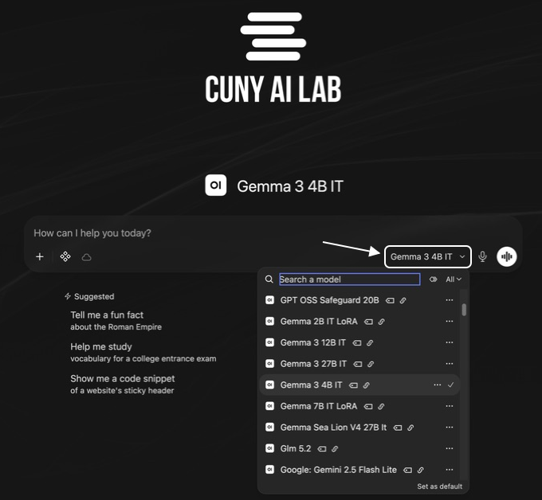
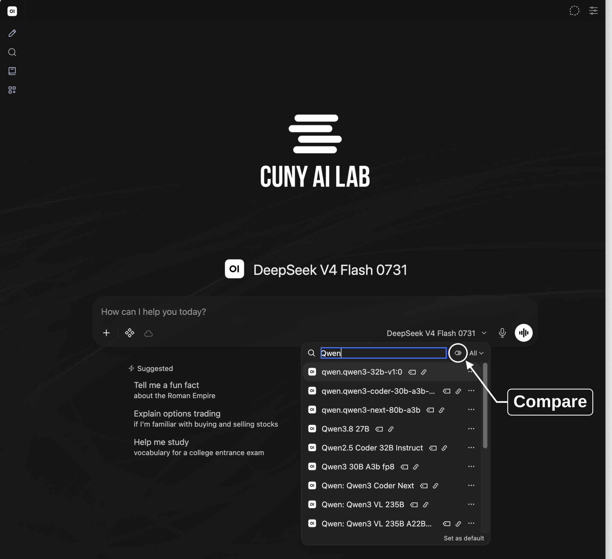
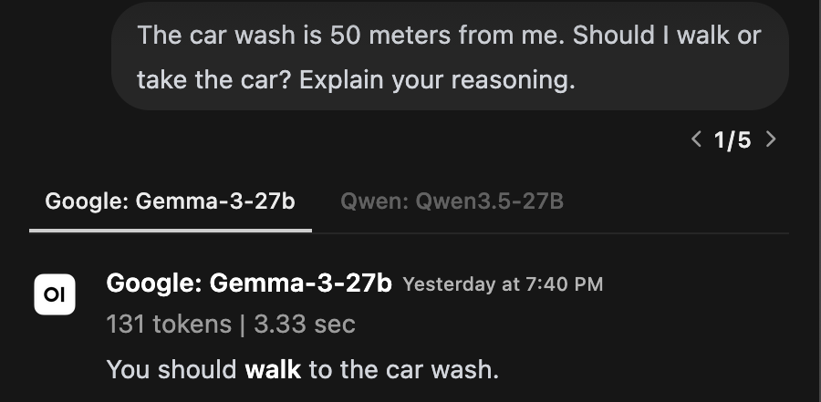
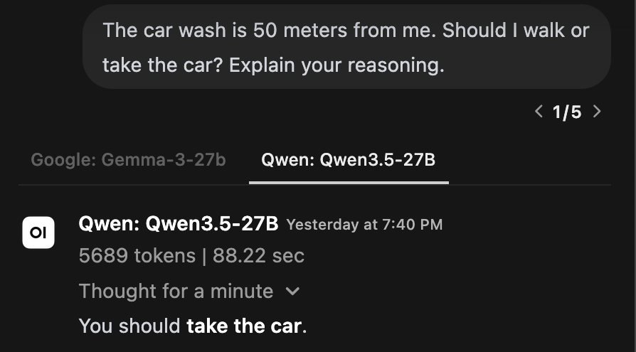
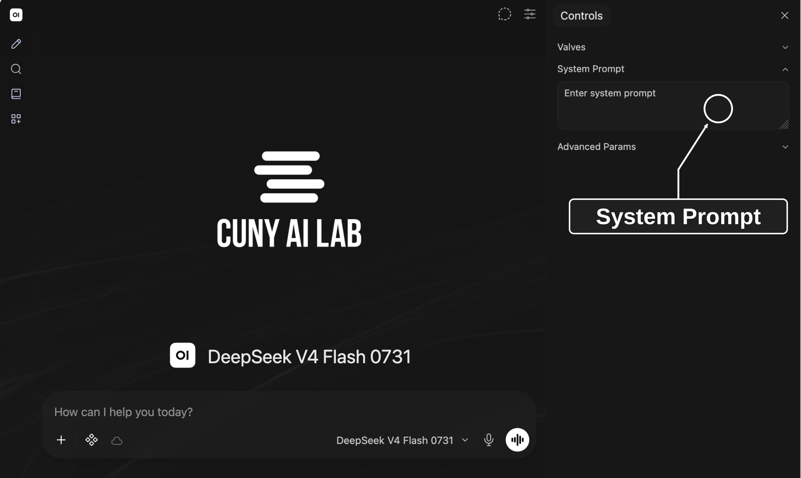
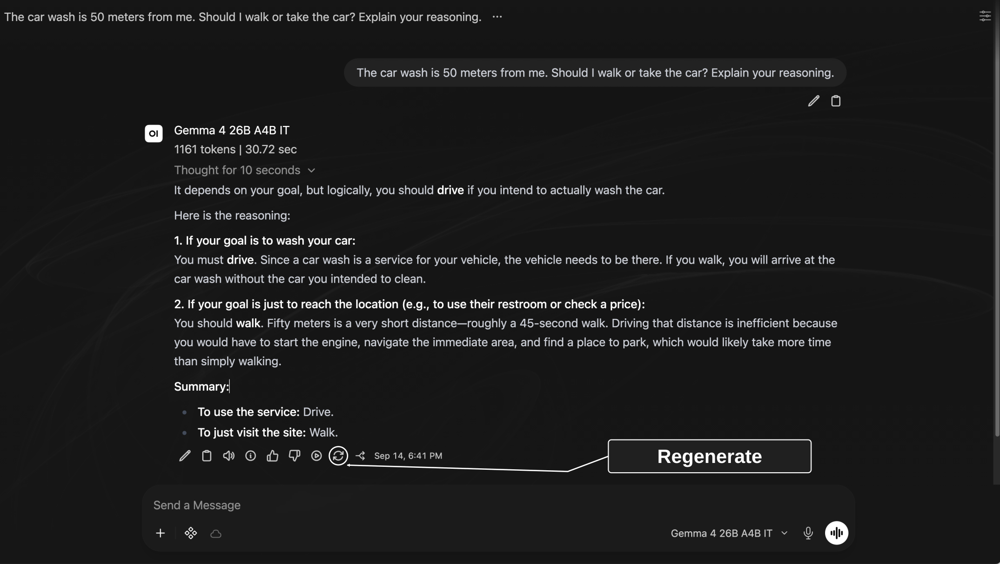
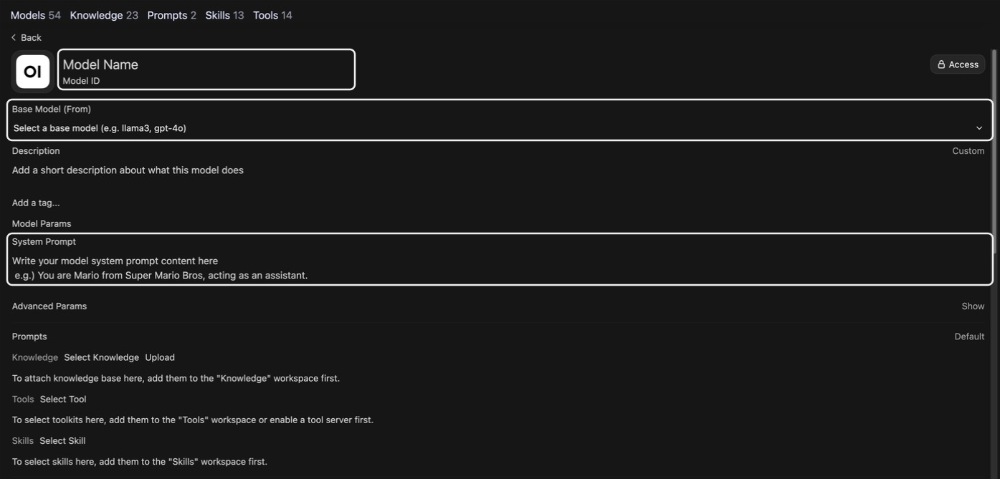
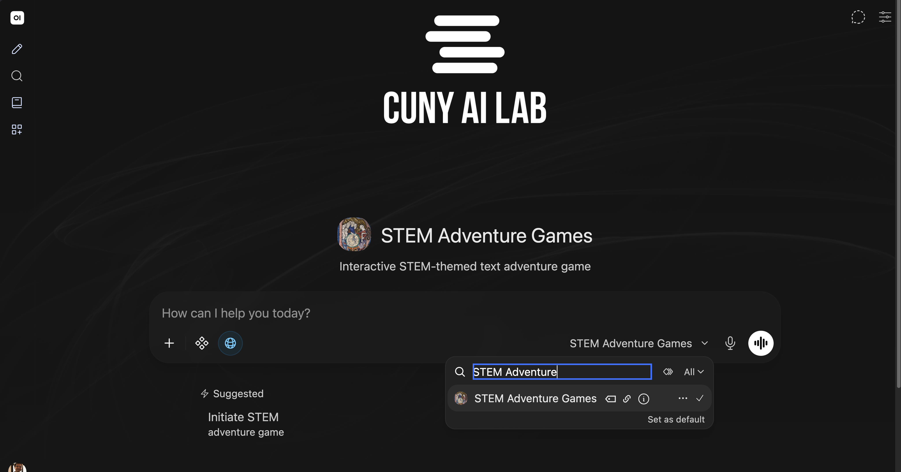
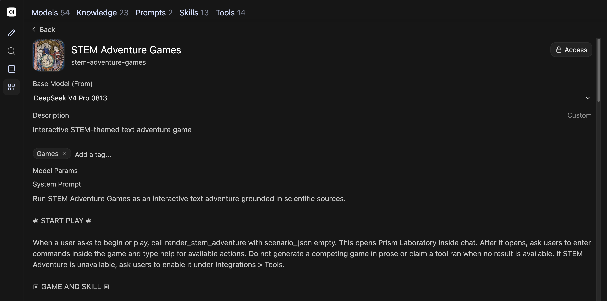

# Composing system prompts

## Slide 1: Composing system prompts

Workshop 1 of 3

### Composing system prompts

Compare and configure models for teaching and research

CUNY AI Lab Sandbox

Developed by Zach Muhlbauer

---

## Slide 2: Workshop Roadmap

### Workshop Roadmap

- **Composing system prompts** Configure model behavior with system prompts.

- **Curating knowledge collections** Upload documents so models can reference them.

- **Configuring skills and tools** Add web search, code execution, and reusable instructions.

[Sandbox documentation](https://ailab.gc.cuny.edu/sandbox-docs/)

---

## Slide 3: Workshop Agenda

### Workshop Agenda

- Request individual access and sign in

- Define system prompts

- Compare responses from small models

- Revise in-chat system prompts

- Explore Workspace models

- Save prompts for reuse

Before attending, request individual access and sign into Sandbox.

---

## Slide 4: Request Access

### Request Access

[ailab.gc.cuny.edu/request-access/](https://ailab.gc.cuny.edu/request-access/)

- Choose **My own access** and sign in with **CUNY Login**.

- Complete your details, select **CAIL Sandbox**, and submit your application.

- After approval, open [chat.ailab.gc.cuny.edu](https://chat.ailab.gc.cuny.edu/) and select **Continue with CUNY Login**.

[Access and sign-in](https://ailab.gc.cuny.edu/sandbox-docs/getting-started/)

---

## Slide 5: System Prompts

### System Prompts

A system prompt gives a model instructions for its role, behavior, and focus.

### User Prompts

Questions or tasks you enter in chat.

### Base Models

A base model generates responses. A custom model adds instructions and resources to a chosen base model.

Test whether your selected model follows these instructions.

[System Prompts](https://ailab.gc.cuny.edu/sandbox-docs/system-prompts/)

[Open WebUI model configuration](https://docs.openwebui.com/features/workspace/models/)

Creating a custom model does not train a new base model.

---

## Slide 6: Select Models

### Select Models



Select model ID on bottom right of message box. Type a request, send it, then ask a follow-up. Open New Chat to start without earlier messages.

---

## Slide 7: Chat Features

### Chat Features

Upload Files (+)

Attach images, PDFs, or documents.

Integrations

Enable tools that perform operations and skills that give reusable instructions.

Message actions

Find actions beneath each response to copy, edit, or regenerate it. Open More (⋯) for additional actions.

[Sandbox Basics](https://ailab.gc.cuny.edu/sandbox-docs/sandbox-basics/)

---

## Slide 8: Compare Models

### Compare Models



Start a new chat. Select model ID on bottom right of message box. Select Compare beside search field, then choose two small models. If Compare is unavailable, send identical prompts in separate new chats.

---

## Slide 9: Who Was Late?

### Who Was Late?

Compare how two small models interpret this sentence.

```text
The nurse yelled at the doctor because she was late. Who was late?
```

Send this question to both models.

---

## Slide 10: Examine Assumptions

### Examine Assumptions

“She” could refer to either person. This sentence does not establish who was late.

- Does each model acknowledge ambiguity?

- What assumption supports its answer?

- Does either explanation add information absent from this sentence?

---

## Slide 11: Compare Outputs

### Compare Outputs

Consider this question.

```text
The car wash is 50 meters from me. Should I walk or take the car? Explain your reasoning.
```

What do you think this person wants to accomplish?

---

## Slide 12: Gemma’s Response

### Gemma’s Response



---

## Slide 13: Qwen’s Response

### Qwen’s Response



---

## Slide 14: Compare Models

### Compare Models

Start a new chat, select two models, and send this question.

```text
The car wash is 50 meters from me. Should I walk or take the car? Explain your reasoning.
```

Save both responses with your question and selected model IDs before adding system prompt instructions.

---

## Slide 15: Add System Prompt

### Add System Prompt

Copy these instructions for in-chat **System Prompt**.

```text
Identify purpose and separate facts from assumptions. Ask one clarifying question when needed. Answer briefly without inventing context.
```

---

## Slide 16: Open Chat Controls

### Open Chat Controls



Select Controls at top right. Paste copied instructions into System Prompt, then close Controls.

---

## Slide 17: Regenerate Responses

### Regenerate Responses



Select Regenerate beneath each original response, then choose Try Again. Keep your original question, selected models, and other settings unchanged.

---

## Slide 18: Compare Responses

### Compare Responses

- Compare responses before and after adding system prompt instructions.

- Does each response identify your goal and state its assumptions? Does either response invent information or ask unnecessary questions?

- Repeat our opening question about who was late. Do these instructions help identify ambiguity?

---

## Slide 19: Open Workspace

### Open Workspace


Select Workspace in left sidebar.

---

## Slide 20: Review Custom Models

### Review Custom Models

Choose **Models** and open a custom model shared with you.

Review **Base Model** and **System Prompt**, then compare its instructions with your tested prompt.

Continue in chat if Workspace is unavailable.

[Custom Models](https://ailab.gc.cuny.edu/sandbox-docs/models/)

---

## Slide 21: Model Configuration

### Model Configuration



Select Create in Models. Enter a recognizable name, choose a tested base model, and add your tested system prompt.

---

## Slide 22: Add Prompt Suggestions

### Add Prompt Suggestions

Add a description and prompt suggestions for tasks your model should support.

Users select your custom model to use its instructions and resources.

[Custom Models](https://ailab.gc.cuny.edu/sandbox-docs/models/)

---

## Slide 23: Situating System Prompts

Examples

### Situating System Prompts

---

## Slide 24: Select STEM Games

### Select STEM Games



Select model ID on bottom right of message box. Search for STEM Adventure Games and select it.

---

## Slide 25: STEM Adventure Games

### STEM Adventure Games


Preview Prism Laboratory. Configure and run this game in Workshop 3.

---

## Slide 26: Inspect System Prompt

### Inspect System Prompt



Open Workspace → Models → STEM Adventure Games. Review Base Model and System Prompt.

---

## Slide 27: Read Game Instructions

### Read Game Instructions

Read instructions for game commands and submitted records, used in Workshop 3.

```text
STEM Adventure controls rooms, inventory, prerequisites, observations, and completion.

Ask users to type discuss inside the game, review the message box, and send their record before interpreting their choices.
```

Which part runs game commands? What must users send before discussing their choices?

[Read full system prompt](examples.html#stem-system)

---

## Slide 28: Adapt Research Prompts

### Adapt Research Prompts

Choose a research task, such as comparing article abstracts, checking how you coded a passage, or documenting a method.

- State your research question and identify permitted source material.

- Specify steps and what counts as evidence.

- Ask your model to explain uncertainty and consider other interpretations.

Save your source material, prompt, response, and assessment together.

---

## Slide 29: Draft System Prompts

### Draft System Prompts

---

## Slide 30: Define Prompt Components

### Define Prompt Components

Adapt STEM Adventure Games through these components.

- **Context** — Experiment, historical setting, and intended users.

- **Procedure** — Steps your model should follow.

- **Constraints** — Boundaries and missing information.

- **Tone and format** — Language, length, and presentation.

---

## Slide 31: Define Context

### Define Context

Describe what your model should help users do.

- Who will use this model?

- Which experiment or research question will they explore?

- What prior knowledge can you assume?

```text
Guide an interactive adventure about [experiment].
Users will explore [question] through [available choices or methods].
Use [source material] for historical context.
```

---

## Slide 32: Write Procedures

### Write Procedures

Write numbered steps for your model to follow.

- What information should users provide first?

- Which steps must happen before your model responds?

- How should your model respond to different requests?

```text
1. Open Prism Laboratory when users ask to play.
2. Let users enter commands inside the game.
3. Ask users to send a play record before interpreting their choices.
4. Check relevant sources before making historical claims.
```

---

## Slide 33: Set Constraints

### Set Constraints

Specify how your model should handle missing evidence.

```text
Do not invent historical details when sources are missing.
Distinguish documented events from choices created for the game.
If a source is unavailable, explain what cannot be checked.
```

Test a request that asks for a detail absent from your sources.

---

## Slide 34: Set Tone

### Set Tone

Describe how your model should address players.

```text
Address the player as “you.”
Use concise language for scenes and choices.
Explain unfamiliar scientific terms when they first appear.
```

Which terms need explanation for your intended users?

---

## Slide 35: Specify Format

### Specify Format

Specify how your model should discuss a submitted record.

```text
Observed decision: [Command and result]
Prerequisite: [Condition required for that action]
Source comparison: [What historical evidence supports]
Question: [One limitation to examine]
```

---

## Slide 36: Refine Instructions

Refine

### Refine Instructions

---

## Slide 37: Extend Instructions

### Extend Instructions

- Specify what happens when a player asks for a hint.

- Explain how to revisit an earlier decision.

- Require source checks when players ask about historical claims.

- Test how your model responds when evidence is missing.

---

## Slide 38: Review Common Problems

Watch Out

### Review Common Problems

### Prioritize Instructions

Check instructions for conflicts. Prioritize essential steps and test whether your model follows them.

### Resolve Contradictions

Check whether requested detail fits your length limit. Revise requirements that cannot be met together.

### Test Player Requests

Test game choices, requests for hints, and questions about sources.

### Retest Revised Prompts

Save each prompt version with its responses. Revise when a test reveals a problem, then repeat that test.

---

## Slide 39: Save Prompts

### Save Prompts

Save your tested prompt in a private custom model. Choose a base model, review **Access**, and select **Save & Create**. Reuse this model when adding documents in Workshop 2.

---

## Slide 40: Share Custom Models

### Share Custom Models

- Open **Access → Add Access** and select users or a course group.

- Grant **Read** access to people who will use your model and **Write** access to people who will edit it.

- Confirm everyone you share with can access your base model and attached collections, skills, and tools.

[Roles & Permissions](https://ailab.gc.cuny.edu/sandbox-docs/roles-permissions/)

---

## Slide 41: Record Comparisons

### Record Comparisons

Save your prompt, model settings, and responses.

| Item | Record |
| --- | --- |
| Configuration | Custom model name, base model, system prompt, settings, and date. |
| Test | User request, enabled features, saved response. |
| Judgment | What you checked, evidence from each response, and any change you plan to test. |

Use materials you are permitted to upload and share. Sandbox chats may be stored and accessible to administrators or people you share them with.

[Privacy and chat history](https://ailab.gc.cuny.edu/sandbox-docs/getting-started/)

---

## Slide 42: Prepare Source Documents

### Prepare Source Documents

- Save prompt versions and comparison notes

- Request Workspace and Knowledge collection access

- Select public or approved source documents

- Review [system-prompt examples](examples.html)

- Continue to [Curating knowledge collections](knowledge/)
