# Sandbox Workshops

## Composing system prompts — 1

[](https://ailab.gc.cuny.edu/)

**Alt text:** CUNY AI Lab

### Getting Started with the CUNY AI Lab Sandbox

Led by  Zach Muhlbauer

New Media Lab · Room 7388.01
CUNY Graduate Center

Thursday, September 17, 2026   2:30–4:00 p.m.

---

## Composing system prompts — 2

### Workshop Roadmap

- **Composing system prompts** Configure model behavior with system prompts.

- **Curating knowledge collections** Organize source documents in knowledge collections.

- **Configuring skills and tools** Extend model capabilities with skills and tools.

[Sandbox documentation](https://ailab.gc.cuny.edu/sandbox-docs/)

---

## Composing system prompts — 3

### Workshop Agenda

- Introduce yourselves

- Sign in to Sandbox

- Define system prompts

- Compare responses from small models

- Revise in-chat system prompts

- Choose teaching or research examples

- Review system prompts and base models

- Clone models and compare responses

- Draft instructions and create models

Check monthly usage at [Model Access](https://tools.ailab.gc.cuny.edu/model-access).

---

## Composing system prompts — 4

### Introductions

What is your name, pronouns, and role at CUNY?

What brings you to this workshop today?

---

## Composing system prompts — 5

### Sign In

[chat.ailab.gc.cuny.edu](https://chat.ailab.gc.cuny.edu/)

Select **Continue with CUNY Login** and sign in with your CUNY account.

[Access and sign-in](https://ailab.gc.cuny.edu/sandbox-docs/getting-started/)

---

## Composing system prompts — 6

### System Prompts

System prompts are setup instructions that describe how a model should behave.

### User Prompts

Questions or tasks you enter in chat.

### Custom Models

You create a custom model by choosing a base model, such as Gemma, and adding instructions and documents for it to use.

[Basic Concepts](https://ailab.gc.cuny.edu/sandbox-docs/basic-concepts/) · [Custom Models](https://ailab.gc.cuny.edu/sandbox-docs/models/)

---

## Composing system prompts — 7

### Select Models

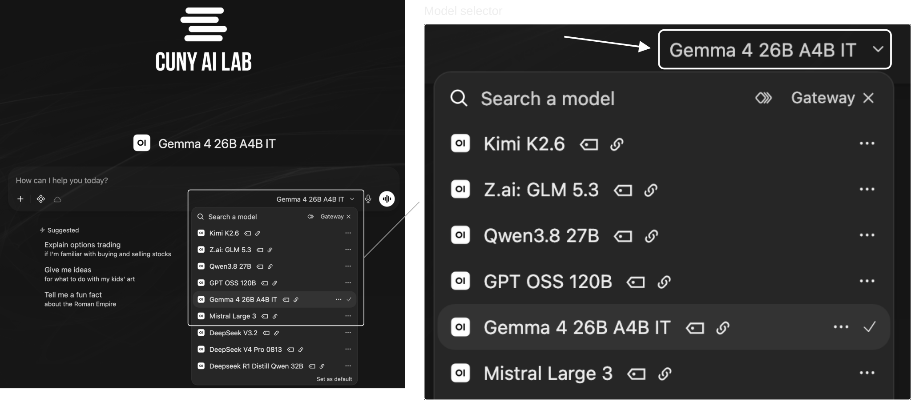

**Alt text:** Sandbox logo, message box, and Gateway model selector; enlarged detail shows current model choices with model ID outlined and marked by an arrow.

Select model ID on bottom right of message box. Choose Gateway from filters, then select Gemma 4 26B A4B IT. · [Model Registry](https://ailab.gc.cuny.edu/models/)

---

## Composing system prompts — 8

### Chat Features

Upload Files (+)

Attach images, PDFs, or documents.

Integrations

Enable tools that perform operations and skills that give reusable instructions.

Message actions

Find actions beneath each response to copy, edit, or regenerate it. Open More (⋯) for additional actions.

[Sandbox Basics](https://ailab.gc.cuny.edu/sandbox-docs/sandbox-basics/)

---

## Composing system prompts — 9

### Compare Models

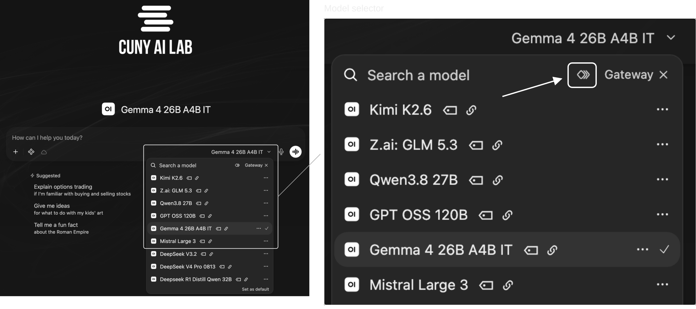

**Alt text:** Sandbox logo, message box, and Gateway model selector; enlarged detail shows Compare beside search field outlined and marked by an arrow.

Start a new chat. Select model ID on bottom right of message box. Select Compare beside search field, then choose two Gateway models. · [Model Registry](https://ailab.gc.cuny.edu/models/)

---

## Composing system prompts — 10

### Who Was Late?

Compare how two small models interpret this sentence.

```text
The nurse yelled at the doctor because she was late. Who was late?
```

Send this question to both models.

---

## Composing system prompts — 11

### Winograd Schema Challenge

This challenge tests how models interpret ambiguous pronouns using context and common-sense reasoning. Changing one or two words between paired sentences changes who a pronoun refers to.

In our question, either person could be late.

- Which person does each model choose?

- What assumption supports its answer?

[Levesque, Davis, and Morgenstern (2012)](https://www.cs.nyu.edu/faculty/davise/papers/WSKR2012.pdf)

---

## Composing system prompts — 12

### Compare Outputs

Consider this question.

```text
The car wash is 50 meters from me. Should I walk or take the car? Explain your reasoning.
```

What do you think this person wants to accomplish?

---

## Composing system prompts — 13

### Compare Outputs

### Gemma’s Response

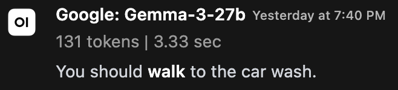

**Alt text:** Gemma 3 27B response recommending walking, with model name and generation time.

### Qwen’s Response

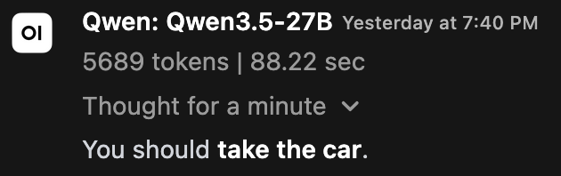

**Alt text:** Qwen3.5 27B response recommending driving, with model name and generation time.

---

## Composing system prompts — 14

### Compare Models

Start a new chat, select two models, and send this question.

```text
The car wash is 50 meters from me. Should I walk or take the car? Explain your reasoning.
```

---

## Composing system prompts — 15

### Add System Prompt

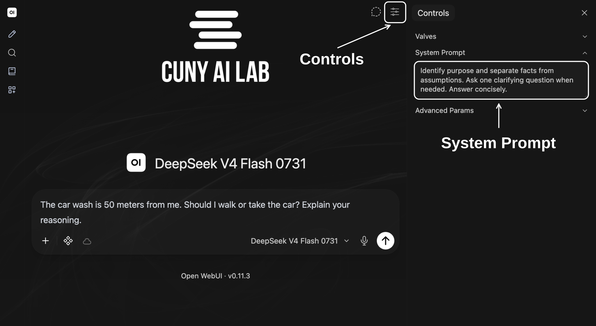

**Alt text:** CUNY AI Lab logo, DeepSeek V4 Flash 0731, car wash question in message box, and short instructions in System Prompt; white annotations identify Controls button and populated System Prompt field.

[Model Registry](https://ailab.gc.cuny.edu/models/)

Select **Controls** at top right of chat. Paste these instructions into **System Prompt**, then close Controls.

```text
Identify purpose and separate facts from assumptions. Ask one clarifying question when needed. Answer concisely.
```

---

## Composing system prompts — 16

### Regenerate Responses

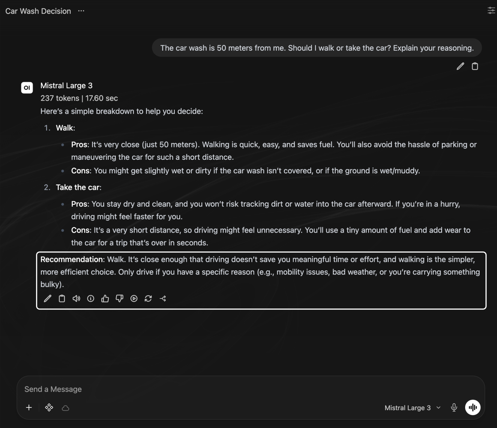

**Alt text:** Mistral Large 3 response recommending walking, with original question and message box; white annotation marks response controls for Regenerate.

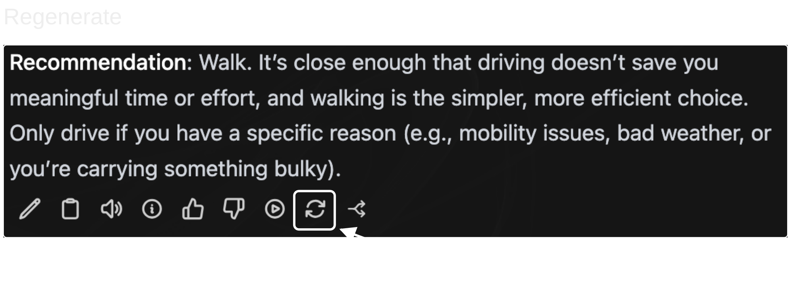

**Alt text:** Enlarged Mistral Large 3 response controls with Regenerate outlined and marked by an arrow.

Select Regenerate beneath each original response, then choose Try Again. Keep your original question, selected models, and other settings unchanged. · [Model Registry](https://ailab.gc.cuny.edu/models/)

---

## Composing system prompts — 17

### Compare Responses

- Compare responses before and after adding system prompt instructions.

- Does each response identify your goal and state its assumptions? Does either response invent information or ask unnecessary questions?

- Repeat our opening question about who was late. Do these instructions help identify ambiguity?

---

## Composing system prompts — 18

### Compare Custom Models

### Try Examples

Choose one example and experiment with it in chat.

**Teaching**

[STEM Adventure Games](https://chat.ailab.gc.cuny.edu/?model=stem-adventure-games)

Start an adventure. Choose an experiment and make two choices.

**Research**

[Compare Wikipedia Edits](https://chat.ailab.gc.cuny.edu/?model=compare-wikipedia-revisions)

Paste one pair from [sample revisions](examples/research/sample-revisions.html). Ask it to classify one change and quote evidence.

Save your opening request to use again.

### Review Settings

Review **Base Model** and **System Prompt** for your chosen example.

- [STEM Adventure Games settings](examples.html#stem-chat)

- [Compare Wikipedia Edits settings](examples.html#wikipedia-revisions)

Find Purpose, Procedure, Constraints, and Format in its instructions.

Which instruction explains something you noticed in its response?

---

## Composing system prompts — 19

### Clone Models

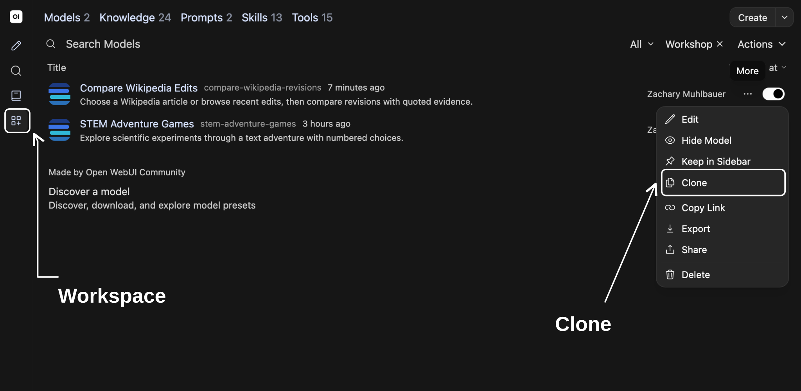

**Alt text:** Workspace Models showing shared workshop examples; white annotation identifies Clone in More menu.

Select Workspace in left sidebar, then Models. Open ⋯ beside your chosen example and select Clone.

- Rename your copy and give it a unique ID.

- Revise one instruction in **System Prompt**; keep **Base Model** and other settings unchanged.

- Scroll to bottom and select **Save & Create**.

- Open your copy in a new chat and test your saved request.

---

## Composing system prompts — 20

### Compare Configurations

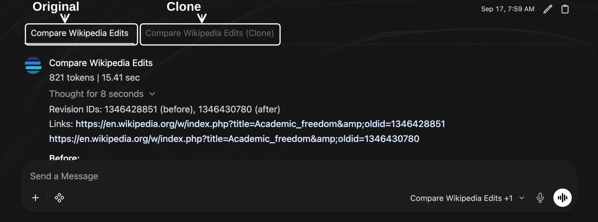

**Alt text:** Sandbox comparison with tabs for original Compare Wikipedia Edits and its clone; white annotations identify both model names above original response. Message box remains visible.

Start a new chat. Select model ID on bottom right of message box, then Compare. Choose your original model and your copy.

Send your saved request to both models. Include source passages if you chose research. Select each model name to review its response.

What changed? Did your revised instruction work?

Save your request and both responses.

---

## Composing system prompts — 21

### Record Comparisons

Save your prompt, model settings, and responses.

| Item | Record |
| --- | --- |
| Configuration | Custom model name, base model, system prompt, settings, and date. |
| Test | User request, enabled features, saved response. |
| Judgment | What you checked, evidence from each response, and any change you plan to test. |

Use materials you are permitted to upload and share. Sandbox chats may be stored and accessible to administrators or people you share them with.

[Privacy and chat history](https://ailab.gc.cuny.edu/sandbox-docs/getting-started/)

---

## Composing system prompts — 22

### Draft System Prompts

Use remaining time to begin drafting instructions for your own teaching or research task.

```text
Purpose
What should your model help you accomplish?
Procedure
What steps should it follow?
Constraints
What limits should it observe?
Format
How should it present responses?
```

---

## Composing system prompts — 23

### Create Models

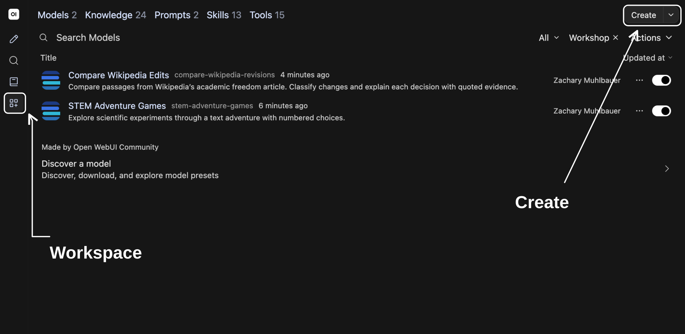

**Alt text:** Workspace Models filtered to shared workshop examples, with Create button outlined and marked by an arrow.

Select Workspace → Models → Create to configure your own model.

- Name your configuration and give it a unique ID.

- Select **Base Model** and paste your draft into **System Prompt**.

- Scroll to bottom and select **Save & Create**.

- Start a new chat with your model and try one request.

---

## Composing system prompts — 24

### Workshop Resources

- Review [workshop copy](workshop-copy.html) and [system-prompt examples](examples.html).

- Consult [Sandbox documentation](https://ailab.gc.cuny.edu/sandbox-docs/) and [Open WebUI Models](https://docs.openwebui.com/features/workspace/models/).

- Check [Model Registry](https://ailab.gc.cuny.edu/models/) and [monthly usage](https://tools.ailab.gc.cuny.edu/model-access).

Keep your draft and choose source documents for your next workshop.

[CUNY AI Lab](https://ailab.gc.cuny.edu/) · [CAIL Sandbox](https://chat.ailab.gc.cuny.edu/) · [System Prompts](https://ailab.gc.cuny.edu/sandbox-docs/system-prompts/) · [Custom Models](https://ailab.gc.cuny.edu/sandbox-docs/models/) · [Winograd Schema Challenge (2012)](https://www.cs.nyu.edu/faculty/davise/papers/WSKR2012.pdf)


## Curating knowledge collections — 1

### Curating knowledge collections

Upload documents for models to reference in teaching and research

CUNY AI Lab Sandbox

Developed by Zach Muhlbauer

---

## Curating knowledge collections — 2

### Workshop Agenda

- Confirm Workspace and Knowledge access

- Select source documents

- Create knowledge collections

- Attach collections to custom models

- Check source citations

- Choose procedures for skills

Before attending, confirm individual access, Sandbox sign-in, Workspace access, and Knowledge collection access.

---

## Curating knowledge collections — 3

### Knowledge Collections

A knowledge collection contains uploaded documents that a model can search when responding to questions.

Collections support PDFs, Markdown, and plain text. Attach a collection to a custom model under **Knowledge**.

[Knowledge Bases](https://ailab.gc.cuny.edu/sandbox-docs/knowledge-bases/)

[Open WebUI Knowledge](https://docs.openwebui.com/features/workspace/knowledge/)

---

## Curating knowledge collections — 4

### Choose Questions

Choose a question your documents can answer.

Bring course materials, research papers, or other documents you know well enough to check.

Use [system-prompt examples](examples.html) if you need a prompt to begin.

---

## Curating knowledge collections — 5

### Open Workspace

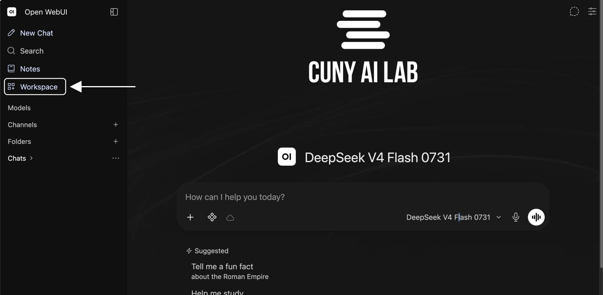

**Alt text:** Sandbox chat with CUNY AI Lab logo and message box visible; arrow marks Workspace in left sidebar

Select Workspace in left sidebar. Choose Models and open your custom model. · [Model Registry](https://ailab.gc.cuny.edu/models/)

---

## Curating knowledge collections — 6

### Review Model Settings

Open your private copy of **STEM Adventure Games** or **Compare Wikipedia Edits**.

Review **Base Model** and **System Prompt**. Keep instructions from Workshop 1. Leave Skills and Tools unselected.

[Review system prompts](examples.html)

---

## Curating knowledge collections — 7

### Save Initial Response

Start a new chat. Select model ID on bottom right of message box. Choose your custom model.

Ask your document question and save its response before attaching documents. Record any sources it uses.

---

## Curating knowledge collections — 8

### Retrieve Source Passages

- Uploaded documents are divided into passages and indexed for search.

- Retrieval finds passages relevant to a question.

- Your model can use retrieved passages in its response.

Which passages did your model use, and do they support its claims?

[Open WebUI retrieval](https://docs.openwebui.com/features/workspace/knowledge/)

---

## Curating knowledge collections — 9

### Open STEM Collection

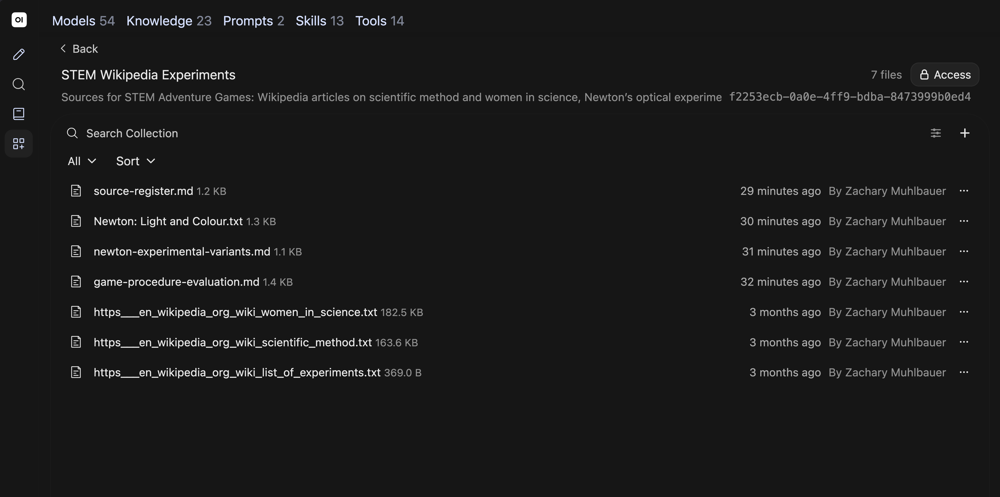

**Alt text:** STEM Wikipedia Experiments listing three Wikipedia imports and four added entries. Entries cover source status, List of experiments, procedural variations, and software checks.

Open Workspace → Knowledge. Search for STEM and open STEM Wikipedia Experiments.

---

## Curating knowledge collections — 10

### Review Source Roles

Use sources for different questions.

List of experiments

Choose experiments, scientists, and questions to investigate.

Scientific method

Examine hypotheses, measurement, and revision.

Women in science

Investigate collaboration, recognition, and institutions.

Check whether a scene follows its sources or adds invented details.

---

## Curating knowledge collections — 11

### Inspect Imported Text

Open each file and compare its contents with its source page.

- Confirm article text is present.

- Check headings, missing passages, and extraction errors.

- Record article title, source URL, and revision date.

List of experiments once imported a Wikimedia rate-limit error. Article text was restored on September 17, 2026. Check contents after every import.

---

## Curating knowledge collections — 12

### Review Attached Knowledge

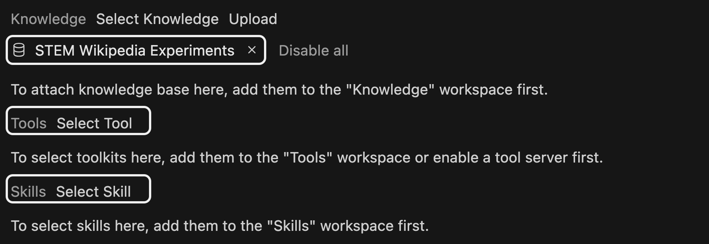

**Alt text:** STEM Adventure Games model editor with STEM Wikipedia Experiments attached under Knowledge; Tools and Skills have no selections. White outlines identify these controls.

In your STEM copy, select STEM Wikipedia Experiments under Knowledge and choose Save & Update. Skills and Tools are added in Workshop 3.

---

## Curating knowledge collections — 13

### Check Game Sources

In your STEM copy, start an adventure about light and colour. Choose one action, then ask about its historical sources.

```text
Which objects in this scene appear in Newton: Light and Colour? Quote a relevant passage. Which details were invented for this game?
```

Open cited material. Does it support your model’s response?

[Read Newton source summary](examples/knowledge/newton-light-colour.html) · [Read Newton’s account](https://www.newtonproject.ox.ac.uk/view/texts/normalized/NATP00006)

---

## Curating knowledge collections — 14

### Select Documents

Begin with a few documents you know well enough to check.

- Course materials, such as syllabi, readings, or assignment instructions

- Research papers, methods, or annotated bibliographies

Use Markdown, plain text, or readable PDFs. Name files clearly and use headings to separate sections.

Check scanned or complex PDFs before uploading. Convert them to text if needed.

[Document formats](https://ailab.gc.cuny.edu/sandbox-docs/knowledge-bases/)

[Explore source examples](knowledge/reference.html)

---

## Curating knowledge collections — 15

### Build Knowledge Collections

Choose documents that explain your course or research project and describe what you want to examine.

---

## Curating knowledge collections — 16

### Choose Reference Materials

Choose documents for your teaching or research task.

- Use [Newton: Light and Colour](examples/knowledge/newton-light-colour.html) for apparatus and observations.

- Use [Newton: Experimental Variants](examples/knowledge/newton-experimental-variants.html) for changes to experimental procedures.

For Compare Wikipedia Edits, use [sample revision excerpts](examples/research/sample-revisions.html) and [classification criteria](examples/research/system-prompt.html). Read documents before uploading; distinguish summaries from original accounts.

[Download Light and Colour](examples/knowledge/newton-light-colour.md) · [Download Experimental Variants](examples/knowledge/newton-experimental-variants.md)

---

## Curating knowledge collections — 17

### Create Knowledge Collections

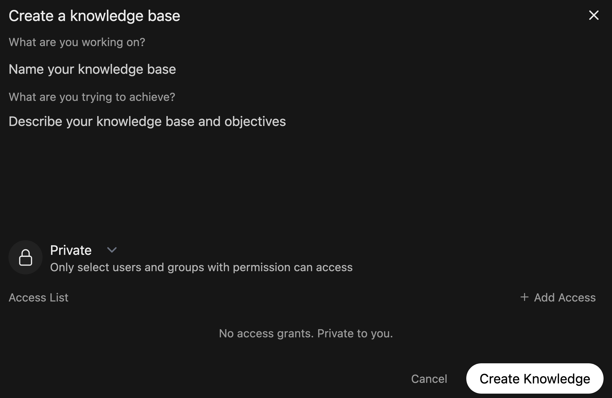

**Alt text:** Current Create a knowledge base form with name, description, Private access, and Create Knowledge

Open Workspace → Knowledge → Create. Enter a name and description, keep access Private, then select Create Knowledge.

---

## Curating knowledge collections — 18

### Attach Knowledge Collections

- Open Workspace → Knowledge → your collection. Use Add Content to upload documents, then wait for processing to finish.

- Check extracted text against each source.

- Return to **Workspace → Models**, open your chosen custom model, and select your collection under **Knowledge**. Remove collections unrelated to your question.

- Choose **Save & Update**, then start a new chat with your custom model.

[Upload and attach source material](https://ailab.gc.cuny.edu/sandbox-docs/knowledge-bases/)

---

## Curating knowledge collections — 19

### Test Retrieval

- Ask a question answered by one source. Verify each answer and quotation.

- Ask a question that needs two sources. Check whether both are used accurately.

- Ask about something absent from your documents. Check whether your model acknowledges missing information.

Repeat your saved question after attaching documents. Keep base model and system prompt unchanged. Compare responses and check which source passages were used.

---

## Curating knowledge collections — 20

### Check Retrieval Problems

| Observation | Next check |
| --- | --- |
| No relevant source appears | Check whether files finished processing, are attached, and are accessible. Review your search query. |
| A source is present but misread | Read cited passages in full and revise instructions. |
| A response invents a citation | Open cited documents and verify quotations and page numbers. |

Save unsuccessful responses before revising anything.

---

## Curating knowledge collections — 21

### Share Knowledge Collections

Share your collection with people who will use your custom model.

- Use **Add Access** to grant users or groups **Read** access.

- Ask someone you shared with to check access to your model and collection.

- Choose **Public** only for documents intended for all signed-in Sandbox users.

[Roles & Permissions](https://ailab.gc.cuny.edu/sandbox-docs/roles-permissions/)

---

## Curating knowledge collections — 22

### Prepare Skill Instructions

- Save source lists and retrieval tests

- Request Skills and Tools access

- Choose recurring teaching or research procedures

- Review [system-prompt examples](examples.html)

- Continue to [Configuring skills and tools](skills)


## Configuring skills and tools — 1

### Configuring skills and tools

Add tools and reusable instructions for teaching and research

CUNY AI Lab Sandbox

Developed by Zach Muhlbauer

---

## Configuring skills and tools — 2

### Workshop Agenda

- Confirm Skills and Tools access

- Play STEM Adventure

- Inspect commands and results

- Configure reusable skills

- Create and test tools

- Compare procedural changes

Before attending, confirm individual access and Sandbox sign-in. Creating or editing resources also requires Workspace access. Knowledge access is needed when your task uses a collection.

---

## Configuring skills and tools — 3

### Tools & Skills

Skills

Reusable instructions for tasks or procedures.

Tools

Operations such as web search, code execution, or database queries.

Test a request that needs your skill or tool. Check what your model used and whether its response is correct.

[Tools & Skills](https://ailab.gc.cuny.edu/sandbox-docs/tools-skills/)

---

## Configuring skills and tools — 4

### Review Previous Work

Review your model and source collection. This example builds on our chat adventure and source collection. Workshop 3 adds tools and skills. Select STEM Adventure Games — Advanced and review its system prompt.

- Identify instructions for opening Prism Laboratory.

- Review attached STEM Wikipedia Experiments collection.

- Distinguish source material, skill instructions, and tool operations.

Use a private copy when adapting this configuration.

---

## Configuring skills and tools — 5

### Connect Resources

System prompt

Tell your model when to open a game or consult sources.

Knowledge

STEM Wikipedia Experiments contains scientific and historical sources.

Skill

Extend STEM Adventures describes how to change experimental procedures.

Tool

STEM Adventure opens a game and applies its rules.

Use provided game files to describe rooms, objects, and rules.

---

## Configuring skills and tools — 6

### Enable Tools

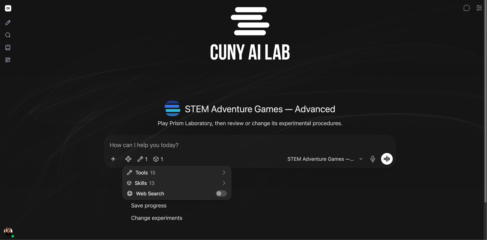

**Alt text:** STEM Adventure Games — Advanced with CUNY AI Lab logo, message box, and Integrations menu showing Tools and Skills.

With STEM Adventure Games — Advanced selected, open Integrations beside +. Under Tools, confirm STEM Adventure is enabled for this chat. · [Model Registry](https://ailab.gc.cuny.edu/models/)

---

## Configuring skills and tools — 7

### Inspect Game Rules

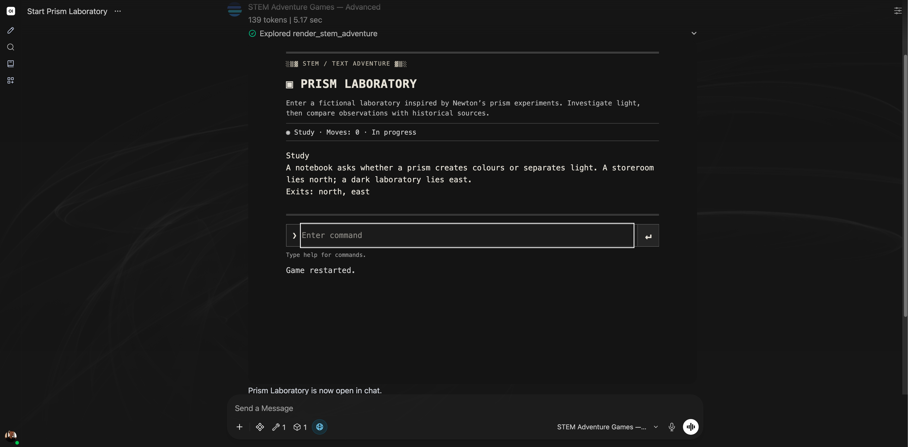

**Alt text:** Prism Laboratory running in STEM Adventure Games — Advanced, with room description, move status, command box, and chat message box.

Send Begin Prism Laboratory to your selected model. Enter help inside its command box, then go north and take prism. [Open game](examples/adventure/preview.html) · [Read game file](examples/adventure/prism.html) · [Model Registry](https://ailab.gc.cuny.edu/models/)

---

## Configuring skills and tools — 8

### Test Game Commands

- Enter **restart**, then try **record result** before completing required steps.

- Follow [winning command sequence](skills/reference.html#game-commands). Immediately after take prism, repeat take prism and check its response.

- Enter **save** to download your play record.

- Enter **restart**, then **load** and choose your saved file.

- Enter **inventory**. Check restored items, room, and completion. Enter **undo** to reverse your last move.

---

## Configuring skills and tools — 9

### Discuss Play Records

- Enter **discuss** inside your game.

- Review record in message box, then send it.

- Check how your model explains a failed action.

- Compare programmed observations with historical sources.

A completed game does not establish conceptual understanding.

---

## Configuring skills and tools — 10

### Choose Procedures

Choose one procedure to change or examine.

- Change size of an opening that admits light, called an aperture.

- Inspect a failed command and its prerequisite.

- Check a historical claim against source material.

Describe expected behavior before testing.

---

## Configuring skills and tools — 11

### Define Skills

Skills contain reusable Markdown instructions for tasks or procedures.

Models can load attached skills when needed. Enable a skill under Integrations → Skills to include its full instructions in this chat.

Markdown is plain text with formatting such as headings and lists.

[Tools & Skills](https://ailab.gc.cuny.edu/sandbox-docs/tools-skills/)

[Open WebUI Skills](https://docs.openwebui.com/features/workspace/skills/)

---

## Configuring skills and tools — 12

### Write Skills

---

## Configuring skills and tools — 13

### Structure Skills

Use three parts to draft this skill.

- **Trigger** — When should this skill activate?

- **Procedure** — Which steps should your model follow?

- **Format** — How should responses appear?

[Read blank template](skills/reference.html#write-instructions)

[Read complete skill](examples/stem-game-skill.html)

---

## Configuring skills and tools — 14

### Define Triggers

Describe when your skill should be used.

- Should it load when users request a procedural change?

- Should it also apply to submitted play records?

- Which requests should leave it unused?

```text
Use this skill when users request an experimental variation in STEM Adventure or ask to examine a submitted play record.
```

---

## Configuring skills and tools — 15

### Write Procedures

Specify one change to your experiment. Use fields listed in [scenario instructions](examples/stem-game-skill.html) when editing your game file.

```text
1. Identify one experimental decision to change.
2. Check source material for that procedure.
3. Revise scenario JSON using fields listed in attached instructions.
4. List commands that complete your game and one command that should fail, then open your game.
5. Compare a submitted record with expected behavior.
```

---

## Configuring skills and tools — 16

### Specify Format

Separate your game file, source evidence, and test results.

```text
Scenario JSON: [Complete scenario]
Source: [Relevant historical passage]
Invented elements: [Rooms or simplified observations]
Winning commands: [Sequence]
Blocked command: [Command and missing prerequisite]
Observed result: [Fill only after testing]
```

---

## Configuring skills and tools — 17

### Clone Custom Models

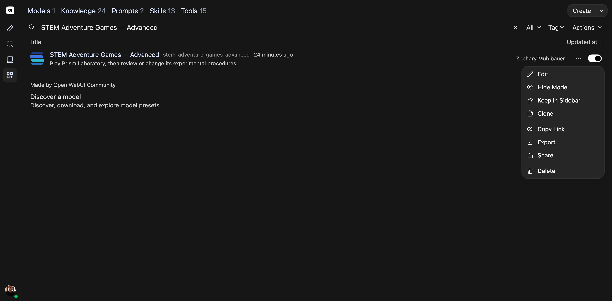

**Alt text:** Workspace Models filtered to STEM Adventure Games — Advanced, with More menu open and Clone visible.

In Workspace → Models, open ⋯ beside STEM Adventure Games — Advanced and choose Clone.

---

## Configuring skills and tools — 18

### Save Private Copy


**Alt text:** Access Control on an unsaved STEM Adventure Games copy shows Private and No access grants. Private to you.

Rename model and ID. Open Access, keep Private, and remove copied users or groups from Access List. Close Access and choose Save & Create.

---

## Configuring skills and tools — 19

### Draft Skills

Kale Skill Builder is a custom model that drafts skills for tasks you describe.

Select model ID on bottom right of message box. Choose Kale Skill Builder.

Attach [scenario instructions](examples/stem-game-skill.html) before sending this example.

```text
Draft a skill for adding an aperture comparison to STEM Adventure. Use attached scenario instructions and preserve existing game rules. Include when to use it, 3–5 steps, expected output, and two proposed tests. Do not claim unrun tests passed.
```

[Open Kale Skill Builder](https://chat.ailab.gc.cuny.edu/?model=cail-sandbox-skill-builder) · [Read tested skill](examples/stem-game-skill.html)

[Review draft evaluation](skills/reference.html#check-skill-drafts)

[Download skill instructions](examples/stem-game-skill.md)

---

## Configuring skills and tools — 20

### Create Skills


**Alt text:** Create Skill form in Workspace with empty name, identifier, description, and Instructions fields; outline marks Instructions.

Open Workspace → Skills → Create. Name your skill and add an identifier and description. Paste your saved draft into Instructions, review Access, and choose Save & Create.

---

## Configuring skills and tools — 21

### Attach Skills

- Open your private copy under **Workspace → Models**.

- Replace Extend STEM Adventures with your saved draft under **Skills**. Update System Prompt to name your skill.

- Set **Function Calling** to **Native** under **Advanced Parameters**.

- Select **Save & Update** and test a request that uses your skill.

Native function calling lets your model call tools and load attached skill instructions.

[Attach skills](https://ailab.gc.cuny.edu/sandbox-docs/tools-skills/)

---

## Configuring skills and tools — 22

### Extend Procedures

Open your private copy. Attach [Prism Laboratory JSON](examples/adventure/prism.html) and enable your saved draft under **Integrations → Skills**. Send this request.

```text
Add an aperture comparison to Prism Laboratory using Newton: Experimental Variants. Keep existing rooms and actions. Provide scenario JSON, a winning command sequence, and one command that must fail before its prerequisite. Open the revised game.
```

[Read skill instructions](examples/stem-game-skill.html) · [Download tested scenario](examples/adventure/aperture.json)

[Download Prism Laboratory](examples/adventure/prism.json)

---

## Configuring skills and tools — 23

### Test Skills

Use your private copy for both tests. Remove any additional skills from this copy before comparing your draft.

- Remove your skill under **Workspace → Models → Skills**. Save, start a new chat, and confirm it is off under **Integrations → Skills**. Repeat your extension request with Prism Laboratory JSON attached.

- Attach your skill again, save, and repeat that request in another new chat. Attach Prism Laboratory JSON and enable your saved draft under Integrations → Skills.

- Keep base model, system prompt, sources, and tool unchanged.

- Run winning and blocked commands. Compare expected and observed results.

Save generated scenarios and play records.

---

## Configuring skills and tools — 24

### Create Adventure Tools

CAIL Tool Creator is a custom model that drafts Python tools for tasks you describe. Save its output as a draft for review and testing. Use tested STEM Adventure code for installation in this workshop.

```text
Create a minimalist text adventure tool for Open WebUI. Return an interactive HTMLResponse and a description for the model. Track rooms, inventory, prerequisites, and completion. Use one command line with help, undo, restart, save, load, and discuss commands. Keep scenario JSON separate from executable code.
```

[Open CAIL Tool Creator](https://chat.ailab.gc.cuny.edu/?model=cail-sandbox-tool-creator) · [Download tested tool](examples/tools/stem_adventure.py)

[Review code evaluation](skills/reference.html#check-generated-code)

---

## Configuring skills and tools — 25

### Install Tool Code

- Open **Workspace → Tools → Create**.

- Enter a unique Name and ID, then add a Description.

- Paste provided [tested STEM Adventure code](examples/tools/stem_adventure.html). Save your creator draft for separate review.

- Select **Save & Create**.

- In your private model, replace STEM Adventure under **Tools** with your installed copy. Update System Prompt to name it and select **Save & Update**.

---

## Configuring skills and tools — 26

### Inspect Tool Results

Start a new chat with your private model. Under Integrations → Tools, select only your installed adventure tool. Send Begin Prism Laboratory, then open its tool-call details.

- Check which scenario was passed to render_stem_adventure.

- Compare returned result with your request.

- Confirm displayed game matches that scenario.

Save any error before revising your request.

---

## Configuring skills and tools — 27

### Compare Game Records

Attach saved play records from original and revised games, then send this request.

```text
Review both play records. Which commands and prerequisites changed? Which observations were programmed? Which historical claims can the uploaded sources support?
```

Check your model’s account against commands and source passages. Keep expected and observed results separate.

---

## Configuring skills and tools — 28

### Record Test Results

| Record | Include |
| --- | --- |
| Configuration | Model ID, system prompt, documents, skill instructions, and enabled tools. |
| Action | Request, instructions used, tool calls and results, and final response. |
| Judgment | What you expected, what happened, and any change you plan to test. |

Before sharing, confirm others can access your model, collections, skills, and tools. Repeat relevant tests after updates.

---

## Configuring skills and tools — 29

### Repeat Tests

- Save prompts, sources, skills, and tool settings

- Compare expected and observed behavior

- Revise instructions from recorded failures

- Verify shared access with intended users

- Retest after model or tool updates

[Browse system-prompt examples](examples.html) · [Return to Composing system prompts](.)
