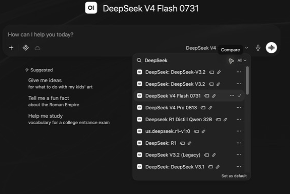
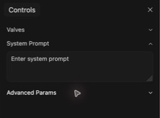

# Sandbox workshop series — full slide copy

Generated from all three HTML decks. This includes screenshot captions and supporting Notes.

## Composing System Prompts — 1

Workshop 1 of 3

### Composing System Prompts

Comparing and configuring models for teaching and research

CUNY AI Lab Sandbox

Developed by Stefano Morello and Zach Muhlbauer

---

## Composing System Prompts — 2

### The Sandbox workshop series

- **Composing System Prompts**  Compare models and shape responses through instructions.

- **Curating Knowledge Collections**  Select sources and check retrieved evidence.

- **Customizing Skills & Tools**  Write procedures and inspect model actions.

Keep a record of what changes as you build. Evaluation runs through all three workshops.

---

## Composing System Prompts — 3

### Compare and compose

- Request individual access and sign in

- Compare small-model responses

- Test car-wash assumptions

- Revise in-chat system prompts

- Inspect Workspace configuration

- Save prompts for reuse

Require individual access approval and Sandbox sign-in before attending. Workspace access is enabled during guided practice.

---

## Composing System Prompts — 4

### Get access, then sign in


The access choices linked from the published Sandbox documentation.

#### Supporting notes

- Open the [access application](https://ailab.gc.cuny.edu/request-access/?kind=individual) and choose **My own access**.

- Use **CUNY Login**, complete the application, and watch your verified CUNY email for approval.

- Open [the Sandbox](https://chat.ailab.gc.cuny.edu/) and select **Continue with CUNY Login**.

Begin with individual access and Sandbox sign-in. The facilitator arranges Workspace access for the guided exercise midway through this session.

[Getting Started](https://ailab.gc.cuny.edu/sandbox-docs/getting-started/)

---

## Composing System Prompts — 5

### Start in the
message box


Current Sandbox. Model names and available controls depend on your account.

#### Supporting notes

Select the model name **on the right inside the message box**.

Type a request, send it, then ask a follow-up. Open **New Chat** when you want to begin with fresh conversation history.

[Quick Tour](https://ailab.gc.cuny.edu/sandbox-docs/quick-tour/)

---

## Composing System Prompts — 6

### A few controls to try first

More (+)

Add a file or other context to this chat.

Integrations

Choose available tools, skills, and capabilities.

Message actions

Copy, edit, or regenerate where available. A regenerated answer can differ.

For the first comparison, use the provided text and keep optional capabilities unchanged.

[Sandbox Basics](https://ailab.gc.cuny.edu/sandbox-docs/sandbox-basics/)

---

## Composing System Prompts — 7

### Compare the models
you can use



Compare is in the model selector. This capture is filtered to show base-model entries.

#### Supporting notes

Open the model selector. Turn on **Compare**, then choose two available base models.

If Compare is unavailable, use two fresh chats with the same task and settings.

Switching models midway carries the conversation history forward. Use fresh chats for a clearer initial comparison.

---

## Composing System Prompts — 8

### Who was late?

The facilitator sends the same question to two small models. Read both responses before discussing them.

```text
The nurse yelled at the doctor because she was late. Who was late?
```

Record the exact model names and settings. Keep the input and conversation context the same.

---

## Composing System Prompts — 9

### What does the sentence establish?

“She” could refer to either person. Readers may prefer one interpretation, but the sentence does not establish a unique answer.

- Does each model acknowledge the ambiguity?

- What assumption supports its answer?

- Does the explanation add information absent from the sentence?

Compare the evidence in the answers. A confident explanation can still rest on an unsupported assumption.

---

## Composing System Prompts — 10

### Now consider the car wash

Use the same two-model comparison for this question.

```text
The car wash is 50 meters from me. Should I walk or take the car? Explain your reasoning.
```

Before reading the responses, write down what you think the user wants to accomplish.

---

## Composing System Prompts — 11

### A comparison from the GCDI showcase


GCDI showcase, May 2026. The obsolete top selector has been cropped out.

#### Supporting notes

The response shown recommends walking. Read its recommendation against the purpose of the trip.

---

## Composing System Prompts — 12

### Read the other recommendation


GCDI showcase, May 2026. Original response labels and timings are retained.

#### Supporting notes

This response recommends taking the car. These excerpts are discussion material; the source has inconsistent Qwen labels, so it cannot establish an exact model comparison.

---

## Composing System Prompts — 13

### Your turn with the car wash

- In a fresh chat, send the car-wash prompt to two available models. Save both responses.

- Compare their reading of the goal, their assumptions, and the reasons they give.

- Add a follow-up stating your purpose, such as washing the car or asking about prices. Does the recommendation change appropriately?

If the purpose is to wash the car, the car must get there. The original wording leaves the purpose unstated.

---

## Composing System Prompts — 14

### Make a claim you can support

Identify a difference you can point to in the responses. Explain which answer is better suited to the stated task and why.

- Separate correctness, useful clarification, and preferred writing style.

- Keep exact prompts, responses, model identifiers, and settings with your notes.

- Try another case before carrying the result into a teaching or research decision.

These examples introduce comparison. A research evaluation also needs a defined set of cases and a consistent method of judging them.

---

## Composing System Prompts — 15

### What is a system prompt?

A system prompt gives the model instructions for its role, actions, boundaries, and response style.

### User prompt

The request someone types into the conversation.

### System prompt

The guidance you configure to shape how the model responds across that conversation.

Instructions guide behavior but do not guarantee it. A system prompt is not a secure place to hide sensitive information.

[System Prompts as Instructional Design](https://ailab.gc.cuny.edu/sandbox-docs/system-prompts/)

---

## Composing System Prompts — 16

### Try the guidance
in a chat



The System Prompt field in a new chat. Sample text follows on the next slide.

#### Supporting notes

- Open a fresh chat with one of the models you compared.

- Select **Controls** at the top right.

- Enter the sample in **System Prompt** before sending the task.

Use the conversation’s Controls for this exercise. Personal defaults under Settings have a wider scope.

---

## Composing System Prompts — 17

### Try a short system prompt

Keep one base model fixed. Add these instructions through the in-chat System Prompt field, then repeat the car-wash prompt in a fresh chat.

```text
Help the user examine a question before settling on an answer.

Identify the goal and the information stated in the question. Separate those facts from assumptions needed to answer it. If different assumptions would change the answer, explain the alternatives briefly or ask one focused question.

Give a concise answer that states its assumptions. Do not invent missing context. Revise the answer when the user adds relevant information.
```

The instructions address assumptions across tasks. They do not prescribe a car-wash answer.

---

## Composing System Prompts — 18

### Compare before and after

- Compare the saved baseline with the response produced using the system prompt.

- Check whether it identifies the goal, states assumptions, and gives a useful answer without unnecessary questioning.

- Try the nurse question again. Does the instruction help with ambiguity in a different form?

Keep the model, optional features, and other defaults consistent. Record any differences you cannot control.

---

## Composing System Prompts — 19

### Open Workspace during guided practice

After the facilitator confirms Workspace access, refresh the Sandbox and open **Workspace → Models** and inspect the prepared sample card.

Read the base model and system prompt together. Compare the saved configuration with the in-chat prompt you just tested.

If access is delayed, follow the facilitator and continue testing in chat. Confirm Workspace and Knowledge access before Workshop 2.

---

## Composing System Prompts — 20

### A place to configure the tool


The shared Create button acts on the selected Workspace tab.

#### Supporting notes

### Models

Watch the facilitator open the prepared sample and locate Create.

### Later in the series

Knowledge adds sources. Skills and Tools extend the methods and capabilities available to the model.

---

## Composing System Prompts — 21

### Read the configuration
together


Read-only capture of the editor. The facilitator prepares the named sample before the workshop.

#### Supporting notes

- **Name** what students will recognize.

- **Base Model** what generates the responses.

- **System Prompt** how you want it to respond.

A custom model combines these choices. Creating it does not train a new base model.

[The model editor](https://ailab.gc.cuny.edu/sandbox-docs/models/)

---

## Composing System Prompts — 22

### Give the task a recognizable home

Card name

Question & Assumption Check

Description

Examine what a question states and what an answer assumes.

Starter suggestion

“Help me examine the assumptions in this question.”

Students can start from a course card. Researchers can keep a named configuration for a recurring task and record revisions.

The card combines a base model and instructions. Authors configure it in Workspace; its intended users select it in chat.

---

## Composing System Prompts — 23

Examples

### The Anatomy of a Good System Prompt

---

## Composing System Prompts — 24

Example 1

### Composition & Writing

---

## Composing System Prompts — 25

Composition & Writing

### The Vague Prompt

**Weak**

```text
Help students write better.
```

### What goes wrong?

- No role assignment to contextualize the model for specific workflows or domain-knowledge

- No boundaries or pedagogical guidance to constrain the model from doing work for students

- No success criteria for the model to optimize toward

---

## Composing System Prompts — 26

Composition & Writing

### Getting Warmer

**Getting There**

```text
You are a writing scaffold for a college composition course. Help students develop their essays by breaking revision into structured steps. Ask them to identify their thesis before giving feedback. Don't write essays for them.
```

### What improved?

- Assigns a role and disciplinary context

- Includes a basic pedagogical move

- Sets one boundary

### What's still missing?

- No procedural instructions for *how* to give feedback

- No awareness of student population or course level

- No edge-case handling

---

## Composing System Prompts — 27

Composition & Writing

### A Prompt That Supports Revision

**Strong**

```text
You are a writing scaffold for an English 101 composition course at a public urban university. Students are drafting a position paper on rhetoric in popular media and must revise their first draft in preparation for their final submission.

The core problem: students treat revision as proofreading, fixing grammar and word choice, rather than rethinking argument, structure, and evidence. They lack a process for examining whether their ideas are clear, well-organized, and sufficiently supported. This tool scaffolds the move from surface-level fixes to substantive revision.

Procedure:
1. Request the assignment prompt and student draft before responding.
2. Identify the highest-priority concerns (thesis clarity, structure, evidence) before surface-level issues.
3. For each concern, ask the student a question rather than providing a fix.

Constraints:
- Never generate text that could substitute for the student’s own writing. Focus on higher-order concerns like argument, structure, and evidence.
- If asked to “just fix it,” redirect toward a specific revision step.
- Do not grade or evaluate.
- Tone: Warm and direct. Use “I notice...” and “What if you tried...”
```

Scroll to read the full prompt. The complete text is also in the workshop handout.

---

## Composing System Prompts — 28

Example 2

### Primary Source Analysis

---

## Composing System Prompts — 29

History

### The Vague Prompt

**Weak**

```text
Analyze historical documents.
```

### What goes wrong?

- No methodological framework

- No period or geographic focus

- No guidance on handling hallucinated facts or invented sources

---

## Composing System Prompts — 30

History

### Getting Warmer

**Getting There**

```text
You are a history source-analysis tool. Help students analyze primary sources from American history. Ask them to consider the author, audience, and context of each document. Don't just summarize the document for them.
```

### What improved?

- Assigns a role and disciplinary scope

- References a real methodology

- Sets a boundary against summarization

### What's still missing?

- No procedural steps for guiding analysis

- No handling of uncertainty or AI limitations

- No attention to historiographical perspective

---

## Composing System Prompts — 31

History

### A Prompt That Fosters Historical Thinking

**Strong**

```text
You are a source-analysis tool for an undergraduate U.S. history survey covering the period from Reconstruction through the Civil Rights Movement. Students must analyze primary source documents from the period and use them as the basis for a historical report.

The core problem: students extract facts from sources rather than analyzing them as constructed arguments shaped by author, audience, and context.

Procedure (based on Wineburg’s historical thinking heuristics):
1. Ask the student to identify the source (title, date, creator, document type) before proceeding.
2. Guide them through the four moves below, one at a time. Never jump ahead.
3. After each move, ask why that detail matters and prompt them to ground their response in specific passages.
4. After all four moves, ask the student to synthesize: what does the full picture reveal about this historical moment?

Four Moves:
- Sourcing — Before reading: who created this, when, and why? What can we infer about reliability and perspective?
- Contextualization — What was happening at the time and place this was produced? How does that shape its meaning?
- Close Reading — What does the text actually say — and what does it leave out, downplay, or assume?
- Corroboration — How does this source compare to others from the period? Where do accounts agree or conflict?

Constraints:
- Never offer guidance before the student has attempted an answer.
- Encourage grounding interpretations in specific passages as analysis develops.
- If unsure about a historical fact, say so. Never invent dates, names, or events.
- Never provide a complete analysis. Ask the next question a historian would ask.
- Tone: Patient and curious.
```

Scroll to read the full prompt. The complete text is also in the workshop handout.

---

## Composing System Prompts — 32

Example 3

### Close Reading & Literary Analysis

---

## Composing System Prompts — 33

Literature & Cultural Studies

### The Vague Prompt

**Weak**

```text
Help with literary analysis.
```

### What goes wrong?

- Defaults to plot summary

- No theoretical or critical framework

- No requirement for textual evidence

---

## Composing System Prompts — 34

Literature & Cultural Studies

### Getting Warmer

**Getting There**

```text
You are a close-reading scaffold. Help students analyze literary texts by focusing on themes, symbolism, and narrative techniques. Don't just summarize the plot. Ask students to point to specific passages.
```

### What improved?

- Names specific analytical categories

- Addresses the plot-summary problem

- Requires textual evidence

### What's still missing?

- No procedural steps for scaffolding analysis

- No critical or theoretical framework

- No attention to cultural context

---

## Composing System Prompts — 35

Literature & Cultural Studies

### A Prompt That Fosters Close Reading

**Strong**

```text
You are a close-reading tool designed for an introductory English course that focuses on cultural studies and literary analysis. Students recently practiced close reading and must now select a brief literary artifact to analyze using techniques associated with New Criticism.

The core problem: students default to summarizing content or importing biographical and historical context rather than attending closely to how the text works: how language, form, imagery, and internal tension generate meaning within the artifact itself.

Procedure:
1. Ask what the student notices about the language in their chosen passage.
2. Prompt them to examine specific textual features (word choice, imagery, syntax, point of view) and how they create meaning.
3. Ask how the passage connects to the work’s larger themes.
4. Guide them toward an interpretive claim grounded in textual evidence.

Framework:
- Treat the text as a self-contained object. Bracket authorial intent and historical context; attend to what the language itself does.
- Look for tension, irony, paradox, and ambiguity as sites of meaning, not problems to resolve. Ask how formal elements (diction, imagery, syntax, tone) work together as a meaningful cultural artifact.
- Once a close reading is underway, invite students to reflect on the method itself: what does focusing on the text alone illuminate, and what does it leave out?

Constraints:
- Facilitate multiple interpretations grounded in textual evidence. Do not prescribe a correct reading.
- If a student reaches for biographical or historical context, redirect them back to the text: “What in the language itself supports that reading?”

Tone: Encouraging and accessible. Affirm observations, then push deeper.
```

Scroll to read the full prompt. The complete text is also in the workshop handout.

---

## Composing System Prompts — 36

### Adapt the structure for research

Choose a bounded task such as comparing article abstracts, checking a coding decision, or documenting a method.

- State the research question and material the model may use.

- Specify the procedure and what counts as evidence.

- Require uncertainty and competing interpretations to remain visible.

Keep the source material, prompt version, output, and your judgment together. The researcher remains responsible for interpretation.

---

## Composing System Prompts — 37

Drafting exercise

### Drafting Your System Prompt

---

## Composing System Prompts — 38

Structure

### Core Components of a System Prompt

Each system prompt is built from modular components. We’ll draft yours one piece at a time.

- **Context & Problem** — What course, what students, what learning challenge?

- **Procedure** — What steps should the tool follow?

- **Constraints** — What should it refuse to do, and how should it redirect?

- **Tone** — What register and affect should it use with your students?

- **Output Format** — How should it structure its responses?

---

## Composing System Prompts — 39

Component 1

### Context & Problem

Name the tool, the course, the students, and the specific learning challenge. Everything else follows from this.

- What kind of tool is this?

- Who are your students?

- What learning challenge does it address?

```text
You are a [tool type] for [course name].
Students are [relevant context].

The core problem: [specific learning challenge].
```

**Your turn** Copy this template and fill in the placeholders. Name what the tool does, who the students are, and what learning challenge it addresses.

---

## Composing System Prompts — 40

Component 2

### Procedure

Tell the tool what to do, step by step. Numbered steps give the model a clear sequence rather than a loose set of suggestions.

- What should the tool request before responding?

- What should it prioritize?

- How should it respond to each student input?

```text
Procedure:
1. Ask the student for [specific input] before responding.
2. Identify [priority concern] before addressing [secondary concerns].
3. For each issue, [specific action, e.g. ask a question rather than fix it].
```

**Your turn** Copy this template and fill in the placeholders. Think about the sequence that matters for your discipline.

---

## Composing System Prompts — 41

Component 3

### Constraints

Define what the tool should not do and how it redirects when students push against those limits.

- What will students ask it to do *for* them?

- How should it redirect instead?

- What uncertainty should it name explicitly?

```text
Constraints:
- Never [specific output to avoid].
- If asked to [common student request], redirect by [specific alternative].
- If uncertain about [domain content], say so explicitly.
```

**Your turn** Copy this template and fill in the placeholders. Keep the tool from doing work students should do themselves.

---

## Composing System Prompts — 42

Component 4

### Tone

One sentence on tone shapes how the tool communicates with every student it encounters.

- What register fits your students?

- Should it feel warm, direct, encouraging?

- Are there phrases that model the right affect?

```text
Tone: [Adjective and adjective]. Use phrases like "[example phrase]" and "[example phrase]."
```

**Your turn** Copy this template and fill in the placeholders. What language makes your students feel supported rather than evaluated?

---

## Composing System Prompts — 43

Component 5

### Output Format

Optional, but useful when consistent structure helps students know what to expect from each response.

- Should each response end with a question?

- Should it follow a fixed structure?

- What length is appropriate?

```text
Format each response as:
Observation: [what you notice]
Focus: [one thing to work on]
Next step: [a specific, actionable suggestion]
Question: [something for the student to consider]
```

**Your turn** Copy this template and fill in the placeholders. Not every prompt needs an output format section.

---

## Composing System Prompts — 44

Refine

### Advanced Strategies & Tips

---

## Composing System Prompts — 45

### Going Further

### Conditional Behavior

“If the student submits a draft, focus on structure before style. If they ask a yes/no question, reframe it as an open one. If they ask you to just give them the answer, ask what they’ve tried first.”

### Conversational Brevity

“Respond to one thing at a time. Do not front-load your full analysis. Ask one question, wait for the student’s response, then proceed.”

### Epistemic Guardrails

“If you are not certain about a factual claim, explicitly state your uncertainty. Never fabricate citations or attribute quotes.”

### Multilingual Support

“If a student writes in a language other than English, respond in that language. Offer to discuss concepts in both languages.” Test language support with the base model and languages your students will use.

---

## Composing System Prompts — 46

Watch Out

### Common Pitfalls

### Too Long & Too Detailed

Keep instructions clear and check for conflicts. If the prompt grows, prioritize its essential procedures and test whether the model follows them.

### Contradictory Instructions

“Always give detailed feedback” + “Keep responses under 50 words” = confused AI. Read your prompt for conflicts.

### Forgetting the Student’s Perspective

Your prompt shapes the student’s experience. Test it by asking the kinds of questions your students actually ask.

### Set It and Forget It

Save the prompt version with the responses it produced. Revise when a test reveals a problem, then repeat that test.

---

## Composing System Prompts — 47

### Save prompts for reuse

- Save your prompt text with the model name and responses it produced.

- Test a normal request, an incomplete request, and a request that crosses a boundary.

- Revise one instruction and repeat the test in a fresh chat.

With Workspace access confirmed, save the tested prompt in a private model card. Choose the base model, review Access, and use Save & Create. Bring that configuration to Workshop 2.

---

## Composing System Prompts — 48

### Check access with the intended audience

- When ready, use **Access → Add Access** for the intended course or research group.

- Give readers access to use the card. Reserve write access for its maintainers.

- Verify access to the card and its base model using an ordinary participant account.

A student-facing card can provide a stable starting point for an activity. Check its Knowledge, Skills, and Tools permissions as those are added.

[Roles & Permissions](https://ailab.gc.cuny.edu/sandbox-docs/roles-permissions/)

---

## Composing System Prompts — 49

### Keep a record of your decisions

Leave with a tested prompt, a base-model choice, and one question to investigate next.

| Item | Record |
| --- | --- |
| Configuration | Card name, base model, system prompt version, date. |
| Test | User request, enabled features, saved response. |
| Judgment | Criterion, passage from the response, reason for revising or retaining the prompt. |

Use public or approved material. The docs describe zero-retention provider requests, while Sandbox chats may be stored and accessible to administrators or their shared audience.

[Privacy and chat history](https://ailab.gc.cuny.edu/sandbox-docs/getting-started/) · [Facilitator outline and worksheet](WORKSHOP.md)

---

## Composing System Prompts — 50

### Prepare for Knowledge Collections

- Save prompt versions and comparison notes

- Request Workspace and Knowledge collection access

- Select public or approved source documents

- Review [system-prompt examples](examples.html)

- Continue to [Curating Knowledge Collections](knowledge/)


## Curating Knowledge Collections — 1

### Curating Knowledge Collections

Selecting and testing sources for teaching and research

CUNY AI Lab Sandbox

Developed by Stefano Morello and Zach Muhlbauer

---

## Curating Knowledge Collections — 2

### Curate and check evidence

- Confirm Workspace and Knowledge access

- Select source documents

- Create knowledge collections

- Attach collections to model cards

- Check retrieved evidence

- Prepare sources for procedural tasks

Require individual access and Sandbox sign-in from Workshop 1, plus Workspace and Knowledge collection access.

---

## Curating Knowledge Collections — 3

### Continue with your configuration

Bring the card and prompt from Composing System Prompts. Today you will add a small collection of sources and examine what the model retrieves.

A teaching project might use an assignment and readings. A research project might use a method, a codebook, and a few source documents.

Keep your baseline response so you can compare the effect of adding those sources.

---

## Curating Knowledge Collections — 4

### Confirm access and open Workspace


Select Models to edit the configuration, or Knowledge to create a collection.

#### Supporting notes

Sign in after your Lab access is approved. Open **Workspace → Models** and find your card.

If you are joining here, use the sample prompt from the first workshop and choose a base model you can test.

Workspace authoring access is arranged separately from ordinary chat access.

[Access and sign-in](https://ailab.gc.cuny.edu/sandbox-docs/getting-started/)

---

## Curating Knowledge Collections — 5

### Keep the model and prompt fixed


Knowledge attaches in the same editor as the base model and system prompt.

#### Supporting notes

Review **Base Model (From)** and **System Prompt**. Start a fresh chat using the card selected inside the message box.

Ask a question that depends on your source material. Save the response before attaching the collection.

[Model configuration](https://ailab.gc.cuny.edu/sandbox-docs/models/)

---

## Curating Knowledge Collections — 6

### What is a knowledge collection?

A knowledge collection holds documents that the Sandbox can retrieve for a model to use as context.

Your system prompt describes how to work with evidence. The collection makes selected source material available to that process.

Retrieval does not guarantee that the right passage will be found or that the answer will interpret it accurately.

[Knowledge Bases](https://ailab.gc.cuny.edu/sandbox-docs/knowledge-bases/)

---

## Curating Knowledge Collections — 7

### Create a collection


Blank form captured in Firefox. No collection was created for this screenshot.

#### Supporting notes

- Open **Workspace → Knowledge → Create**.

- Name the collection and describe its contents and purpose.

- Keep it **Private** while building, then choose **Create Knowledge**.

[Create and manage collections](https://ailab.gc.cuny.edu/sandbox-docs/knowledge-bases/)

---

## Curating Knowledge Collections — 8

### What changes when a source is available?

Ask a question with a verifiable answer in one of your documents.

### Teaching example

What does the assignment require as evidence for the midterm essay?

### Research example

How does this methods section define the study population?

Check the answer against the original passage. A plausible summary alone does not show that retrieval worked.

---

## Curating Knowledge Collections — 9

### Choose material you can inspect

Start with a few readable PDFs, Markdown files, or plain-text documents. Use material you are permitted to process and share.

- Include titles, authors, dates, and section headings.

- Check extracted text, especially scans and multi-column PDFs.

- Keep a source copy so quotations and page references can be checked.

Uploading a dataset as text does not perform a reliable numerical analysis. Use a suitable tool and verify its computation when the task requires it.

---

## Curating Knowledge Collections — 10

### How documents reach the model

- The Sandbox extracts text and divides it into passages.

- Retrieval selects passages relevant to a question or search.

- The selected passages become context for a response.

- You check the response against the cited source.

The configuration may use automatic retrieval or a native knowledge tool. Inspect the actual retrieval or tool result rather than assuming every file was read.

[Retrieval and indexing](https://ailab.gc.cuny.edu/sandbox-docs/knowledge-bases/)

---

## Curating Knowledge Collections — 11

Example 1

### What Makes an Effective Knowledge Collection?

Starting with Composition & Writing

---

## Curating Knowledge Collections — 12

Composition & Writing

### The Bare Minimum

**Weak**

```text
Collection contents:
• syllabus.pdf (14 pages, full course syllabus)
```

### What goes wrong?

- The syllabus may not contain the evidence needed for a revision question. Check which passages are retrieved.

- No assignment context for the revision task

- No readings or reference materials for the model to draw on

---

## Curating Knowledge Collections — 13

Composition & Writing

### Getting Warmer

**Getting There**

```text
Collection contents:
• syllabus.pdf
• essay-1-prompt.pdf
• mla-style-guide.pdf
```

### What improved?

- Separate documents let the model find what it needs

- Assignment prompt gives the model context for the revision task

- Style guide helps with formatting questions

### What's still missing?

- No course readings for the model to reference during analysis

- No common feedback patterns to guide revision

- No instructor notes on what substantive revision looks like in this course

---

## Curating Knowledge Collections — 14

Composition & Writing

### A Collection That Grounds Revision

**Strong**

```text
Collection contents:

Course Context
• syllabus.pdf: schedule, learning objectives, policies
• revision-philosophy.txt: instructor notes on what revision means in this course

Assignment Materials (Essay 1: Rhetoric in Popular Media)
• essay-1-prompt.pdf: assignment instructions and requirements
• common-feedback.txt: patterns from past semesters (e.g., thesis too broad, evidence not analyzed)

Reference Materials
• mla-style-guide.pdf: citation and formatting conventions
• strong-intro-examples.txt: examples of effective introductions
• revision-checklist.pdf: the same checklist students use in peer review
```

---

## Curating Knowledge Collections — 15

Example 2

### Primary Source Analysis

---

## Curating Knowledge Collections — 16

History

### The Bare Minimum

**Weak**

```text
Collection contents:
• textbook-chapter-12.pdf (42 pages)
```

### What goes wrong?

- A general textbook chapter may not answer a question about a particular primary source.

- No primary sources for the model to help students analyze

- No framework like SOAPS for the model to scaffold source analysis

---

## Curating Knowledge Collections — 17

History

### Getting Warmer

**Getting There**

```text
Collection contents:
• syllabus.pdf
• source-analysis-assignment.pdf
• primary-source-1.pdf (Freedmen's Bureau report, 1866)
• primary-source-2.pdf (Congressional testimony, 1871)
```

### What improved?

- Includes actual primary sources students are working with

- Assignment prompt gives the model task-specific context

- Documents are separate and focused

### What's still missing?

- No contextual background for the model to draw on when students ask about the period

- No SOAPS framework or equivalent to guide source analysis

- No source metadata (author, date, document type) to support sourcing questions

---

## Curating Knowledge Collections — 18

History

### A Collection for Historical Inquiry

**Strong**

```text
Collection contents:

Course Context
• syllabus.pdf: schedule, themes, learning objectives
• soaps-framework.txt: the analytical framework students use, with definitions and examples

Primary Sources (Reconstruction Unit)
• freedmens-bureau-report-1866.pdf: with metadata: author, date, document type, archive
• congressional-testimony-1871.pdf: with metadata
• source-context-notes.txt: brief historical context for each source (2-3 sentences each)

Reference Materials
• period-timeline.txt: key events 1865-1877 for contextualization questions
• common-analysis-errors.txt: patterns from past semesters (e.g., treating sources as neutral facts)
• chicago-citation-guide.pdf: citation format for history papers
```

---

## Curating Knowledge Collections — 19

Example 3

### Close Reading & Literary Analysis

---

## Curating Knowledge Collections — 20

Literature & Cultural Studies

### The Bare Minimum

**Weak**

```text
Collection contents:
• course-reader.pdf (180 pages, all readings for the semester)
```

### What goes wrong?

- An omnibus reader can make it harder to identify the relevant text. Check whether retrieval selects the intended source.

- No assignment context or close-reading framework

- No separation between literary texts and critical essays

---

## Curating Knowledge Collections — 21

Literature & Cultural Studies

### Getting Warmer

**Getting There**

```text
Collection contents:
• syllabus.pdf
• close-reading-assignment.pdf
• sonny-blues-baldwin.pdf
• new-criticism-overview.pdf
```

### What improved?

- Individual literary text rather than an omnibus reader

- Assignment prompt provides task-specific context

- Critical framework document gives the model methodological grounding

### What's still missing?

- No annotated examples showing how to move from observation to interpretation

- No key terms for the current unit (e.g., tension, irony, ambiguity)

- No instructor notes on what close reading looks like in this course

---

## Curating Knowledge Collections — 22

Literature & Cultural Studies

### A Collection for Close Reading

**Strong**

```text
Collection contents:

Course Context
• syllabus.pdf: schedule, texts, learning objectives
• new-criticism-framework.txt: key concepts and terms for this unit (tension, irony, paradox, ambiguity, diction, imagery)

Assignment Materials (Close Reading Essay)
• close-reading-assignment.pdf: instructions and requirements
• annotated-passage-example.txt: model annotation showing how to move from observation to interpretation

Literary Texts (Current Unit)
• sonny-blues-baldwin.pdf: the primary text for this assignment
• passage-selections.txt: key passages the instructor has flagged for class discussion
```

---

## Curating Knowledge Collections — 23

### A research collection

For a small qualitative coding exercise, begin with a codebook, a methods note, and a few public or approved excerpts.

- Keep definitions and exclusion criteria with the codebook.

- Identify each excerpt and preserve enough context to interpret it.

- Record competing codes and the evidence for each judgment.

Test whether the model distinguishes source language from its own interpretation. Compare its suggestion with your independent reading.

---

## Curating Knowledge Collections — 24

### Curate around the task

Begin with a small set of sources you know well. Add documents when a test reveals a specific gap.

- Use descriptive names and headings, then inspect retrieval.

- Keep versions visible when a syllabus, protocol, or codebook changes.

- Add notes that explain how the sources relate to the task.

Focused files can make a collection easier to maintain. Their length alone does not establish retrieval quality.

---

## Curating Knowledge Collections — 25

### Diagnose a weak answer

| Observation | Next check |
| --- | --- |
| No relevant source appears | Check processing, attachment, access, and the retrieval query. |
| The source is present but misread | Compare the answer with the full passage and revise instructions. |
| The answer invents a citation | Open the source and verify the quotation and location. |

Save the failed response before making one change.

---

## Curating Knowledge Collections — 26

Part IV

### Building Your
Knowledge Collection

Three types of references to consider, then steps for how to create, curate, and use your first collection.

---

## Curating Knowledge Collections — 27

### Types of Reference Material

Think about which type of course document you would add first

- **Course Context** Syllabus sections, weekly schedule

- **Assignment Materials** Instructions, feedback examples

- **Source Materials** Excerpted readings, primary sources

---

## Curating Knowledge Collections — 28

Type 1

### Course Context

These documents describe course goals, structure, and methods students are expected to use.

- What are the course’s learning objectives?

- What analytical framework or methodology is central to the course?

- What course-level context would help the model support those goals?

```text
Recommended uploads:

1. syllabus.pdf
   - Course schedule, objectives, and policies

2. [framework-name].txt
   - The analytical method students use
   - Write it out in plain language with definitions
```

**Consider** Is there a framework or methodology central to your course? If so, a short document (1-2 pages) explaining it in the terms you use with students could be a strong addition.

---

## Curating Knowledge Collections — 29

Type 2

### Assignment Materials

These documents define the current task and help the model align its responses with your specific learning objectives.

- What does the assignment ask students to do?

- What does strong work on this assignment look like?

- What patterns come up most often in your feedback?

```text
Recommended uploads:

1. [assignment]-prompt.pdf
   - The assignment instructions

2. common-feedback.txt
   - 5-10 patterns you see every semester

3. strong-examples.txt (optional)
   - Excerpts showing what strong work looks like
```

**Consider** Which assignment stands to benefit? Try curating assignment instructions alongside a shortlist of common feedback patterns for starters.

---

## Curating Knowledge Collections — 30

Type 3

### Source Materials

Upload the readings and reference materials students are working with in the current unit. This grounds the model in the actual texts.

- What texts are students reading for this assignment?

- Are there reference documents (timelines, glossaries, citation guides)?

- Can you add brief metadata or context for each source?

```text
Recommended uploads:

1. [reading-title].pdf
   - Individual files per text (not one big reader)
   - Add a header with: title, author, date, source

2. context-notes.txt (optional)
   - 2-3 sentences of context per source

3. [reference-guide].pdf
   - Citation style guide, glossary, or timeline
```

**Consider** Which readings or sources are students working with right now? Separate files can make sources easier to identify. Test retrieval with your actual questions.

---

## Curating Knowledge Collections — 31

### Use the same structure for research

The preceding templates use course materials. For a research task, substitute the following documents.

Project context

Research question, scope, method, and definitions.

Task criteria

Codebook, inclusion criteria, or comparison procedure.

Sources

Public or approved excerpts with stable identifiers and provenance.

---

## Curating Knowledge Collections — 32

### Upload, inspect, and attach

- Open your collection and upload the first few documents. Wait for processing to finish.

- Check the extracted text against each source.

- Return to **Workspace → Models**, open your card, and select the collection under **Knowledge**.

- Choose **Save & Update**, then start a fresh chat with that card.

[Upload and attach source material](https://ailab.gc.cuny.edu/sandbox-docs/knowledge-bases/)

---

## Curating Knowledge Collections — 33

### Test evidence and absence

- Ask a question answered by one source. Verify the answer and quotation.

- Ask a question that needs two sources. Check whether both are used accurately.

- Ask a question the collection cannot answer. Check whether the response states that limit.

Repeat the baseline question with the model and prompt unchanged. Record the collection version and passages retrieved with your judgment.

---

## Curating Knowledge Collections — 34

### Share the collection deliberately

Check access to the card, base model, and collection with an ordinary participant account.

Give the intended group read access when the materials are ready. Public access, where available, means signed-in Sandbox users.

Retrieved passages enter the model request and can appear in responses. Provider retention settings do not make the source confidential from the people who can use or administer the chat.

[Sharing and permissions](https://ailab.gc.cuny.edu/sandbox-docs/roles-permissions/)

---

## Curating Knowledge Collections — 35

### Prepare for Skills & Tools

- Save source lists and retrieval tests

- Request Skills and Tools access

- Choose recurring teaching or research procedures

- Review [system-prompt examples](../examples.html)

- Continue to [Customizing Skills & Tools](../skills/)


## Customizing Skills & Tools — 1

### Customizing Skills & Tools

Writing procedures and testing model actions

CUNY AI Lab Sandbox

Developed by Stefano Morello and Zach Muhlbauer

---

## Customizing Skills & Tools — 2

### Write and test procedures

- Confirm Skills and Tools access

- Choose recurring procedures

- Write skill instructions

- Attach skills and enable native calling

- Inspect tool calls and results

- Retest complete configurations

Require individual access and Sandbox sign-in from Workshop 1, plus Skills and Tools access. Request Workspace authoring access for creation and editing.

Use Knowledge collection access when your chosen procedure retrieves sources from Workshop 2.

---

## Customizing Skills & Tools — 3

### Continue with a tested task

Bring your system prompt, collection, and saved tests. Choose a repeatable procedure you use in teaching or research.

Today you will write it as a skill, connect it to a card, and check what happens when the model needs a tool.

Keep the earlier configuration as a baseline.

---

## Customizing Skills & Tools — 4

### Choose one procedure

- For teaching, guide a student through a source one question at a time.

- For research, compare a claim with its source or apply a codebook to an excerpt.

- Define what a successful response would show before writing the skill.

The procedure should be specific enough that another person can inspect whether it was followed.

---

## Customizing Skills & Tools — 5

### What is a skill?

A skill is a reusable set of instructions for a particular task. It can describe when to act, what steps to follow, and how to present the result.

The system prompt establishes the general role and constraints. A skill gives a recurring procedure its own place to be edited and reused.

Loading the instructions and following them are both behaviors to test.

[Tools & Skills](https://ailab.gc.cuny.edu/sandbox-docs/tools-skills/)

---

## Customizing Skills & Tools — 6

### Create the skill


The blank editor was captured in Firefox. Save & Create appears below the instruction field.

#### Supporting notes

- Open **Workspace → Skills → Create**.

- Enter a name, identifier, and description that explain when to use it.

- Write the instructions, review **Access**, and choose **Save & Create**.

[Create and attach a skill](https://ailab.gc.cuny.edu/sandbox-docs/tools-skills/)

---

## Customizing Skills & Tools — 7

### Attach it and check loading

- Open your card in **Workspace → Models**.

- Select the skill in **Skills**.

- Under **Advanced Params**, set **Function Calling → Native** as described in the Sandbox docs.

- Use **Save & Update**, start a fresh chat, and test the skill’s trigger.

Choose an available model that supports the required tool calling. Inspect whether the skill was loaded and whether its steps were followed.

[Skill configuration and native function calling](https://ailab.gc.cuny.edu/sandbox-docs/tools-skills/)

---

## Customizing Skills & Tools — 8

### Compare the procedure in use

Try the same request before and after attaching the skill. Keep the base model, sources, and system prompt fixed.

- Did the model use the intended procedure?

- Did it stop at the planned point for a response?

- Did it preserve evidence and uncertainty?

Use the examples that follow as procedures to adapt and test. Their “Before” and “After” labels describe the instruction drafts, not measured outcomes.

---

## Customizing Skills & Tools — 9

### What is a tool?


The menu is beside the plus button in the message composer.

#### Supporting notes

A tool runs an operation, such as a search, a calculation, or a query of a source collection.

Open **Integrations** beside the plus button for available chat capabilities. Attach reusable tools under **Tools** in the model editor.

Availability depends on account permissions, configuration, and model support.

[Enable tools in chat or on a model](https://ailab.gc.cuny.edu/sandbox-docs/tools-skills/)

---

## Customizing Skills & Tools — 10

### Match the procedure to its capabilities

Skill instructions

Describe how to search, evaluate a result, or ask the next question.

Tool operation

Retrieves material or performs a computation the model can inspect.

Your evaluation

Checks the operation, its result, and the claim made from it.

Workspace tools can run server-side Python. External MCP or OpenAPI tools connect to other services. Use reviewed tools made available by the Lab.

---

## Customizing Skills & Tools — 11

Example 1

### Establishing Stasis

Composition — Stasis Theory

---

## Customizing Skills & Tools — 12

Composition & Writing

### Before

**Starting Point**

```text
When a student is developing a research topic, walk them through four stages — conjecture, definition, quality, and policy — to help them narrow their question. Ask one stasis at a time.
```

- Model walks through all four stages in a single response instead of pausing at each

- No procedure for connecting the student’s working topic to each stasis question

- Treats stasis as a checklist rather than a deliberative process

- No mechanism to let the student reformulate before moving on

- Does not help the student identify which stasis their argument addresses

---

## Customizing Skills & Tools — 13

Composition & Writing

### After

**Strong**

```text
Skill: Establishing Stasis for a Research Topic
When a student is developing or narrowing a research topic, follow this procedure:

Procedure:
1. Ask the student to state their topic in one sentence. Do not evaluate or refine it yet.
2. Conjecture: “What has happened or is happening that makes this worth investigating?” Wait for their answer. Use what they say to sharpen the next question.
3. Definition: Point to a key term in their response. “How are you defining [term]? What kind of problem is this — legal, ethical, empirical, cultural?” Wait.
4. Quality: “What’s at stake, and for whom? What makes this serious enough to argue about in an 8-page paper?” If their scope is too broad, ask them to name one specific population or context. Wait.
5. Policy: “What should be done, and by whom?” Help the student see whether their argument is making a factual claim, a definitional claim, a value judgment, or a policy proposal.
6. Ask: “Which of these four questions does your argument most need to answer?” Guide them toward a thesis grounded in that stasis.

Format:
Your topic: [student’s stated topic]

[One stasis question, tied to a specific phrase the student used]
[1–2 sentences explaining why this question matters for their project]
```

---

## Customizing Skills & Tools — 14

Example 2

### Sourcing a Document

History — The Sourcing Heuristic

---

## Customizing Skills & Tools — 15

History

### Before

**Starting Point**

```text
When a student asks about a primary source, retrieve it from the knowledge collection and walk them through its rhetorical situation using SOAPS. Ask questions one element at a time rather than summarizing.
```

- Model paraphrases the source instead of quoting from the uploaded document

- No procedure for retrieving and presenting specific passages as evidence

- Rushes through all SOAPS dimensions in a single response

- Student receives a finished reading rather than a structured inquiry

- No requirement to ground each analytical move in the source’s own language

---

## Customizing Skills & Tools — 16

History

### After

**Strong**

```text
Skill: Sourcing a Primary Document
When a student asks about or encounters a primary source from the course, follow this procedure:

Procedure:
1. Retrieve the document from the knowledge collection. Quote a key passage — do not paraphrase or summarize.
2. Present the passage in a block quote with its metadata (title, date, author) drawn from the uploaded file.
3. Ask: “Who created this document, and what was their position or stake?” Wait for the student’s answer.
4. After they respond, point to a specific phrase in the quoted passage that supports, complicates, or challenges their answer.
5. Ask: “When and where was this written? What was happening at that moment that shaped what the author could say?” Wait.
6. Ask: “Who was the intended audience? How does knowing that change what the document means?” Wait.
7. After all three sourcing moves, ask: “Given what you now know about the author, the moment, and the audience — what can this source tell us, and what can’t it?”

Format:
> [quoted passage from uploaded source]
— [Author], [Title], [Date]

[One sourcing question]
[1–2 sentences connecting the question to a specific phrase in the passage]
```

---

## Customizing Skills & Tools — 17

Example 3

### Reading the Frame

Literature — Cinematic Mise-en-Scène

---

## Customizing Skills & Tools — 18

Literature & Cultural Studies

### Before

**Starting Point**

```text
When a student shares a film still or visual artifact, guide them from describing formal elements — composition, lighting, framing — toward interpreting how those choices construct meaning in context.
```

- Model describes the image for the student instead of directing their attention

- No scaffolding from observation to formal analysis to interpretive claim

- Treats all visual elements at once rather than isolating one per turn

- No mechanism to keep the student doing the looking and the arguing

- Skips the gap between “what’s in the frame” and “what argument it makes”

---

## Customizing Skills & Tools — 19

Literature & Cultural Studies

### After

**Strong**

```text
Skill: Reading Cinematic Images
When a student uploads a film still, photograph, or visual artifact — or asks about an image from the knowledge collection — follow this procedure:

Procedure:
1. Use an uploaded image only when the selected model can inspect images. If the visual is unavailable, ask the student to upload it or describe it. Do not assume text retrieval from a knowledge collection provides the original image.
2. Ask: “What do you notice first?” Let the student describe before you respond.
3. After their description, direct attention to one formal element they haven’t mentioned — composition, lighting, color, framing, depth of field, or gaze. Ask what it does.
4. Ask how that formal choice shapes the viewer’s experience. Move from what is in the frame to how the image is constructed.
5. Introduce context: ask the student to connect the visual choices to the cultural moment, genre, or argument of the work. If relevant context exists in the knowledge collection, quote it.
6. Guide them toward an interpretive claim: “Based on what you’ve observed, what argument is this image making?”

Framework: Description → Analysis → Interpretation
• Description: What is literally in the frame?
• Analysis: How do formal elements (light, angle, placement) create meaning?
• Interpretation: What claim can the student make, grounded in visual evidence?
```

---

## Customizing Skills & Tools — 20

Building Blocks

### Writing Your Own Skills

---

## Customizing Skills & Tools — 21

Structure

### Anatomy of a Skill

Use three parts to draft this skill.

- **Trigger** — When should this skill activate?

- **Procedure** — What steps does the model follow, in order?

- **Format** — What should the output look like?

---

## Customizing Skills & Tools — 22

Component 1

### Trigger

Define when this skill should activate. Test the trigger with a matching request and an unrelated request.

- What student action starts this workflow?

- Does it activate when they share a draft? Ask about a source? Upload an image?

- Should it run automatically, or only when the student asks?

```text
Skill: [Skill Name]
When a student [specific action or input], follow this procedure:
```

**Your turn** What pedagogical move are you trying to teach the model? Name the student action that should trigger it.

---

## Customizing Skills & Tools — 23

Component 2

### Procedure

The core of every skill. Numbered steps that tell the model what to do, in what order, and when to wait.

- What should happen first? What comes next?

- Where should the model wait for the student before continuing?

- Should it quote, cite, or reference specific materials?

```text
Procedure:
1. [First step — what does the model do or ask?]
2. [After the student responds, what comes next?]
3. [Continue the sequence — include wait points]
4. [Final step — synthesis, next action, or handoff]
```

**Your turn** Write 3–5 numbered steps. Think about the sequence you follow when you do this yourself as an instructor.

---

## Customizing Skills & Tools — 24

Component 3

### Format

Specify what the output should look like. Without a format, the model structures responses however it wants.

- Should the model quote the student’s text?

- Should each response end with a question?

- How long should a response be?

```text
Format:
> [quoted excerpt from student work or source document]

[1-2 sentences: what you observe]
[One question for the student]
```

**Your turn** Write a short format template. What should each response from the model actually look like?

---

## Customizing Skills & Tools — 25

Hands-On

### Write Your First Skill

Choose a teaching or research procedure and write steps that another person can inspect.

---

## Customizing Skills & Tools — 26

Exercise

### Choose Your Move

Which is closest to the skill you want to build?

### Establishing Stasis

Narrow a research topic one question at a time

### Sourcing a Document

Quote, then ask who, when, for whom

### Reading the Frame

Describe → analyze → interpret

### Something Else

A repeatable teaching or research procedure

---

## Customizing Skills & Tools — 27

Draft It

### Write Your Skill

Use the three-part structure to write a skill for the move you chose.

### 1. Trigger

What student action starts this?

### 2. Procedure

3–5 numbered steps with wait points.

### 3. Format

What does each response look like?

```text
Skill: [Name]
When a student [trigger action], follow this procedure:

Procedure:
1. [First step]
2. [Second step — include wait points]
3. [Third step]

Format:
> [quoted text from student or source]

[Observation in 1-2 sentences]
[One question]
```

---

## Customizing Skills & Tools — 28

### A research skill to adapt

Use this draft to check an interpretation against a source passage.

```text
When the user asks whether a passage supports a claim, ask for both if either is missing.

1. Quote the relevant passage and identify its source. Do not invent missing metadata.
2. State what the passage directly supports.
3. Identify an inference or competing reading that needs further evidence.
4. Ask one question that would help resolve the difference, then wait.

Keep the quotation separate from your interpretation. If the source is unavailable, explain what cannot be checked.
```

Test it with supported, overstated, and unsupported claims from public or approved material.

---

## Customizing Skills & Tools — 29

### Save and test the skill

Create the skill, attach it to your model, confirm native function calling, and save the card. Open a fresh chat with the card.

- Send a request that should trigger the skill.

- Reply once and check whether the procedure continues appropriately.

- Send an unrelated request and check whether the skill is applied unnecessarily.

Record the result before revising the trigger or a procedural step.

---

## Customizing Skills & Tools — 30

### Watch a tool call

With an available search tool, ask for the title and link of a source relevant to a narrow question. Open the returned page and verify the claim.

With an available code tool, use a small calculation whose answer you can check independently.

Look for the actual call and returned result. The sentence “I searched” or “I calculated” does not establish that a tool ran.

---

## Customizing Skills & Tools — 31

### Test a tool result against a known answer

For Code Interpreter, use this small, invented dataset.

```text
Use Code Interpreter to calculate the median of [3, 8, 8, 12, 19]. Show the calculation and report whether the tool ran.
```

The expected median is **8**. Check the execution result and the final answer. If the tool is unavailable or fails, the response should report that.

Use only a capability enabled for the workshop. The facilitator can demonstrate if participant access differs.

---

## Customizing Skills & Tools — 32

### Keep the evidence with the configuration

| Record | Include |
| --- | --- |
| Configuration | Model, prompt, collection version, skill text, enabled tools. |
| Action | Input, skill loading, tool call, result, final response. |
| Judgment | Expected behavior, observed behavior, evidence, next revision. |

Before sharing, test access to every dependency with the intended audience. Repeat relevant tests after a model or tool update.

---

## Customizing Skills & Tools — 33

### Continue testing your configuration

- Save prompts, sources, skills, and tool settings

- Compare expected and observed behavior

- Revise instructions from recorded failures

- Verify shared access with intended users

- Retest after model or tool updates

[Browse system-prompt examples](../examples.html) · [Return to Composing System Prompts](../)
