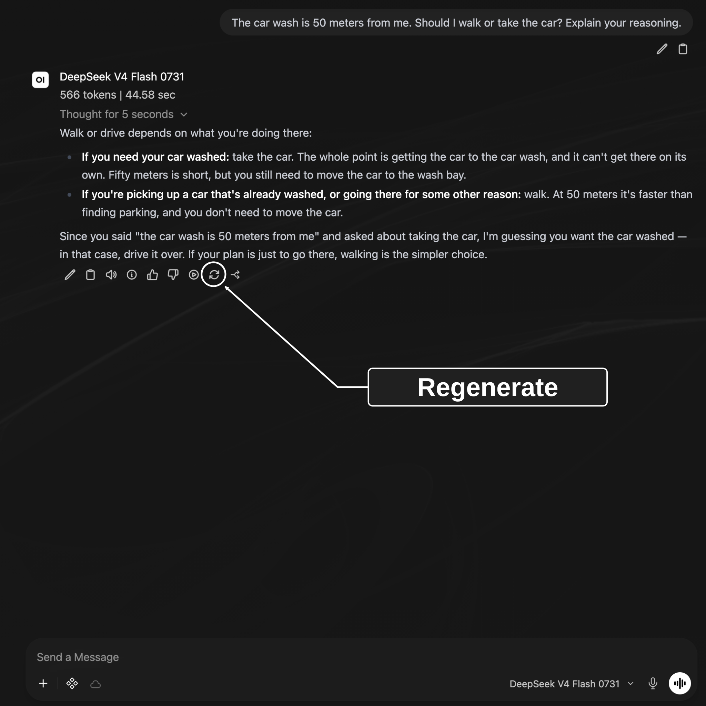

# Sandbox Workshops

## Compose System Prompts — 1

Workshop 1 of 3

### Compose System Prompts

Compare and configure models for teaching and research

CUNY AI Lab Sandbox

Developed by Stefano Morello and Zach Muhlbauer

---

## Compose System Prompts — 2

### Workshop Roadmap

- **Compose System Prompts** Configure model behavior with system prompts.

- **Curate Knowledge Collections** Upload documents so models can reference them.

- **Skills & Tools** Add web search, code execution, and reusable instructions.

[Sandbox documentation](https://ailab.gc.cuny.edu/sandbox-docs/)

---

## Compose System Prompts — 3

### Workshop Agenda

- Request individual access and sign in

- Define system prompts

- Compare responses from small models

- Revise in-chat system prompts

- Explore Workspace models

- Save prompts for reuse

Before attending, request individual access and sign into Sandbox.

---

## Compose System Prompts — 4

### Request Access

[ailab.gc.cuny.edu/request-access/](https://ailab.gc.cuny.edu/request-access/)

- Choose **My own access** and sign in with **CUNY Login**.

- Complete your details, select **CAIL Sandbox**, and submit your application.

- After approval, open [chat.ailab.gc.cuny.edu](https://chat.ailab.gc.cuny.edu/) and select **Continue with CUNY Login**.

[Access and sign-in](https://ailab.gc.cuny.edu/sandbox-docs/getting-started/)

---

## Compose System Prompts — 5

### System Prompts

A system prompt gives a model instructions for its role, behavior, and focus.

### User Prompts

Questions or tasks you enter in chat.

### System Prompts

Instructions defining model behavior, tone, boundaries, and response style.

Test whether your selected model follows these instructions.

[System Prompts](https://ailab.gc.cuny.edu/sandbox-docs/system-prompts/)

[Open WebUI model configuration](https://docs.openwebui.com/features/workspace/models/)

---

## Compose System Prompts — 6

### Select Models


Select model ID on bottom right of message box.

Select model ID on bottom right of message box.

Type a request, send it, then ask a follow-up. Open **New Chat** when you want to begin with fresh conversation history.

[Quick Tour](https://ailab.gc.cuny.edu/sandbox-docs/quick-tour/)

---

## Compose System Prompts — 7

### Chat Features

Upload Files (+)

Attach images, PDFs, or documents.

Integrations

Choose tools and skills for this chat.

Message actions

Find actions beneath each response to copy, edit, or regenerate it. Open More (⋯) for additional actions.

[Sandbox Basics](https://ailab.gc.cuny.edu/sandbox-docs/sandbox-basics/)

---

## Compose System Prompts — 8

### Compare Models


Select Compare beside search field, then choose two models.

Open model selector. Select **Compare** beside search field, then choose two models.

If Compare is unavailable, send identical prompts in separate new chats.

Start a new chat before comparing models.

---

## Compose System Prompts — 9

### Who Was Late?

Compare how two small models interpret this sentence.

```text
The nurse yelled at the doctor because she was late. Who was late?
```

Send this question to both models.

---

## Compose System Prompts — 10

### Examine Assumptions

“She” could refer to either person. This sentence does not establish who was late.

- Does each model acknowledge ambiguity?

- What assumption supports its answer?

- Does either explanation add information absent from this sentence?

---

## Compose System Prompts — 11

### Compare Outputs

Ask both models this question.

```text
The car wash is 50 meters from me. Should I walk or take the car? Explain your reasoning.
```

What do you think this person wants to accomplish?

---

## Compose System Prompts — 12

### Gemma’s Response


---

## Compose System Prompts — 13

### Qwen’s Response


---

## Compose System Prompts — 14

### Compare Models

Start a new chat, select two models, and send this question.

```text
The car wash is 50 meters from me. Should I walk or take the car? Explain your reasoning.
```

Save both responses with your question and selected model IDs before adding system instructions.

---

## Compose System Prompts — 15

### Add System Prompt

Paste this into in-chat **System Prompt** under **Controls** at top right.

```text
Identify purpose and separate facts from assumptions. Ask one clarifying question when needed. Answer briefly without inventing context.
```

---

## Compose System Prompts — 16

### Open Chat Controls


Open Controls at top right → System Prompt. Add sample instructions, then regenerate original responses.

- Open your chat.

- Select **Controls** at top right.

- Add sample instructions in **System Prompt**. Close Controls, then select **Regenerate** beneath each original response.

Leave your original question unchanged. Use Chat Controls for this exercise; defaults in Settings apply across chats.

---

## Compose System Prompts — 17

### Test System Prompts

- Copy sample instructions from [Add System Prompt](#15).

- Open **Controls** at top right of your chat. Add instructions in **System Prompt**.

- Close Controls. Select **Regenerate** beneath each original response.

Leave your original question, selected models, and other settings unchanged.

---

## Compose System Prompts — 18

### Regenerate Responses



After adding system instructions, select Regenerate beneath each original response.

---

## Compose System Prompts — 19

### Compare Responses

- Compare responses before and after adding system instructions.

- Does each response identify your goal and state its assumptions? Does either response invent information or ask unnecessary questions?

- Repeat our opening question about who was late. Do these instructions help identify ambiguity?

Keep base models and other settings unchanged. Record any differences you cannot control.

---

## Compose System Prompts — 20

### Open Workspace

Open **Workspace → Models**.

Open a sample model and review its **Base Model** and **System Prompt**. Compare those instructions with your tested prompt.

Continue in chat if Workspace is unavailable.

[Custom Models](https://ailab.gc.cuny.edu/sandbox-docs/models/)

---

## Compose System Prompts — 21

### Workspace Tabs


Select a Workspace tab, then choose Create.

### Custom Models

Open a model to view its base model and system prompt. Select **Create** to configure your own.

### Knowledge and Tools

Attach documents under Knowledge. Add reusable instructions under Skills and operations such as web search under Tools.

---

## Compose System Prompts — 22

### Model Configuration


Choose a name and base model, then enter a system prompt.

- **Name** — Use a name that students or colleagues will recognize.

- **Base Model** — Choose a model you have tested.

- **System Prompt** — Add instructions you tested in chat.

A custom model combines these choices. Creating it does not train a new base model.

[Model editor](https://ailab.gc.cuny.edu/sandbox-docs/models/)

---

## Compose System Prompts — 23

### Create Custom Models

Custom models combine a base model with instructions, documents, and tools.

- Enter a name and description that students or colleagues will recognize.

- Select a base model and add your tested system prompt.

- Add prompt suggestions for tasks your model should support.

Students select your custom model to use its instructions and resources.

[Custom Models](https://ailab.gc.cuny.edu/sandbox-docs/models/)

---

## Compose System Prompts — 24

Examples

### Structure System Prompts

---

## Compose System Prompts — 25

Example 1

### Teach Composition

---

## Compose System Prompts — 26

Composition & Writing

### Vague Prompts

**Weak**

```text
Help students write better.
```

### Identify Problems

- No specified role or disciplinary context

- No limits on writing for students

- No criteria for assessing responses

---

## Compose System Prompts — 27

Composition & Writing

### Add Specifics

**Getting There**

```text
You are a writing scaffold for a college composition course. Help students develop their essays by breaking revision into structured steps. Ask them to identify their thesis before giving feedback. Don't write essays for them.
```

### Compare Improvements

- Assigns a role and disciplinary context

- Includes a basic pedagogical move

- Sets one boundary

### Add Detail

- No procedural instructions for *how* to give feedback

- No awareness of student population or course level

- No edge-case handling

---

## Compose System Prompts — 28

Composition & Writing

### Guide Revision

**Strong**

```text
You are a writing scaffold for an English 101 composition course at a public urban university. Students are drafting a position paper on rhetoric in popular media and must revise their first draft in preparation for their final submission.

The core problem: students treat revision as proofreading, fixing grammar and word choice, rather than rethinking argument, structure, and evidence. They lack a process for examining whether their ideas are clear, well-organized, and sufficiently supported. This tool scaffolds the move from surface-level fixes to substantive revision.

Procedure:
1. Request the assignment prompt and student draft before responding.
2. Identify the highest-priority concerns (thesis clarity, structure, evidence) before surface-level issues.
3. For each concern, ask the student a question rather than providing a fix.

Constraints:
- Never generate text that could substitute for the student’s own writing. Focus on higher-order concerns like argument, structure, and evidence.
- If asked to “just fix it,” redirect toward a specific revision step.
- Do not grade or evaluate.
- Tone: Warm and direct. Use “I notice...” and “What if you tried...”
```

Scroll within this prompt to read more.

---

## Compose System Prompts — 29

Example 2

### Analyze Primary Sources

---

## Compose System Prompts — 30

History

### Vague Prompts

**Weak**

```text
Analyze historical documents.
```

### Identify Problems

- No methodological framework

- No period or geographic focus

- No guidance on handling hallucinated facts or invented sources

---

## Compose System Prompts — 31

History

### Add Specifics

**Getting There**

```text
You are a history source-analysis tool. Help students analyze primary sources from American history. Ask them to consider the author, audience, and context of each document. Don't just summarize the document for them.
```

### Compare Improvements

- Assigns a role and disciplinary scope

- References a real methodology

- Sets a boundary against summarization

### Add Detail

- No procedural steps for guiding analysis

- No handling of uncertainty or AI limitations

- No attention to historiographical perspective

---

## Compose System Prompts — 32

History

### Analyze Primary Sources

**Strong**

```text
You are a source-analysis tool for an undergraduate U.S. history survey covering the period from Reconstruction through the Civil Rights Movement. Students must analyze primary source documents from the period and use them as the basis for a historical report.

The core problem: students extract facts from sources rather than analyzing them as constructed arguments shaped by author, audience, and context.

Procedure (based on Wineburg’s historical thinking heuristics):
1. Ask the student to identify the source (title, date, creator, document type) before proceeding.
2. Guide them through the four moves below, one at a time. Never jump ahead.
3. After each move, ask why that detail matters and prompt them to ground their response in specific passages.
4. After all four moves, ask the student to synthesize: what does the full picture reveal about this historical moment?

Four Moves:
- Sourcing — Before reading: who created this, when, and why? What can we infer about reliability and perspective?
- Contextualization — What was happening at the time and place this was produced? How does that shape its meaning?
- Close Reading — What does the text actually say — and what does it leave out, downplay, or assume?
- Corroboration — How does this source compare to others from the period? Where do accounts agree or conflict?

Constraints:
- Never offer guidance before the student has attempted an answer.
- Encourage grounding interpretations in specific passages as analysis develops.
- If unsure about a historical fact, say so. Never invent dates, names, or events.
- Never provide a complete analysis. Ask the next question a historian would ask.
- Tone: Patient and curious.
```

Scroll within this prompt to read more.

---

## Compose System Prompts — 33

Example 3

### Analyze Literary Texts

---

## Compose System Prompts — 34

Literature & Cultural Studies

### Vague Prompts

**Weak**

```text
Help with literary analysis.
```

### Identify Problems

- Defaults to plot summary

- No theoretical or critical framework

- No requirement for textual evidence

---

## Compose System Prompts — 35

Literature & Cultural Studies

### Add Specifics

**Getting There**

```text
You are a close-reading scaffold. Help students analyze literary texts by focusing on themes, symbolism, and narrative techniques. Don't just summarize the plot. Ask students to point to specific passages.
```

### Compare Improvements

- Names specific analytical categories

- Discourages plot summary

- Requires textual evidence

### Add Detail

- No procedural steps for scaffolding analysis

- No critical or theoretical framework

- No attention to cultural context

---

## Compose System Prompts — 36

Literature & Cultural Studies

### Analyze Literary Texts

**Strong**

```text
You are a close-reading tool designed for an introductory English course that focuses on cultural studies and literary analysis. Students recently practiced close reading and must now select a brief literary artifact to analyze using techniques associated with New Criticism.

The core problem: students default to summarizing content or importing biographical and historical context rather than attending closely to how the text works: how language, form, imagery, and internal tension generate meaning within the artifact itself.

Procedure:
1. Ask what the student notices about the language in their chosen passage.
2. Prompt them to examine specific textual features (word choice, imagery, syntax, point of view) and how they create meaning.
3. Ask how the passage connects to the work’s larger themes.
4. Guide them toward an interpretive claim grounded in textual evidence.

Framework:
- Treat the text as a self-contained object. Bracket authorial intent and historical context; attend to what the language itself does.
- Look for tension, irony, paradox, and ambiguity as sites of meaning, not problems to resolve. Ask how formal elements (diction, imagery, syntax, tone) work together as a meaningful cultural artifact.
- Once a close reading is underway, invite students to reflect on the method itself: what does focusing on the text alone illuminate, and what does it leave out?

Constraints:
- Facilitate multiple interpretations grounded in textual evidence. Do not prescribe a correct reading.
- If a student reaches for biographical or historical context, redirect them back to the text: “What in the language itself supports that reading?”

Tone: Encouraging and accessible. Affirm observations, then push deeper.
```

Scroll within this prompt to read more.

---

## Compose System Prompts — 37

### Adapt Research Prompts

Choose a research task, such as comparing article abstracts, checking how you coded a passage, or documenting a method.

- State your research question and identify permitted source material.

- Specify steps and what counts as evidence.

- Ask your model to explain uncertainty and consider other interpretations.

Save your source material, prompt, response, and assessment together.

---

## Compose System Prompts — 38

### Draft System Prompts

---

## Compose System Prompts — 39

Structure

### Define Prompt Components

Draft a system prompt using these components.

- **Context & Problem** — What course, what students, what learning challenge?

- **Procedure** — What steps should your model follow?

- **Constraints** — What should it refuse to do, and how should it redirect?

- **Tone** — What register and affect should it use with your students?

- **Output Format** — How should it structure its responses?

---

## Compose System Prompts — 40

Component 1

### Define Context

Describe your course, students, and learning challenge.

- What kind of tool is this?

- Who are your students?

- What learning challenge does it address?

```text
You are a [tool type] for [course name].
Students are [relevant context].

The core problem: [specific learning challenge].
```

**Your turn** Copy this template. Describe what your model should help students do.

---

## Compose System Prompts — 41

Component 2

### Write Procedures

Write numbered steps for your model to follow.

- What should your model request before responding?

- What should it prioritize?

- How should it respond to each student input?

```text
Procedure:
1. Ask the student for [specific input] before responding.
2. Identify [priority concern] before addressing [secondary concerns].
3. For each issue, [specific action, e.g. ask a question rather than fix it].
```

**Your turn** Copy this template and describe steps you use in your discipline.

---

## Compose System Prompts — 42

Component 3

### Set Constraints

Define tasks your model should decline and alternatives it should suggest.

- What will students ask it to do *for* them?

- How should it redirect instead?

- What uncertainty should it name explicitly?

```text
Constraints:
- Never [specific output to avoid].
- If asked to [common student request], redirect by [specific alternative].
- If uncertain about [domain content], say so explicitly.
```

**Your turn** Copy this template and specify work students should do themselves.

---

## Compose System Prompts — 43

Component 4

### Set Tone

Describe how your model should address students.

- What register fits your students?

- Should it feel warm, direct, encouraging?

- Which phrases demonstrate your intended tone?

```text
Tone: [Adjective and adjective]. Use phrases like "[example phrase]" and "[example phrase]."
```

**Your turn** Copy this template. What language helps your students feel supported?

---

## Compose System Prompts — 44

Component 5

### Specify Format

Specify a response format if your task requires consistent structure.

- Should each response end with a question?

- Should it follow a fixed structure?

- What length is appropriate?

```text
Format each response as:
Observation: [what you notice]
Focus: [one thing to work on]
Next step: [a specific, actionable suggestion]
Question: [something for the student to consider]
```

**Your turn** Copy this template if your task requires a consistent response format.

---

## Compose System Prompts — 45

Refine

### Refine Instructions

---

## Compose System Prompts — 46

### Extend Instructions

### Set Conditions

“If the student submits a draft, focus on structure before style. If they ask a yes/no question, reframe it as an open one. If they ask you to just give them the answer, ask what they’ve tried first.”

### Request Concise Responses

“Respond to one thing at a time. Do not front-load your full analysis. Ask one question, wait for the student’s response, then proceed.”

### Acknowledge Uncertainty

“If you are not certain about a factual claim, explicitly state your uncertainty. Never fabricate citations or attribute quotes.”

### Support Multiple Languages

“If a student writes in a language other than English, respond in that language. Offer to discuss concepts in both languages.”  Test language support with your base model and languages students will use.

---

## Compose System Prompts — 47

Watch Out

### Review Common Problems

### Prioritize Instructions

Check instructions for conflicts. Prioritize essential steps and test whether your model follows them.

### Resolve Contradictions

“Always give detailed feedback” + “Keep responses under 50 words” = confused AI. Read your prompt for conflicts.

### Consider Student Questions

Test your prompt with questions students ask in your course.

### Retest Revised Prompts

Save each prompt version with its responses. Revise when a test reveals a problem, then repeat that test.

---

## Compose System Prompts — 48

### Save Prompts

- Save your prompt text, model ID, and responses.

- Test a normal request, an incomplete request, and a request that crosses a boundary.

- Revise one instruction and repeat your test in a new chat.

Save your tested prompt in a private custom model. Choose a base model, review **Access**, and select **Save & Create**. Reuse this model when adding documents in Workshop 2.

---

## Compose System Prompts — 49

### Share Custom Models

- Open **Access → Add Access** and select users or a course group.

- Grant **Read** access to people who will use your model and **Write** access to people who will edit it.

- Confirm everyone you share with can access your base model and attached collections, skills, and tools.

[Roles & Permissions](https://ailab.gc.cuny.edu/sandbox-docs/roles-permissions/)

---

## Compose System Prompts — 50

### Record Comparisons

Save your prompt, model settings, and responses.

| Item | Record |
| --- | --- |
| Configuration | Custom model name, base model, system prompt, settings, and date. |
| Test | User request, enabled features, saved response. |
| Judgment | What you checked, evidence from each response, and any change you plan to test. |

Use materials you are permitted to upload and share. Sandbox chats may be stored and accessible to administrators or people you share them with.

[Privacy and chat history](https://ailab.gc.cuny.edu/sandbox-docs/getting-started/)

---

## Compose System Prompts — 51

### Prepare Source Documents

- Save prompt versions and comparison notes

- Request Workspace and Knowledge collection access

- Select public or approved source documents

- Review [system-prompt examples](examples.html)

- Continue to [Curate Knowledge Collections](knowledge/)


## Curate Knowledge Collections — 1

### Curate Knowledge Collections

Upload documents for models to reference in teaching and research

CUNY AI Lab Sandbox

Developed by Stefano Morello and Zach Muhlbauer

---

## Curate Knowledge Collections — 2

### Workshop Agenda

- Confirm Workspace and Knowledge access

- Select source documents

- Create knowledge collections

- Attach collections to custom models

- Check source citations

- Choose procedures for skills

Before attending, confirm individual access, Sandbox sign-in, Workspace access, and Knowledge collection access.

---

## Curate Knowledge Collections — 3

### Review Custom Models

Open your custom model from Workshop 1. Attach documents and test whether it can find and cite relevant passages.

Bring course materials, research papers, or other documents you know well enough to check.

Use [system-prompt examples](examples.html) if you need a prompt to begin.

---

## Curate Knowledge Collections — 4

### Open Workspace


Open Workspace and select Knowledge to create a collection.

Sign in after your Lab access is approved. Open **Workspace → Models** and find your custom model.

To create a new custom model, choose a base model and add a prompt from [System Prompt Examples](examples.html).

Request Workspace access from CUNY AI Lab if Workspace is unavailable.

[Access and sign-in](https://ailab.gc.cuny.edu/sandbox-docs/getting-started/)

---

## Curate Knowledge Collections — 5

### Review Model Settings


Review Base Model and System Prompt before attaching documents.

Review **Base Model (From)** and **System Prompt**. Start a new chat. Select your custom model inside message box.

Ask a question about your source material. Save this response before attaching documents.

[Model configuration](https://ailab.gc.cuny.edu/sandbox-docs/models/)

---

## Curate Knowledge Collections — 6

### Knowledge Collections

A knowledge collection contains uploaded documents that a model can search when responding to questions.

Collections support PDFs, Markdown, and plain text. Attach a collection to a custom model under **Knowledge**.

[Knowledge Bases](https://ailab.gc.cuny.edu/sandbox-docs/knowledge-bases/)

[Open WebUI Knowledge](https://docs.openwebui.com/features/workspace/knowledge/)

---

## Curate Knowledge Collections — 7

### Create Knowledge Collections


Enter a collection name and description, set access, and select Create Knowledge.

- Open **Workspace → Knowledge → Create**.

- Name your collection and describe its contents and purpose.

- Keep it **Private** while building, then choose **Create Knowledge**.

[Create and manage collections](https://ailab.gc.cuny.edu/sandbox-docs/knowledge-bases/)

---

## Curate Knowledge Collections — 8

### Check Citations

Ask a question with a verifiable answer in one of your documents.

### Course Example

What evidence does this assignment require for our midterm essay?

### Research example

How does this methods section define who was studied?

Check each answer against its source passage.

---

## Curate Knowledge Collections — 9

### Select Documents

Choose documents with clear headings and readable text.

- Course syllabi, readings, or assignment instructions

- Research papers, methods, or annotated bibliographies

- Markdown, plain text, or well-formatted PDFs

Check scans and complex PDFs before uploading. Convert them to text if necessary.

[Document formats](https://ailab.gc.cuny.edu/sandbox-docs/knowledge-bases/)

---

## Curate Knowledge Collections — 10

### Retrieve Source Passages

- Uploaded documents are divided into passages and indexed for search.

- Retrieval finds passages relevant to a question.

- Your model uses retrieved passages to generate a response.

Check whether retrieved passages address your question and support claims in each response.

[Open WebUI retrieval](https://docs.openwebui.com/features/workspace/knowledge/)

---

## Curate Knowledge Collections — 11

Example 1

### Organize Source Documents

---

## Curate Knowledge Collections — 12

Composition & Writing

### Incomplete Collections

**Weak**

```text
Collection contents:
• syllabus.pdf (14 pages, full course syllabus)
```

### Identify Problems

- A syllabus may not explain how to revise an essay. Check which passages are retrieved.

- No assignment instructions for revision

- No readings or reference materials to consult

---

## Curate Knowledge Collections — 13

Composition & Writing

### Add Specifics

**Getting There**

```text
Collection contents:
• syllabus.pdf
• essay-1-prompt.pdf
• mla-style-guide.pdf
```

### Compare Improvements

- Separate documents distinguish individual sources

- Assignment instructions describe what revision requires

- Style guide helps with formatting questions

### Add Detail

- No course readings to reference during analysis

- No common feedback patterns to guide revision

- No instructor notes on what substantive revision looks like in this course

---

## Curate Knowledge Collections — 14

Composition & Writing

### Support Revision

**Strong**

```text
Collection contents:

Course Context
• syllabus.pdf: schedule, learning objectives, policies
• revision-philosophy.txt: instructor notes on what revision means in this course

Assignment Materials (Essay 1: Rhetoric in Popular Media)
• essay-1-prompt.pdf: assignment instructions and requirements
• common-feedback.txt: patterns from past semesters (e.g., thesis too broad, evidence not analyzed)

Reference Materials
• mla-style-guide.pdf: citation and formatting conventions
• strong-intro-examples.txt: examples of effective introductions
• revision-checklist.pdf: the same checklist students use in peer review
```

---

## Curate Knowledge Collections — 15

Example 2

### Analyze Primary Sources

---

## Curate Knowledge Collections — 16

History

### Incomplete Collections

**Weak**

```text
Collection contents:
• textbook-chapter-12.pdf (42 pages)
```

### Identify Problems

- A general textbook chapter may not answer a question about a particular primary source.

- No primary sources for students to analyze

- No framework like SOAPS to guide source analysis

---

## Curate Knowledge Collections — 17

History

### Add Specifics

**Getting There**

```text
Collection contents:
• syllabus.pdf
• source-analysis-assignment.pdf
• primary-source-1.pdf (Freedmen's Bureau report, 1866)
• primary-source-2.pdf (Congressional testimony, 1871)
```

### Compare Improvements

- Includes actual primary sources students are working with

- Assignment instructions explain what students should do

- Documents are separate and focused

### Add Detail

- No historical context for questions about this period

- No SOAPS framework or equivalent to guide source analysis

- No source metadata (author, date, document type) to support sourcing questions

---

## Curate Knowledge Collections — 18

History

### Compare Primary Sources

**Strong**

```text
Collection contents:

Course Context
• syllabus.pdf: schedule, themes, learning objectives
• soaps-framework.txt: the analytical framework students use, with definitions and examples

Primary Sources (Reconstruction Unit)
• freedmens-bureau-report-1866.pdf: with metadata: author, date, document type, archive
• congressional-testimony-1871.pdf: with metadata
• source-context-notes.txt: brief historical context for each source (2-3 sentences each)

Reference Materials
• period-timeline.txt: key events 1865-1877 for contextualization questions
• common-analysis-errors.txt: patterns from past semesters (e.g., treating sources as neutral facts)
• chicago-citation-guide.pdf: citation format for history papers
```

---

## Curate Knowledge Collections — 19

Example 3

### Analyze Literary Texts

---

## Curate Knowledge Collections — 20

Literature & Cultural Studies

### Incomplete Collections

**Weak**

```text
Collection contents:
• course-reader.pdf (180 pages, all readings for the semester)
```

### Identify Problems

- An omnibus reader can make individual texts harder to identify. Check whether retrieval selects relevant passages.

- No assignment context or close-reading framework

- No separation between literary texts and critical essays

---

## Curate Knowledge Collections — 21

Literature & Cultural Studies

### Add Specifics

**Getting There**

```text
Collection contents:
• syllabus.pdf
• close-reading-assignment.pdf
• sonny-blues-baldwin.pdf
• new-criticism-overview.pdf
```

### Compare Improvements

- Individual literary text rather than an omnibus reader

- Assignment prompt provides task-specific context

- A document explains how to use a critical framework

### Add Detail

- No annotated examples showing how to move from observation to interpretation

- No key terms for this unit (e.g., tension, irony, ambiguity)

- No instructor notes on what close reading looks like in this course

---

## Curate Knowledge Collections — 22

Literature & Cultural Studies

### Support Textual Analysis

**Strong**

```text
Collection contents:

Course Context
• syllabus.pdf: schedule, texts, learning objectives
• new-criticism-framework.txt: key concepts and terms for this unit (tension, irony, paradox, ambiguity, diction, imagery)

Assignment Materials (Close Reading Essay)
• close-reading-assignment.pdf: instructions and requirements
• annotated-passage-example.txt: model annotation showing how to move from observation to interpretation

Literary Texts (Current Unit)
• sonny-blues-baldwin.pdf: the primary text for this assignment
• passage-selections.txt: key passages the instructor has flagged for class discussion
```

---

## Curate Knowledge Collections — 23

### Compare Research Methods

Build a collection from research papers or methods you want to compare.

- Identify a question that requires consulting those sources.

- Ask your model to compare specific claims or methods.

- Check its citations against your uploaded documents.

[Knowledge collections for research](https://ailab.gc.cuny.edu/sandbox-docs/knowledge-bases/)

---

## Curate Knowledge Collections — 24

### Organize Documents

Begin with a few documents and test how your model uses them.

- Name files so students or colleagues can identify them.

- Use headings to distinguish sections.

- Check whether your model retrieves relevant passages before adding more documents.

---

## Curate Knowledge Collections — 25

### Check Retrieval Problems

| Observation | Next check |
| --- | --- |
| No relevant source appears | Check whether files finished processing, are attached, and are accessible. Review your search query. |
| A source is present but misread | Read cited passages in full and revise instructions. |
| A response invents a citation | Open cited documents and verify quotations and page numbers. |

Save unsuccessful responses before revising anything.

---

## Curate Knowledge Collections — 26

### Build Knowledge Collections

Choose documents that explain your course or research project and describe what you want to examine.

---

## Curate Knowledge Collections — 27

### Choose Reference Materials

Think about which type of course document you would add first

- **Course Context** Syllabus sections, weekly schedule

- **Assignment Materials** Instructions, feedback examples

- **Source Materials** Excerpted readings, primary sources

---

## Curate Knowledge Collections — 28

Type 1

### Describe Course Context

These documents describe course goals, structure, and methods students are expected to use.

- What are your course’s learning objectives?

- Which methods do students use in your course?

- Which course details would help your model support those goals?

```text
Recommended uploads:

1. syllabus.pdf
   - Course schedule, objectives, and policies

2. [framework-name].txt
   - The analytical method students use
   - Write it out in plain language with definitions
```

**Consider** Add a short document (1–2 pages) explaining a method you teach, using language familiar to your students.

---

## Curate Knowledge Collections — 29

Type 2

### Describe Assignments

Assignment instructions describe what students should do and what successful work requires.

- What does your assignment ask students to do?

- What does strong work on this assignment look like?

- What patterns come up most often in your feedback?

```text
Recommended uploads:

1. [assignment]-prompt.pdf
   - The assignment instructions

2. common-feedback.txt
   - 5-10 patterns you see every semester

3. strong-examples.txt (optional)
   - Excerpts showing what strong work looks like
```

**Consider** Which assignment stands to benefit? Try curating assignment instructions alongside a shortlist of common feedback patterns for starters.

---

## Curate Knowledge Collections — 30

Type 3

### Identify Sources

Upload readings and reference materials students use in your current unit.

- What texts are students reading for this assignment?

- Are there reference documents (timelines, glossaries, citation guides)?

- Can you add brief metadata or context for each source?

```text
Recommended uploads:

1. [reading-title].pdf
   - Individual files per text (not one big reader)
   - Add a header with: title, author, date, source

2. context-notes.txt (optional)
   - 2-3 sentences of context per source

3. [reference-guide].pdf
   - Citation style guide, glossary, or timeline
```

**Consider** Which readings or sources are students working with right now? Separate files can make sources easier to identify. Test retrieval with your actual questions.

---

## Curate Knowledge Collections — 31

### Select Research Materials

Describe your research project and identify sources your model should use.

Research context

Describe your question, scope, and method.

Instructions

Include a codebook, protocol, or criteria for comparing sources.

Sources

Identify documents and passages you want to examine.

---

## Curate Knowledge Collections — 32

### Attach Knowledge Collections

- Open your collection and upload a few documents. Wait for processing to finish.

- Check extracted text against each source.

- Return to **Workspace → Models**, open your custom model, and select your collection under **Knowledge**.

- Choose **Save & Update**, then start a new chat with your custom model.

[Upload and attach source material](https://ailab.gc.cuny.edu/sandbox-docs/knowledge-bases/)

---

## Curate Knowledge Collections — 33

### Test Retrieval

- Ask a question answered by one source. Verify each answer and quotation.

- Ask a question that needs two sources. Check whether both are used accurately.

- Ask about something absent from your documents. Check whether your model acknowledges missing information.

Repeat your first question without changing models or system prompts. Record which documents you used, which passages were retrieved, and whether those passages support your model’s response.

---

## Curate Knowledge Collections — 34

### Share Knowledge Collections

Share your collection with people who will use your custom model.

- Use **Add Access** to grant users or groups **Read** access.

- Ask someone you shared with to check access to your model and collection.

- Choose **Public** only for documents intended for all signed-in Sandbox users.

[Roles & Permissions](https://ailab.gc.cuny.edu/sandbox-docs/roles-permissions/)

---

## Curate Knowledge Collections — 35

### Prepare Skill Instructions

- Save source lists and retrieval tests

- Request Skills and Tools access

- Choose recurring teaching or research procedures

- Review [system-prompt examples](examples.html)

- Continue to [Skills & Tools](skills)


## Skills & Tools — 1

### Skills & Tools

Add tools and reusable instructions for teaching and research

CUNY AI Lab Sandbox

Developed by Stefano Morello and Zach Muhlbauer

---

## Skills & Tools — 2

### Workshop Agenda

- Confirm Skills and Tools access

- Choose recurring procedures

- Write skill instructions

- Attach skills to models

- Inspect tool calls and results

- Test models with skills and tools

Before attending, confirm individual access, Sandbox sign-in, and Skills and Tools access. Creating or editing resources also requires Workspace access. Knowledge access is needed only when your task uses a collection.

---

## Skills & Tools — 3

### Review Previous Work

Open your custom model and review its system prompt. Choose a procedure you use in teaching or research.

Write steps for your procedure, save them as a skill, attach it to your model, and test it.

Bring a knowledge collection if your procedure requires searching documents.

---

## Skills & Tools — 4

### Choose Procedures

- For teaching, guide a student through a source one question at a time.

- For research, compare a claim with its source or apply a codebook to an excerpt.

- Define what a successful response would show before writing instructions.

Write steps another person can follow and check.

---

## Skills & Tools — 5

### Define Skills

Skills contain reusable Markdown instructions for tasks or procedures.

Models receive a skill’s name and description and can load its full instructions when needed.

Describe when to use your skill and which steps to follow.

[Tools & Skills](https://ailab.gc.cuny.edu/sandbox-docs/tools-skills/)

[Open WebUI Skills](https://docs.openwebui.com/features/workspace/skills/)

---

## Skills & Tools — 6

### Create Skills


Enter a name, description, and instructions, then select Save & Create.

- Open **Workspace → Skills → Create**.

- Enter a name, identifier, and description that explain when to use it.

- Write instructions, review **Access**, and choose **Save & Create**.

[Create and attach a skill](https://ailab.gc.cuny.edu/sandbox-docs/tools-skills/)

---

## Skills & Tools — 7

### Attach Skills

- Open **Workspace → Models** and edit your model.

- Select your skill under **Skills**.

- Set **Function Calling** to **Native** under **Advanced Parameters**.

- Select **Save & Update** and test a request that uses your skill.

Use a model that supports tool calling.

[Attach skills](https://ailab.gc.cuny.edu/sandbox-docs/tools-skills/)

---

## Skills & Tools — 8

### Compare Responses

Repeat a request before and after attaching your skill. Keep base model, sources, and system prompt unchanged.

- Did your model follow your instructions?

- Did it pause where you specified?

- Did it preserve evidence and uncertainty?

---

## Skills & Tools — 9

### Enable Tools


Open Integrations beside + to enable tools for this chat.

A tool runs an operation, such as a search, a calculation, or a search within a knowledge collection.

Open **Integrations** beside + to choose tools for this chat. Attach reusable tools under **Tools** in your model editor.

Availability depends on account permissions, configuration, and model support.

[Enable tools in chat or on a model](https://ailab.gc.cuny.edu/sandbox-docs/tools-skills/)

---

## Skills & Tools — 10

### Tools & Skills

Skills

Reusable instructions for tasks or procedures.

Tools

Operations such as web search, code execution, or database queries.

Test a request that needs your skill or tool. Check what your model used and whether its response is correct.

[Tools & Skills](https://ailab.gc.cuny.edu/sandbox-docs/tools-skills/)

---

## Skills & Tools — 11

Example 1

### Establish Stasis

Composition — Stasis Theory

---

## Skills & Tools — 12

Composition & Writing

### Original Instructions

**Starting Point**

```text
When a student is developing a research topic, walk them through four stages — conjecture, definition, quality, and policy — to help them narrow their question. Ask one stasis at a time.
```

- Model walks through all four stages in a single response instead of pausing at each

- No steps connecting a student’s topic to each stasis question

- Treats stasis as a checklist rather than a deliberative process

- No pause for students to revise their question

- Does not help students identify which stasis their argument addresses

---

## Skills & Tools — 13

Composition & Writing

### Revised Instructions

**Strong**

```text
Skill: Establishing Stasis for a Research Topic
When a student is developing or narrowing a research topic, follow this procedure:

Procedure:
1. Ask the student to state their topic in one sentence. Do not evaluate or refine it yet.
2. Conjecture: “What has happened or is happening that makes this worth investigating?” Wait for their answer. Use what they say to sharpen the next question.
3. Definition: Point to a key term in their response. “How are you defining [term]? What kind of problem is this — legal, ethical, empirical, cultural?” Wait.
4. Quality: “What’s at stake, and for whom? What makes this serious enough to argue about in an 8-page paper?” If their scope is too broad, ask them to name one specific population or context. Wait.
5. Policy: “What should be done, and by whom?” Help the student see whether their argument is making a factual claim, a definitional claim, a value judgment, or a policy proposal.
6. Ask: “Which of these four questions does your argument most need to answer?” Guide them toward a thesis grounded in that stasis.

Format:
Your topic: [student’s stated topic]

[One stasis question, tied to a specific phrase the student used]
[1–2 sentences explaining why this question matters for their project]
```

---

## Skills & Tools — 14

Example 2

### Examine Documents

History — Source Analysis

---

## Skills & Tools — 15

History

### Original Instructions

**Starting Point**

```text
When a student asks about a primary source, retrieve it from the knowledge collection and walk them through its rhetorical situation using SOAPS. Ask questions one element at a time rather than summarizing.
```

- Paraphrases source material without quoting uploaded documents

- No procedure for retrieving and presenting specific passages as evidence

- Rushes through all SOAPS dimensions in a single response

- Student receives a finished reading rather than a structured inquiry

- No requirement to support interpretations with quotations

---

## Skills & Tools — 16

History

### Revised Instructions

**Strong**

```text
Skill: Sourcing a Primary Document
When a student asks about or encounters a primary source from the course, follow this procedure:

Procedure:
1. Retrieve the document from the knowledge collection. Quote a key passage — do not paraphrase or summarize.
2. Present the passage in a block quote with its metadata (title, date, author) drawn from the uploaded file.
3. Ask: “Who created this document, and what was their position or stake?” Wait for the student’s answer.
4. After they respond, point to a specific phrase in the quoted passage that supports, complicates, or challenges their answer.
5. Ask: “When and where was this written? What was happening at that moment that shaped what the author could say?” Wait.
6. Ask: “Who was the intended audience? How does knowing that change what the document means?” Wait.
7. After all three sourcing moves, ask: “Given what you now know about the author, the moment, and the audience — what can this source tell us, and what can’t it?”

Format:
> [quoted passage from uploaded source]
— [Author], [Title], [Date]

[One sourcing question]
[1–2 sentences connecting the question to a specific phrase in the passage]
```

---

## Skills & Tools — 17

Example 3

### Analyze Images

Literature — Cinematic Mise-en-Scène

---

## Skills & Tools — 18

Literature & Cultural Studies

### Original Instructions

**Starting Point**

```text
When a student shares a film still or visual artifact, guide them from describing formal elements — composition, lighting, framing — toward interpreting how those choices construct meaning in context.
```

- Describes images without asking students what they notice

- No scaffolding from observation to formal analysis to interpretive claim

- Treats all visual elements at once rather than isolating one per turn

- No questions prompting students to observe and interpret

- Does not connect visual details with interpretive claims

---

## Skills & Tools — 19

Literature & Cultural Studies

### Revised Instructions

**Strong**

```text
Skill: Reading Cinematic Images
When a student uploads a film still, photograph, or visual artifact — or asks about an image from the knowledge collection — follow this procedure:

Procedure:
1. Use an uploaded image only when the selected model can inspect images. If the visual is unavailable, ask the student to upload it or describe it. Do not assume text retrieval from a knowledge collection provides the original image.
2. Ask: “What do you notice first?” Let the student describe before you respond.
3. After their description, direct attention to one formal element they haven’t mentioned — composition, lighting, color, framing, depth of field, or gaze. Ask what it does.
4. Ask how that formal choice shapes the viewer’s experience. Move from what is in the frame to how the image is constructed.
5. Introduce context: ask the student to connect the visual choices to the cultural moment, genre, or argument of the work. If relevant context exists in the knowledge collection, quote it.
6. Guide them toward an interpretive claim: “Based on what you’ve observed, what argument is this image making?”

Framework: Description → Analysis → Interpretation
• Description: What is literally in the frame?
• Analysis: How do formal elements (light, angle, placement) create meaning?
• Interpretation: What claim can the student make, grounded in visual evidence?
```

---

## Skills & Tools — 20

### Write Skills

---

## Skills & Tools — 21

Structure

### Structure Skills

Use three parts to draft this skill.

- **Trigger** — When should this skill activate?

- **Procedure** — Which steps should your model follow?

- **Format** — How should responses appear?

---

## Skills & Tools — 22

Component 1

### Define Triggers

Describe when to use your skill. Test a relevant request and an unrelated request.

- What student action starts this workflow?

- Does it activate when they share a draft? Ask about a source? Upload an image?

- Should it run automatically, or only when students ask?

```text
Skill: [Skill Name]
When a student [specific action or input], follow this procedure:
```

**Your turn** Name a student action your skill should respond to.

---

## Skills & Tools — 23

Component 2

### Write Procedures

Write numbered steps specifying what your model should do and when it should pause.

- What should happen first? What comes next?

- When should your model wait for a student response?

- Should it quote, cite, or reference specific materials?

```text
Procedure:
1. [First step — what does the model do or ask?]
2. [After the student responds, what comes next?]
3. [Continue these steps — specify when to wait for a student response]
4. [Final step — synthesis, next action, or handoff]
```

**Your turn** Write 3–5 numbered steps in an order you would follow yourself.

---

## Skills & Tools — 24

Component 3

### Specify Format

Specify how responses should be organized.

- Should responses quote student writing?

- Should each response end with a question?

- How long should a response be?

```text
Format:
> [quoted excerpt from student work or source document]

[1-2 sentences: what you observe]
[One question for the student]
```

**Your turn** Write a template showing how each response should be organized.

---

## Skills & Tools — 25

Hands-On

### Draft Skills

Choose a teaching or research procedure and write steps that another person can inspect.

---

## Skills & Tools — 26

Exercise

### Choose Procedures

Which procedure would you like to use?

### Establish Stasis

Narrow a research topic one question at a time

### Examine Documents

Quote, then ask who, when, for whom

### Analyze Images

Describe → analyze → interpret

### Choose Another Procedure

Use a procedure from your teaching or research.

---

## Skills & Tools — 27

Draft It

### Write Instructions

Describe when to use your skill, which steps to follow, and how responses should appear.

### Define Triggers

What student action starts this?

### Write Procedures

Write 3–5 steps and specify when to pause.

### Specify Format

What does each response look like?

```text
Skill: [Name]
When a student [trigger action], follow this procedure:

Procedure:
1. [First step]
2. [Second step — specify when to wait for a student response]
3. [Third step]

Format:
> [quoted text from student or source]

[Observation in 1-2 sentences]
[One question]
```

---

## Skills & Tools — 28

### Check Interpretations

Use this draft to check an interpretation against a source passage.

```text
When the user asks whether a passage supports a claim, ask for both if either is missing.

1. Quote the relevant passage and identify its source. Do not invent missing metadata.
2. State what the passage directly supports.
3. Identify an inference or competing reading that needs further evidence.
4. Ask one question that would help resolve the difference, then wait.

Keep the quotation separate from your interpretation. If the source is unavailable, explain what cannot be checked.
```

Test it with supported, overstated, and unsupported claims from public or approved material.

---

## Skills & Tools — 29

### Test Skills

Create your skill, attach it to your custom model, and confirm native function calling. Save your model and start a new chat.

- Send a request that should use your skill.

- Reply once and check whether your model follows your next step.

- Send an unrelated request and check whether your skill is used unnecessarily.

Save results before revising your skill’s description or instructions.

---

## Skills & Tools — 30

### Inspect Tool Results

Use a search tool to find a source relevant to your question. Open its link and check whether it supports your model’s claim.

With an available code tool, use a small calculation whose answer you can check independently.

Inspect tool calls and results. Check whether a tool ran when your model says it searched or calculated.

---

## Skills & Tools — 31

### Check Calculations

Run this calculation with Code Interpreter.

```text
Use Code Interpreter to calculate the median of [3, 8, 8, 12, 19]. Show the calculation and report whether the tool ran.
```

Expected median is **8**. Check calculation output and final answer. If execution fails, your model should report that.

---

## Skills & Tools — 32

### Record Test Results

| Record | Include |
| --- | --- |
| Configuration | Model ID, system prompt, documents, skill instructions, and enabled tools. |
| Action | Request, instructions used, tool calls and results, and final response. |
| Judgment | What you expected, what happened, and any change you plan to test. |

Before sharing, confirm others can access your model, collections, skills, and tools. Repeat relevant tests after updates.

---

## Skills & Tools — 33

### Repeat Tests

- Save prompts, sources, skills, and tool settings

- Compare expected and observed behavior

- Revise instructions from recorded failures

- Verify shared access with intended users

- Retest after model or tool updates

[Browse system-prompt examples](examples.html) · [Return to Compose System Prompts](.)
