# Sandbox Workshops

## Composing System Prompts — 1

[](https://ailab.gc.cuny.edu/)

**Alt text:** CUNY AI Lab

### Composing System Prompts

Led by  Zach Muhlbauer

New Media Lab · Room 7388.01
CUNY Graduate Center

Thursday, September 17, 2026   2:30–4:00 p.m.

[https://cuny-ai-lab.github.io/sandbox-series/basics](https://cuny-ai-lab.github.io/sandbox-series/basics)

---

## Composing System Prompts — 2

### Workshop Roadmap

- **Composing System Prompts** Configure model behavior with system prompts.

- **[Curating knowledge collections](knowledge)** Organize source documents in knowledge collections. Thursday, October 1

- **Configuring skills and tools** Extend model capabilities with skills and tools. Thursday, October 15

[Sandbox documentation  https://ailab.gc.cuny.edu/sandbox-docs/](https://ailab.gc.cuny.edu/sandbox-docs/)

---

## Composing System Prompts — 3

### Workshop Agenda

- Introduce yourselves

- Request access and sign in

- Compare model outputs

- Revise system prompts

- Create custom models

Check monthly usage at Model Access.

[https://tools.ailab.gc.cuny.edu/model-access](https://tools.ailab.gc.cuny.edu/model-access)

---

## Composing System Prompts — 4

### Introductions

What is your name, pronouns, and role at CUNY?

What brings you to this workshop today?

---

## Composing System Prompts — 5

### Sandbox Access

### Request Access

- Open [access application](https://ailab.gc.cuny.edu/request-access/). Choose **My own access** and sign in with **CUNY Login**.

- Enter your details and intended use, complete verification, and select **Submit Application**.

- Watch your verified CUNY email for approval.

### Sign In

Already approved? Open [Sandbox](https://chat.ailab.gc.cuny.edu/).

- Select **Continue with CUNY Login** and enter your CUNY credentials.

- Complete two-factor authentication if prompted.

[https://ailab.gc.cuny.edu/request-access/](https://ailab.gc.cuny.edu/request-access/)[https://chat.ailab.gc.cuny.edu/](https://chat.ailab.gc.cuny.edu/)[Access and sign-in  https://ailab.gc.cuny.edu/sandbox-docs/getting-started/](https://ailab.gc.cuny.edu/sandbox-docs/getting-started/)

---

## Composing System Prompts — 6

### System Prompts

System prompts are setup instructions that describe how a model should behave.

### User Prompts

Questions or tasks you enter in chat.

### Custom Models

You create a custom model by choosing a base model, such as Gemma, and adding instructions and documents for it to use.

[Basic Concepts  https://ailab.gc.cuny.edu/sandbox-docs/basic-concepts/](https://ailab.gc.cuny.edu/sandbox-docs/basic-concepts/)[Custom Models  https://ailab.gc.cuny.edu/sandbox-docs/models/](https://ailab.gc.cuny.edu/sandbox-docs/models/)

---

## Composing System Prompts — 7

### Chat Features

Upload Files (+)

Attach images, PDFs, or documents.

Integrations

Enable tools that perform operations and skills that give reusable instructions.

Message actions

Find actions beneath each response to copy, edit, or regenerate it. Open More (⋯) for additional actions.

[Sandbox Basics  https://ailab.gc.cuny.edu/sandbox-docs/sandbox-basics/](https://ailab.gc.cuny.edu/sandbox-docs/sandbox-basics/)

---

## Composing System Prompts — 8

### Select Models

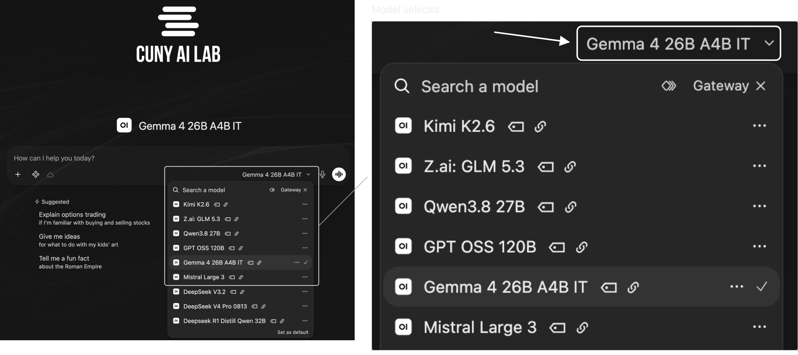

**Alt text:** Sandbox logo, message box, and Gateway model selector; enlarged detail shows current model choices with model ID outlined and marked by an arrow.

Find model selector in bottom right of message box, then select Gemma 4 26B A4B IT.

[Model Registry  https://ailab.gc.cuny.edu/models/](https://ailab.gc.cuny.edu/models/)

---

## Composing System Prompts — 9

### Compare Models

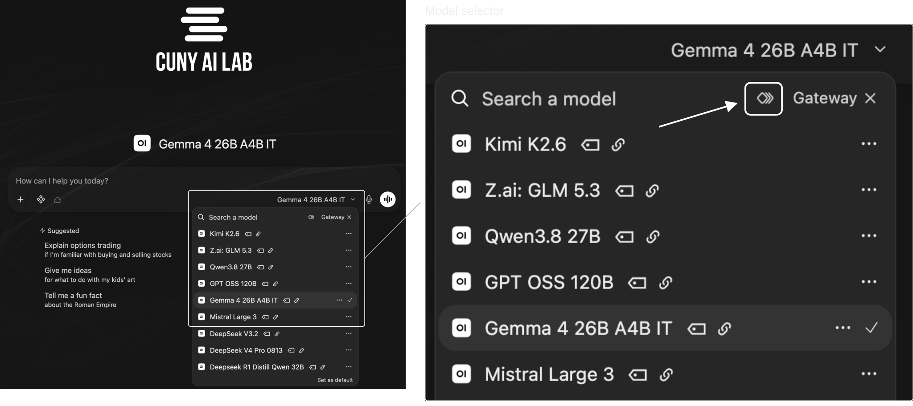

**Alt text:** Sandbox logo, message box, and Gateway model selector; enlarged detail shows Compare beside search field outlined and marked by an arrow.

Reopen model selector and select Compare beside search field. Choose Gemma and another model, such as Mistral Large 3.

[Model Registry  https://ailab.gc.cuny.edu/models/](https://ailab.gc.cuny.edu/models/)

---

## Composing System Prompts — 10

### Who Was Late?

Compare how two models interpret this sentence.

```text
The nurse yelled at the doctor because she was late. Who was late?
```

Send this question to both models.

---

## Composing System Prompts — 11

### Winograd Schema Challenge

This challenge tests how models interpret ambiguous pronouns using context and common-sense reasoning.

In our question, either person could be late.

- Which person does each model choose?

- What assumption supports its answer?

[Levesque, Davis, and Morgenstern (2012)  https://www.cs.nyu.edu/faculty/davise/papers/WSKR2012.pdf](https://www.cs.nyu.edu/faculty/davise/papers/WSKR2012.pdf)

---

## Composing System Prompts — 12

### Compare Outputs

Consider this question.

```text
The car wash is 50 meters from me. Should I walk or take the car? Explain your reasoning.
```

What do you think this person wants to accomplish?

---

## Composing System Prompts — 13

### Gemma vs. Qwen

### Gemma’s Response

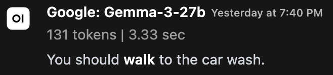

**Alt text:** Gemma 3 27B response recommending walking, with model name and generation time.

### Qwen’s Response

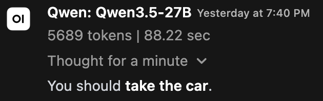

**Alt text:** Qwen3.5 27B response recommending driving, with model name and generation time.

---

## Composing System Prompts — 14

### Going to the Car Wash

Start a new chat, select two models, and send this question.

```text
The car wash is 50 meters from me. Should I walk or take the car? Explain your reasoning.
```

---

## Composing System Prompts — 15

### Add System Prompt

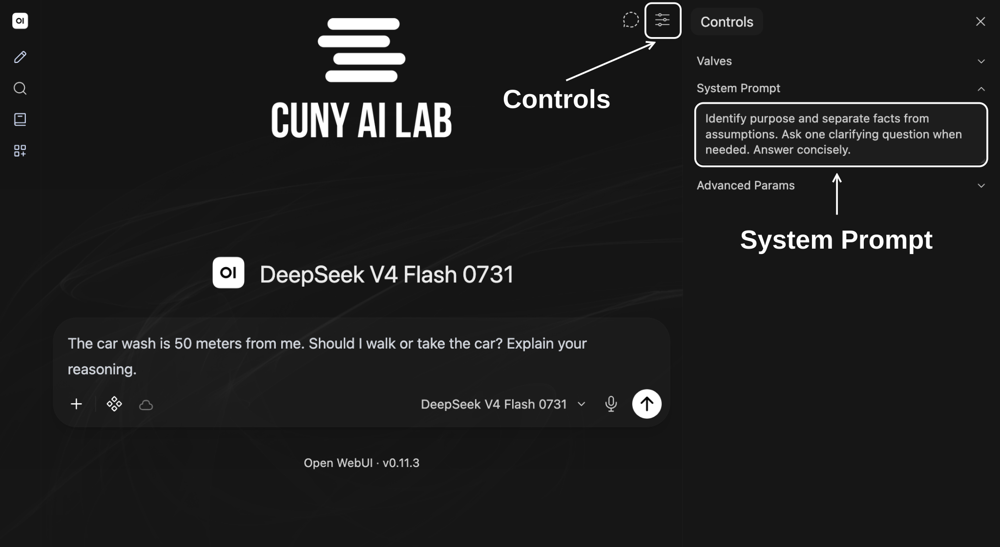

**Alt text:** CUNY AI Lab logo, DeepSeek V4 Flash 0731, car wash question in message box, and short instructions in System Prompt; white annotations identify Controls button and populated System Prompt field.

Select **Controls** at top right of chat. Paste these instructions into **System Prompt**, then close Controls.

```text
Identify purpose and separate facts from assumptions. Ask one clarifying question when needed. Answer concisely.
```

[https://ailab.gc.cuny.edu/models/](https://ailab.gc.cuny.edu/models/)

---

## Composing System Prompts — 16

### Regenerate Responses

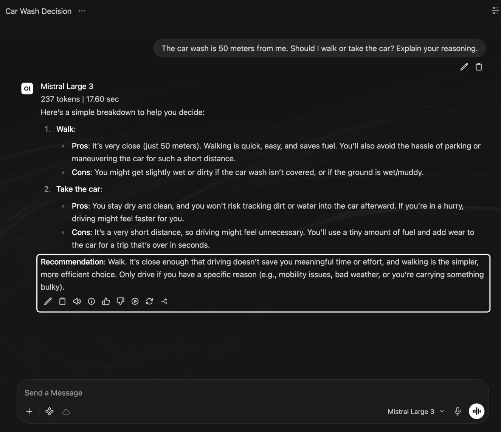

**Alt text:** Mistral Large 3 response recommending walking, with original question and message box; white annotation marks response controls for Regenerate.

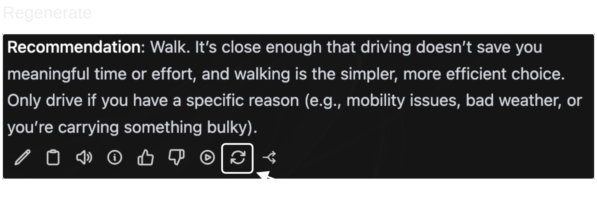

**Alt text:** Enlarged Mistral Large 3 response controls with Regenerate outlined and marked by an arrow.

Select Regenerate beneath each original response, then choose Try Again. Keep your original question, selected models, and other settings unchanged.

[Model Registry  https://ailab.gc.cuny.edu/models/](https://ailab.gc.cuny.edu/models/)

---

## Composing System Prompts — 17

### Debrief Questions

- What changed in each model’s answer to your car wash question after you added system prompt instructions?

- Did either model ask about your purpose or explain its assumptions before recommending walking or driving?

---

## Composing System Prompts — 18

### Explore

### Try Examples

Choose one example and experiment with it in chat.

Teaching

### [STEM Adventure Games](https://chat.ailab.gc.cuny.edu/?model=stem-adventure-games)

Explore scientific experiments through a text adventure with numbered choices.

Research

### [Compare Wikipedia Edits](https://chat.ailab.gc.cuny.edu/?model=compare-wikipedia-revisions)

Compare Wikipedia revisions and examine changes in wording, claims, and citations.

### Review Settings

Review **Base Model** and **System Prompt** for your chosen example.

- [STEM Adventure Games settings](https://chat.ailab.gc.cuny.edu/workspace/models/edit?id=stem-adventure-games)

- [Compare Wikipedia Edits settings](https://chat.ailab.gc.cuny.edu/workspace/models/edit?id=compare-wikipedia-revisions)

Find Purpose, Procedure, Constraints, and Format in its instructions.

Which instruction explains something you noticed in its response?

---

## Composing System Prompts — 19

### Clone Models

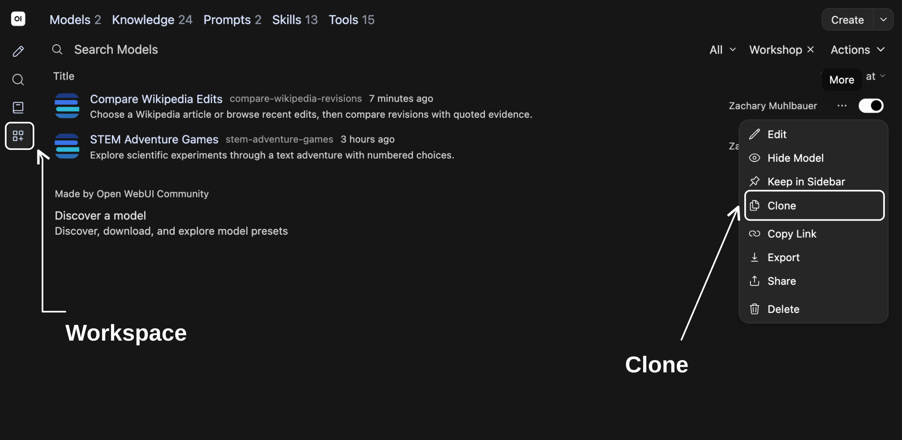

**Alt text:** Workspace Models showing shared workshop examples; white annotation identifies Clone in More menu.

Select Workspace in left sidebar, then Models. Open ⋯ beside your chosen example and select Clone.

- Rename your copy.

- Revise one instruction in **System Prompt**; keep **Base Model** and other settings unchanged.

- Scroll to bottom and select **Save & Create**.

- Open your copy in a new chat and repeat your original request.

---

## Composing System Prompts — 20

### Compare Configurations

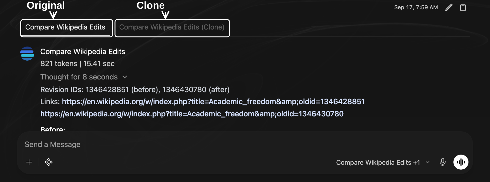

**Alt text:** Sandbox comparison with tabs for original Compare Wikipedia Edits and its clone; white annotations identify both model names above original response. Message box remains visible.

Start a new chat. Select model ID on bottom right of message box, then Compare. Choose your original model and your copy.

- What did you change?

- Did your intended revision prove effective?

- How could you imagine testing custom models like this in the future?

---

## Composing System Prompts — 21

### Draft System Prompts

Use remaining time to begin drafting instructions for your own teaching or research task.

```text
Purpose
What should your model help you accomplish?

Procedure
What steps should it follow?

Constraints
What limits should it observe?

Format
How should it present responses?
```

---

## Composing System Prompts — 22

### Create Models

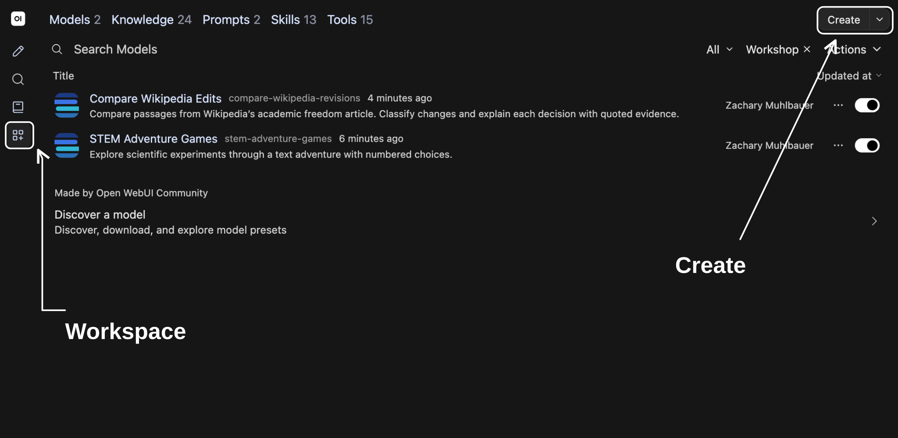

**Alt text:** Workspace Models filtered to shared workshop examples, with Create button outlined and marked by an arrow.

Select Workspace → Models → Create to configure your own model.

- Name your configuration.

- Select **Base Model** and paste your draft into **System Prompt**.

- Scroll to bottom and select **Save & Create**.

- Start a new chat with your model and try one request.

---

## Composing System Prompts — 23

### Next Workshops

### Knowledge Collections

**Building Custom Models with Knowledge Collections**

Thursday, October 1, 2026
2:30–4:00 pm

### Skills & Tools

**Extending Custom Models with Skills & Tools**

Thursday, October 15, 2026
2:30–4:00 pm

New Media Lab · Room 7388.01
CUNY Graduate Center

[Register for workshops  https://cail-workshop-registration.ailab-452.workers.dev/](https://cail-workshop-registration.ailab-452.workers.dev/)

---

## Composing System Prompts — 24

### Workshop Resources

Keep your draft and choose source documents for your next workshop.

### Workshop Materials

- [Open Knowledge Collections  https://cuny-ai-lab.github.io/sandbox-series/knowledge/](knowledge)

- [Review workshop copy  https://cuny-ai-lab.github.io/sandbox-series/basics/workshop-copy.html](basics/workshop-copy.html)

- [Consult Sandbox documentation  https://ailab.gc.cuny.edu/sandbox-docs/](https://ailab.gc.cuny.edu/sandbox-docs/)

- [Consult Open WebUI Models  https://docs.openwebui.com/features/workspace/models/](https://docs.openwebui.com/features/workspace/models/)

### Model Resources

- [Check Model Registry  https://ailab.gc.cuny.edu/models/](https://ailab.gc.cuny.edu/models/)

- [Check monthly usage  https://tools.ailab.gc.cuny.edu/model-access](https://tools.ailab.gc.cuny.edu/model-access)

- [Consult AI Lab guides  https://ailab.gc.cuny.edu/guides/](https://ailab.gc.cuny.edu/guides/)


## Curating knowledge collections — 1

[](https://ailab.gc.cuny.edu/)

**Alt text:** CUNY AI Lab

### Curating knowledge collections

Led by  Zach Muhlbauer  and  Meha Gupta

New Media Lab · Room 7388.01
CUNY Graduate Center

Thursday, October 1, 2026   2:30–4:00 p.m.

[https://cuny-ai-lab.github.io/sandbox-series/knowledge](https://cuny-ai-lab.github.io/sandbox-series/knowledge)

---

## Curating knowledge collections — 2

### Workshop Roadmap

- **[Composing System Prompts](basics)** Configure model behavior with system prompts. Thursday, September 17

- **Curating Knowledge Collections** Organize source documents in knowledge collections. Thursday, October 1

- **Configuring Skills and Tools** Extend model capabilities with skills and tools. Thursday, October 15

[https://ailab.gc.cuny.edu/sandbox-docs/](https://ailab.gc.cuny.edu/sandbox-docs/)

---

## Curating knowledge collections — 3

### Workshop Agenda

- Explore and clone · 15 minutes

- Select new sources · 25 minutes

- Create and populate collections · 20 minutes

- Revise system prompts · 10 minutes

- Test and revise · 20 minutes

Requires individual access, Sandbox sign-in.

Open Sandbox <https://chat.ailab.gc.cuny.edu/>

---

## Curating knowledge collections — 4

### Retrieval-Augmented Generation

A Knowledge collection contains documents a custom model can search.

**Retrieval-augmented generation (RAG)** combines information retrieval with text generation. It retrieves relevant source passages and adds them to a model’s context alongside your request and system prompt instructions.

**Search documents → Retrieve passages → Generate response**

 Open WebUI Knowledge <https://docs.openwebui.com/features/workspace/knowledge/>

---

## Curating knowledge collections — 5

### Explore STEM Adventures

**STEM Adventure Games** uses source documents to guide a text adventure with numbered choices.

Clone this example, then adapt its sources and instructions for a topic and audience you choose.

<https://chat.ailab.gc.cuny.edu/?model=stem-adventure-games>

---

## Curating knowledge collections — 6

### Clone Custom Model

Select **Workspace** in left sidebar, then **Models**. Search for **STEM Adventure Games**. Open **⋯** beside it and select **Clone**.


**Alt text:** Workspace Models filtered to STEM Adventure Games, with white annotations identifying Workspace in left sidebar and Clone for original model.

---

## Curating knowledge collections — 7

### Name Your Copy

Give your copy a unique name and model ID. Base model, system prompt, and settings carry over when you clone.

Scroll to bottom and select **Save & Create**.


**Alt text:** STEM Adventure Games clone form with white annotations identifying its name, model ID, and base model.

---

## Curating knowledge collections — 8

### Try Custom Model

Open **New Chat**. Select model ID on bottom right of message box. Choose your saved copy.

Select **Start an adventure**, choose an experiment, and try its numbered choices. Ask for another menu to see new options.

---

## Curating knowledge collections — 9

### Example Sources

Select **Workspace → Knowledge** and open **STEM Wikipedia Experiments** to see how an example collection is organized.


**Alt text:** Expanded Sandbox sidebar showing Workspace, Knowledge tab, and STEM Wikipedia Experiments collection, each outlined.

**List of experiments** guides adventure options; **Scientific method** guides decisions; **Women in science** adds historical context.

Next, choose sources for your adapted version.


**Alt text:** STEM Wikipedia Experiments containing three original Wikipedia source documents, outlined together.

---

## Curating knowledge collections — 10

### Choose Purpose

What should players learn or explore?

Choose a topic and audience for your adaptation of **STEM Adventure Games**. Identify a question players could investigate through their choices.

---

## Curating knowledge collections — 11

### Find Sources

Locate three Wikipedia articles about your chosen topic.

Read relevant passages. Choose sources that explain what players could investigate and which decisions they could make.

---

## Curating knowledge collections — 12

### Create Your Collection

Select **Workspace → Knowledge → Create**. Name your collection and describe what your sources cover.

Keep access **Private** and select **Create Knowledge**.


**Alt text:** Create a knowledge base form with STEM Workshop Sources entered and white outlines identifying name, description, and Create Knowledge.

---

## Curating knowledge collections — 13

### Add Source Text

Select **Add Content → New directory**. Name it **Wikipedia**, select **Create**, then open **Wikipedia**.

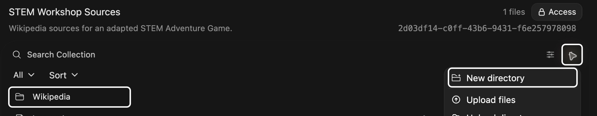

**Alt text:** New directory and Wikipedia directory outlined in Sandbox.

Select **Add Content → Add text content**. Use article title as filename.

Copy and paste several paragraphs or complete sections from each Wikipedia article, including its link.

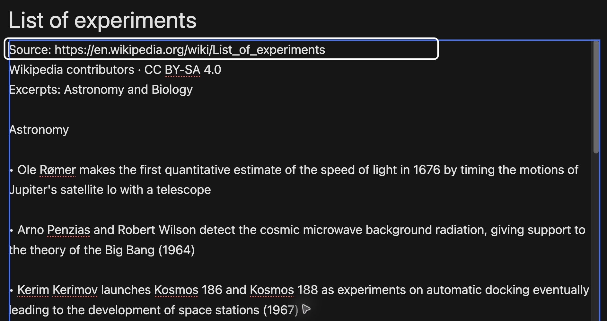

**Alt text:** List of experiments editor filled with Wikipedia experiment entries, with source link outlined.

Select **Save**. Repeat for three Wikipedia articles, keeping excerpts and links in separate files.

Wait for processing, then open each file to check text.

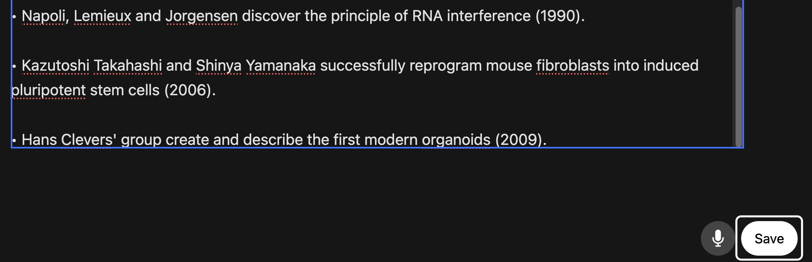

**Alt text:** Bottom of populated List of experiments editor with Save outlined.

---

## Curating knowledge collections — 14

### Add Instructions

Select collection name above directory contents to return to its root. Select **Add Content → Add text content**.

Enter **instructions** as title; Sandbox adds **.txt**. Describe how each source should guide play, substituting your page titles and directions. Select **Save**.

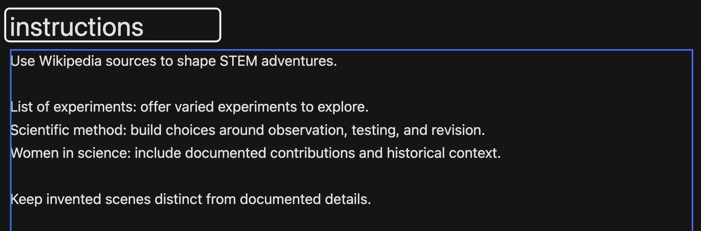

**Alt text:** Add text content editor titled instructions, with directions for using three STEM Wikipedia sources. Title outlined; Sandbox adds .txt when saved.

In **Workspace → Models**, open **⋯ → Edit** beside your saved copy.

Under **Knowledge**, replace **STEM Wikipedia Experiments** with your own collection. Scroll up to **System Prompt**.


**Alt text:** Model editor with Select Knowledge and STEM Workshop Sources in its collection picker annotated.

In cloned **System Prompt**, revise **Purpose** and **Audience** for your topic. Under **Procedure**, replace source and retrieval directions above numbered steps.

Offer four adventure options immediately. After a player chooses, retrieve instructions.txt from attached Knowledge collection and use its directions to find relevant source passages. Reuse those passages during play.

Remove instructions that refer to sources you replaced. Keep numbered game steps, **Constraints**, and **Format**. Select **Save & Update**.

---

## Curating knowledge collections — 15

### Test Custom Model

- Select **New Chat** in left sidebar.

- Select model ID on bottom right of message box. Choose your saved copy.

- Ask for four adventure options about your topic. Choose one to begin.

---

## Curating knowledge collections — 16

### Check Citations

In same chat, ask “Which passage supports this scene? Quote it and cite your source.”

Select a citation beside a response. Does its source passage support that response?


**Alt text:** STEM Adventure Games chat with citation beside a response outlined and labeled. Message box remains visible.

---

## Curating knowledge collections — 17

### Compare Responses

Keep your test chat open. Open **STEM Adventure Games** in another tab and send same opening request.

<https://chat.ailab.gc.cuny.edu/?model=stem-adventure-games>

- How do responses differ?

- Does your copy use new sources as instructed?

---

## Curating knowledge collections — 18

### Revise and Retest

Choose one problem you observed. Change a source or system prompt instruction.

For source changes, update copied excerpts and **instructions.txt**. Wait for processing. For prompt changes, select **Save & Update**.

Open **New Chat**, select your saved copy, and repeat your request. Did this change resolve that problem?

---

## Curating knowledge collections — 19

### Share Custom Model

In your copy’s editor, open **Access** and grant intended users or groups **Read** access. Give those same users **Read** access to its Knowledge collection.

Ask someone to try your copy and check its citations.

 Sandbox Roles & Permissions <https://ailab.gc.cuny.edu/sandbox-docs/roles-permissions/>

---

## Curating knowledge collections — 20

### Parting Questions

How else could you see yourself using knowledge collections in the future?

What are the limitations of this approach?

---

## Curating knowledge collections — 21

### Workshop Resources

Check responses against sources in your collection. Next workshop introduces tools that retrieve Wikipedia content live.

### Workshop Materials

- Review Composing System Prompts <https://cuny-ai-lab.github.io/sandbox-series/basics/>

- Consult Sandbox Knowledge documentation <https://ailab.gc.cuny.edu/sandbox-docs/knowledge-bases/>

- Consult Open WebUI Knowledge <https://docs.openwebui.com/features/workspace/knowledge/>

- Check monthly usage <https://tools.ailab.gc.cuny.edu/model-access>

### Example Model

- Open STEM Adventure Games <https://chat.ailab.gc.cuny.edu/?model=stem-adventure-games>


## Configuring skills and tools — 1

### Configuring skills and tools

Add tools and reusable instructions for teaching and research

CUNY AI Lab Sandbox

Developed by Zach Muhlbauer

[https://cuny-ai-lab.github.io/sandbox-series/skills](https://cuny-ai-lab.github.io/sandbox-series/skills)

---

## Configuring skills and tools — 2

### Workshop Agenda

- Confirm Skills and Tools access

- Play STEM Adventure

- Inspect commands and results

- Configure reusable skills

- Create and test tools

- Compare procedural changes

Before attending, confirm individual access and Sandbox sign-in. Creating or editing resources also requires Workspace access. Knowledge access is needed when your task uses a collection.

---

## Configuring skills and tools — 3

### Tools & Skills

Skills

Reusable instructions for tasks or procedures.

Tools

Operations such as web search, code execution, or database queries.

Test a request that needs your skill or tool. Check what your model used and whether its response is correct.

[Tools & Skills  https://ailab.gc.cuny.edu/sandbox-docs/tools-skills/](https://ailab.gc.cuny.edu/sandbox-docs/tools-skills/)

---

## Configuring skills and tools — 4

### Review Previous Work

Review your model and source collection. This example builds on our chat adventure and source collection. Workshop 3 adds tools and skills. Select STEM Adventure Games — Advanced and review its system prompt.

- Identify instructions for opening Prism Laboratory.

- Review attached STEM Wikipedia Experiments collection.

- Distinguish source material, skill instructions, and tool operations.

Use a private copy when adapting this configuration.

---

## Configuring skills and tools — 5

### Connect Resources

System prompt

Tell your model when to open a game or consult sources.

Knowledge

STEM Wikipedia Experiments contains scientific and historical sources.

Skill

Extend STEM Adventures describes how to change experimental procedures.

Tool

STEM Adventure opens a game and applies its rules.

Use provided game files to describe rooms, objects, and rules.

---

## Configuring skills and tools — 6

### Enable Tools

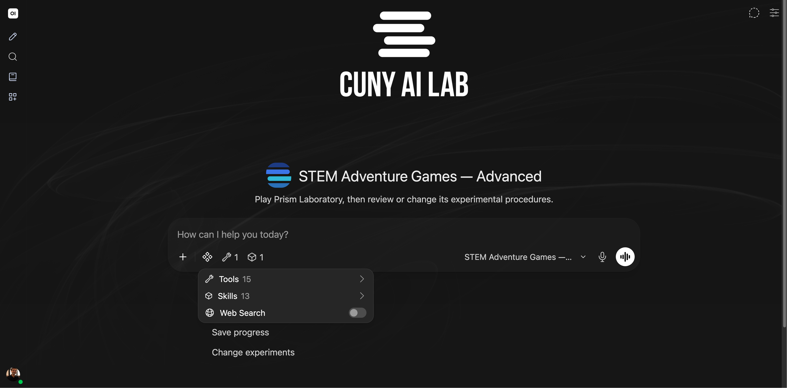

**Alt text:** STEM Adventure Games — Advanced with CUNY AI Lab logo, message box, and Integrations menu showing Tools and Skills.

With STEM Adventure Games — Advanced selected, open Integrations beside +. Under Tools, confirm STEM Adventure is enabled for this chat.

[Model Registry  https://ailab.gc.cuny.edu/models/](https://ailab.gc.cuny.edu/models/)

---

## Configuring skills and tools — 7

### Inspect Game Rules

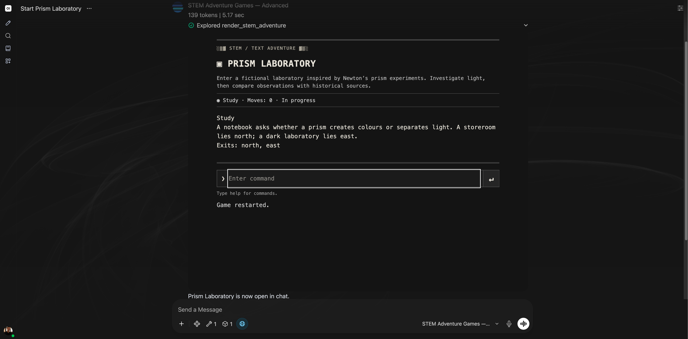

**Alt text:** Prism Laboratory running in STEM Adventure Games — Advanced, with room description, move status, command box, and chat message box.

Send Begin Prism Laboratory to your selected model. Enter help inside its command box, then go north and take prism.

[Open game  https://cuny-ai-lab.github.io/sandbox-series/examples/adventure/preview.html](examples/adventure/preview.html)[Read game file  https://cuny-ai-lab.github.io/sandbox-series/examples/adventure/prism.html](examples/adventure/prism.html)[Model Registry  https://ailab.gc.cuny.edu/models/](https://ailab.gc.cuny.edu/models/)

---

## Configuring skills and tools — 8

### Test Game Commands

- Enter **restart**, then try **record result** before completing required steps.

- Follow [winning command sequence](skills/reference.html#game-commands). Immediately after take prism, repeat take prism and check its response.

- Enter **save** to download your play record.

- Enter **restart**, then **load** and choose your saved file.

- Enter **inventory**. Check restored items, room, and completion. Enter **undo** to reverse your last move.

---

## Configuring skills and tools — 9

### Discuss Play Records

- Enter **discuss** inside your game.

- Review record in message box, then send it.

- Check how your model explains a failed action.

- Compare programmed observations with historical sources.

A completed game does not establish conceptual understanding.

---

## Configuring skills and tools — 10

### Choose Procedures

Choose one procedure to change or examine.

- Change size of an opening that admits light, called an aperture.

- Inspect a failed command and its prerequisite.

- Check a historical claim against source material.

Describe expected behavior before testing.

---

## Configuring skills and tools — 11

### Define Skills

Skills contain reusable Markdown instructions for tasks or procedures.

Models can load attached skills when needed. Enable a skill under Integrations → Skills to include its full instructions in this chat.

Markdown is plain text with formatting such as headings and lists.

[Tools & Skills  https://ailab.gc.cuny.edu/sandbox-docs/tools-skills/](https://ailab.gc.cuny.edu/sandbox-docs/tools-skills/)[Open WebUI Skills  https://docs.openwebui.com/features/workspace/skills/](https://docs.openwebui.com/features/workspace/skills/)

---

## Configuring skills and tools — 12

### Write Skills

---

## Configuring skills and tools — 13

### Structure Skills

Use three parts to draft this skill.

- **Trigger** — When should this skill activate?

- **Procedure** — Which steps should your model follow?

- **Format** — How should responses appear?

 [Read blank template  https://cuny-ai-lab.github.io/sandbox-series/skills/reference.html#write-instructions](skills/reference.html#write-instructions)[Read complete skill  https://cuny-ai-lab.github.io/sandbox-series/examples/stem-game-skill.html](examples/stem-game-skill.html)

---

## Configuring skills and tools — 14

### Define Triggers

Describe when your skill should be used.

- Should it load when users request a procedural change?

- Should it also apply to submitted play records?

- Which requests should leave it unused?

```text
Use this skill when users request an experimental variation in STEM Adventure or ask to examine a submitted play record.
```

---

## Configuring skills and tools — 15

### Write Procedures

Specify one change to your experiment. Use fields listed in [scenario instructions](examples/stem-game-skill.html) when editing your game file.

```text
1. Identify one experimental decision to change.
2. Check source material for that procedure.
3. Revise scenario JSON using fields listed in attached instructions.
4. List commands that complete your game and one command that should fail, then open your game.
5. Compare a submitted record with expected behavior.
```

---

## Configuring skills and tools — 16

### Specify Format

Separate your game file, source evidence, and test results.

```text
Scenario JSON: [Complete scenario]
Source: [Relevant historical passage]
Invented elements: [Rooms or simplified observations]
Winning commands: [Sequence]
Blocked command: [Command and missing prerequisite]
Observed result: [Fill only after testing]
```

---

## Configuring skills and tools — 17

### Clone Custom Models

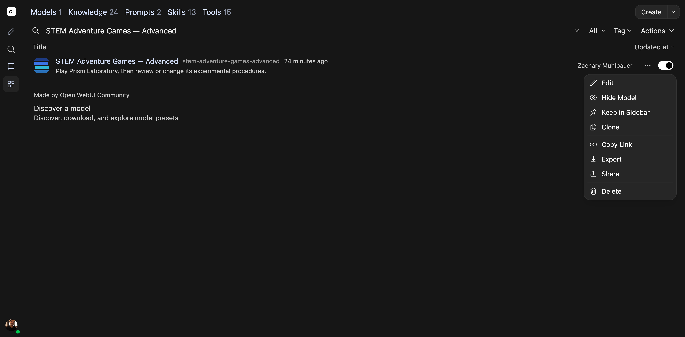

**Alt text:** Workspace Models filtered to STEM Adventure Games — Advanced, with More menu open and Clone visible.

In Workspace → Models, open ⋯ beside STEM Adventure Games — Advanced and choose Clone.

---

## Configuring skills and tools — 18

### Save Private Copy

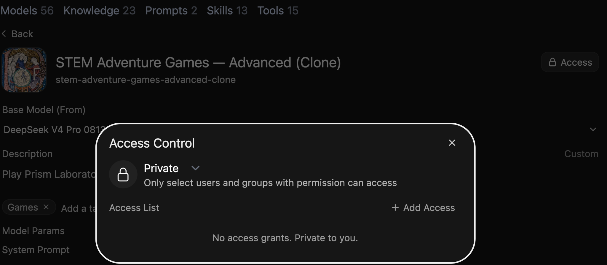

**Alt text:** Access Control on an unsaved STEM Adventure Games copy shows Private and No access grants. Private to you.

Rename model and ID. Open Access, keep Private, and remove copied users or groups from Access List. Close Access and choose Save & Create.

---

## Configuring skills and tools — 19

### Draft Skills

Kale Skill Builder is a custom model that drafts skills for tasks you describe.

Select model ID on bottom right of message box. Choose Kale Skill Builder.

Attach [scenario instructions](examples/stem-game-skill.html) before sending this example.

```text
Draft a skill for adding an aperture comparison to STEM Adventure. Use attached scenario instructions and preserve existing game rules. Include when to use it, 3–5 steps, expected output, and two proposed tests. Do not claim unrun tests passed.
```

[Open Kale Skill Builder  https://chat.ailab.gc.cuny.edu/?model=cail-sandbox-skill-builder](https://chat.ailab.gc.cuny.edu/?model=cail-sandbox-skill-builder)[Read tested skill  https://cuny-ai-lab.github.io/sandbox-series/examples/stem-game-skill.html](examples/stem-game-skill.html)[Review draft evaluation  https://cuny-ai-lab.github.io/sandbox-series/skills/reference.html#check-skill-drafts](skills/reference.html#check-skill-drafts)[Download skill instructions  https://cuny-ai-lab.github.io/sandbox-series/examples/stem-game-skill.md](examples/stem-game-skill.md)

---

## Configuring skills and tools — 20

### Create Skills

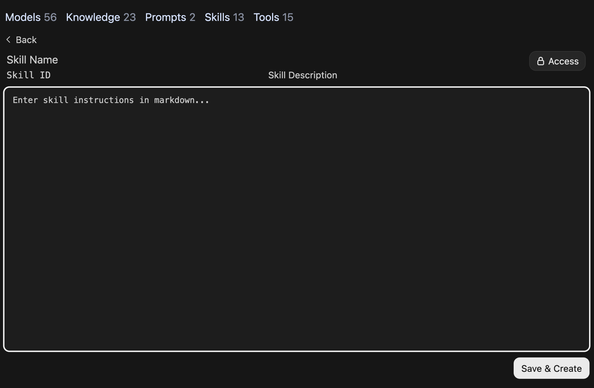

**Alt text:** Create Skill form in Workspace with empty name, identifier, description, and Instructions fields; outline marks Instructions.

Open Workspace → Skills → Create. Name your skill and add an identifier and description. Paste your saved draft into Instructions, review Access, and choose Save & Create.

---

## Configuring skills and tools — 21

### Attach Skills

- Open your private copy under **Workspace → Models**.

- Replace Extend STEM Adventures with your saved draft under **Skills**. Update System Prompt to name your skill.

- Set **Function Calling** to **Native** under **Advanced Parameters**.

- Select **Save & Update** and test a request that uses your skill.

Native function calling lets your model call tools and load attached skill instructions.

[Attach skills  https://ailab.gc.cuny.edu/sandbox-docs/tools-skills/](https://ailab.gc.cuny.edu/sandbox-docs/tools-skills/)

---

## Configuring skills and tools — 22

### Extend Procedures

Open your private copy. Attach [Prism Laboratory JSON](examples/adventure/prism.html) and enable your saved draft under **Integrations → Skills**. Send this request.

```text
Add an aperture comparison to Prism Laboratory using Newton: Experimental Variants. Keep existing rooms and actions. Provide scenario JSON, a winning command sequence, and one command that must fail before its prerequisite. Open the revised game.
```

[Read skill instructions  https://cuny-ai-lab.github.io/sandbox-series/examples/stem-game-skill.html](examples/stem-game-skill.html)[Download tested scenario  https://cuny-ai-lab.github.io/sandbox-series/examples/adventure/aperture.json](examples/adventure/aperture.json)[Download Prism Laboratory  https://cuny-ai-lab.github.io/sandbox-series/examples/adventure/prism.json](examples/adventure/prism.json)

---

## Configuring skills and tools — 23

### Test Skills

Use your private copy for both tests. Remove any additional skills from this copy before comparing your draft.

- Remove your skill under **Workspace → Models → Skills**. Save, start a new chat, and confirm it is off under **Integrations → Skills**. Repeat your extension request with Prism Laboratory JSON attached.

- Attach your skill again, save, and repeat that request in another new chat. Attach Prism Laboratory JSON and enable your saved draft under Integrations → Skills.

- Keep base model, system prompt, sources, and tool unchanged.

- Run winning and blocked commands. Compare expected and observed results.

Save generated scenarios and play records.

---

## Configuring skills and tools — 24

### Create Adventure Tools

CAIL Tool Creator is a custom model that drafts Python tools for tasks you describe. Save its output as a draft for review and testing. Use tested STEM Adventure code for installation in this workshop.

```text
Create a minimalist text adventure tool for Open WebUI. Return an interactive HTMLResponse and a description for the model. Track rooms, inventory, prerequisites, and completion. Use one command line with help, undo, restart, save, load, and discuss commands. Keep scenario JSON separate from executable code.
```

[Open CAIL Tool Creator  https://chat.ailab.gc.cuny.edu/?model=cail-sandbox-tool-creator](https://chat.ailab.gc.cuny.edu/?model=cail-sandbox-tool-creator)[Download tested tool  https://cuny-ai-lab.github.io/sandbox-series/examples/tools/stem_adventure.py](examples/tools/stem_adventure.py)[Review code evaluation  https://cuny-ai-lab.github.io/sandbox-series/skills/reference.html#check-generated-code](skills/reference.html#check-generated-code)

---

## Configuring skills and tools — 25

### Install Tool Code

- Open **Workspace → Tools → Create**.

- Enter a unique Name and ID, then add a Description.

- Paste provided [tested STEM Adventure code](examples/tools/stem_adventure.html). Save your creator draft for separate review.

- Select **Save & Create**.

- In your private model, replace STEM Adventure under **Tools** with your installed copy. Update System Prompt to name it and select **Save & Update**.

---

## Configuring skills and tools — 26

### Inspect Tool Results

Start a new chat with your private model. Under Integrations → Tools, select only your installed adventure tool. Send Begin Prism Laboratory, then open its tool-call details.

- Check which scenario was passed to render_stem_adventure.

- Compare returned result with your request.

- Confirm displayed game matches that scenario.

Save any error before revising your request.

---

## Configuring skills and tools — 27

### Compare Game Records

Attach saved play records from original and revised games, then send this request.

```text
Review both play records. Which commands and prerequisites changed? Which observations were programmed? Which historical claims can the uploaded sources support?
```

Check your model’s account against commands and source passages. Keep expected and observed results separate.

---

## Configuring skills and tools — 28

### Record Test Results

| Record | Include |
| --- | --- |
| Configuration | Model ID, system prompt, documents, skill instructions, and enabled tools. |
| Action | Request, instructions used, tool calls and results, and final response. |
| Judgment | What you expected, what happened, and any change you plan to test. |

Before sharing, confirm others can access your model, collections, skills, and tools. Repeat relevant tests after updates.

---

## Configuring skills and tools — 29

### Repeat Tests

- Save prompts, sources, skills, and tool settings

- Compare expected and observed behavior

- Revise instructions from recorded failures

- Verify shared access with intended users

- Retest after model or tool updates

[Return to Composing System Prompts  https://cuny-ai-lab.github.io/sandbox-series/basics/](basics)
