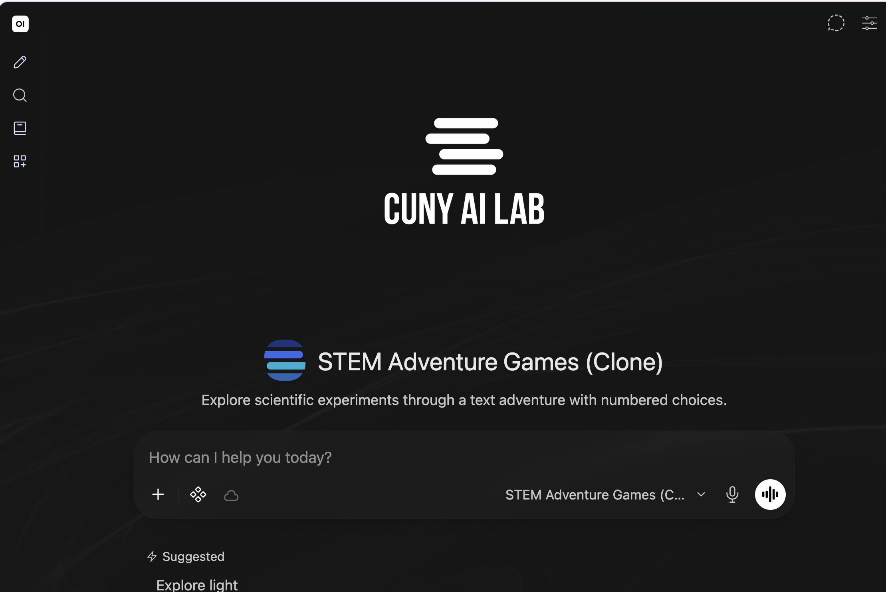
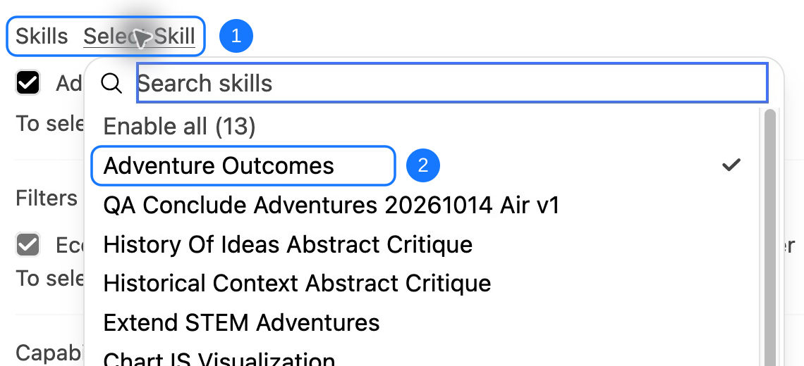
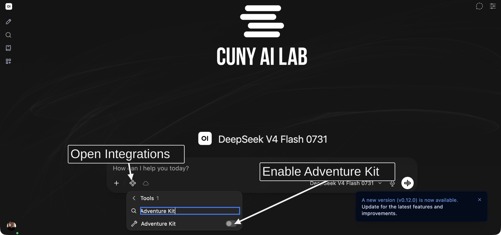

# Sandbox Workshops

## Composing System Prompts — 1

[](https://ailab.gc.cuny.edu/)

**Alt text:** CUNY AI Lab

### Composing System Prompts

Led by  Zach Muhlbauer

New Media Lab · Room 7388.01
CUNY Graduate Center

Thursday, September 17, 2026   2:30–4:00 p.m.

[https://cuny-ai-lab.github.io/sandbox-series/basics](https://cuny-ai-lab.github.io/sandbox-series/basics)

---

## Composing System Prompts — 2

### Workshop Roadmap

- **Composing System Prompts** Configure model behavior with system prompts.

- **[Curating knowledge collections](knowledge)** Organize source documents in knowledge collections. Thursday, October 1

- **Configuring skills and tools** Extend model capabilities with skills and tools. Thursday, October 15

[Sandbox documentation  https://ailab.gc.cuny.edu/sandbox-docs/](https://ailab.gc.cuny.edu/sandbox-docs/)

---

## Composing System Prompts — 3

### Workshop Agenda

- Introduce yourselves

- Request access and sign in

- Compare model outputs

- Revise system prompts

- Create custom models

Check monthly usage at Model Access.

[https://tools.ailab.gc.cuny.edu/model-access](https://tools.ailab.gc.cuny.edu/model-access)

---

## Composing System Prompts — 4

### Introductions

What is your name, pronouns, and role at CUNY?

What brings you to this workshop today?

---

## Composing System Prompts — 5

### Sandbox Access

### Request Access

- Open [access application](https://ailab.gc.cuny.edu/request-access/). Choose **My own access** and sign in with **CUNY Login**.

- Enter your details and intended use, complete verification, and select **Submit Application**.

- Watch your verified CUNY email for approval.

### Sign In

Already approved? Open [Sandbox](https://chat.ailab.gc.cuny.edu/).

- Select **Continue with CUNY Login** and enter your CUNY credentials.

- Complete two-factor authentication if prompted.

[https://ailab.gc.cuny.edu/request-access/](https://ailab.gc.cuny.edu/request-access/)[https://chat.ailab.gc.cuny.edu/](https://chat.ailab.gc.cuny.edu/)[Access and sign-in  https://ailab.gc.cuny.edu/sandbox-docs/getting-started/](https://ailab.gc.cuny.edu/sandbox-docs/getting-started/)

---

## Composing System Prompts — 6

### System Prompts

System prompts are setup instructions that describe how a model should behave.

### User Prompts

Questions or tasks you enter in chat.

### Custom Models

You create a custom model by choosing a base model, such as Gemma, and adding instructions and documents for it to use.

[Basic Concepts  https://ailab.gc.cuny.edu/sandbox-docs/basic-concepts/](https://ailab.gc.cuny.edu/sandbox-docs/basic-concepts/)[Custom Models  https://ailab.gc.cuny.edu/sandbox-docs/models/](https://ailab.gc.cuny.edu/sandbox-docs/models/)

---

## Composing System Prompts — 7

### Chat Features

Upload Files (+)

Attach images, PDFs, or documents.

Integrations

Enable tools that perform operations and skills that give reusable instructions.

Message actions

Find actions beneath each response to copy, edit, or regenerate it. Open More (⋯) for additional actions.

[Sandbox Basics  https://ailab.gc.cuny.edu/sandbox-docs/sandbox-basics/](https://ailab.gc.cuny.edu/sandbox-docs/sandbox-basics/)

---

## Composing System Prompts — 8

### Select Models


**Alt text:** Sandbox logo, message box, and Gateway model selector; enlarged detail shows current model choices with model ID outlined and marked by an arrow.

Find model selector in bottom right of message box, then select Gemma 4 26B A4B IT.

[Model Registry  https://ailab.gc.cuny.edu/models/](https://ailab.gc.cuny.edu/models/)

---

## Composing System Prompts — 9

### Compare Models


**Alt text:** Sandbox logo, message box, and Gateway model selector; enlarged detail shows Compare beside search field outlined and marked by an arrow.

Reopen model selector and select Compare beside search field. Choose Gemma and another model, such as Mistral Large 3.

[Model Registry  https://ailab.gc.cuny.edu/models/](https://ailab.gc.cuny.edu/models/)

---

## Composing System Prompts — 10

### Who Was Late?

Compare how two models interpret this sentence.

```text
The nurse yelled at the doctor because she was late. Who was late?
```

Send this question to both models.

---

## Composing System Prompts — 11

### Winograd Schema Challenge

This challenge tests how models interpret ambiguous pronouns using context and common-sense reasoning.

In our question, either person could be late.

- Which person does each model choose?

- What assumption supports its answer?

[Levesque, Davis, and Morgenstern (2012)  https://www.cs.nyu.edu/faculty/davise/papers/WSKR2012.pdf](https://www.cs.nyu.edu/faculty/davise/papers/WSKR2012.pdf)

---

## Composing System Prompts — 12

### Compare Outputs

Consider this question.

```text
The car wash is 50 meters from me. Should I walk or take the car? Explain your reasoning.
```

What do you think this person wants to accomplish?

---

## Composing System Prompts — 13

### Gemma vs. Qwen

### Gemma’s Response


**Alt text:** Gemma 3 27B response recommending walking, with model name and generation time.

### Qwen’s Response


**Alt text:** Qwen3.5 27B response recommending driving, with model name and generation time.

---

## Composing System Prompts — 14

### Going to the Car Wash

Start a new chat, select two models, and send this question.

```text
The car wash is 50 meters from me. Should I walk or take the car? Explain your reasoning.
```

---

## Composing System Prompts — 15

### Add System Prompt


**Alt text:** CUNY AI Lab logo, DeepSeek V4 Flash 0731, car wash question in message box, and short instructions in System Prompt; white annotations identify Controls button and populated System Prompt field.

Select **Controls** at top right of chat. Paste these instructions into **System Prompt**, then close Controls.

```text
Identify purpose and separate facts from assumptions. Ask one clarifying question when needed. Answer concisely.
```

[https://ailab.gc.cuny.edu/models/](https://ailab.gc.cuny.edu/models/)

---

## Composing System Prompts — 16

### Regenerate Responses


**Alt text:** Mistral Large 3 response recommending walking, with original question and message box; white annotation marks response controls for Regenerate.


**Alt text:** Enlarged Mistral Large 3 response controls with Regenerate outlined and marked by an arrow.

Select Regenerate beneath each original response, then choose Try Again. Keep your original question, selected models, and other settings unchanged.

[Model Registry  https://ailab.gc.cuny.edu/models/](https://ailab.gc.cuny.edu/models/)

---

## Composing System Prompts — 17

### Debrief Questions

- What changed in each model’s answer to your car wash question after you added system prompt instructions?

- Did either model ask about your purpose or explain its assumptions before recommending walking or driving?

---

## Composing System Prompts — 18

### Explore

### Try Examples

Choose one example and experiment with it in chat.

Teaching

### [STEM Adventure Games](https://chat.ailab.gc.cuny.edu/?model=stem-adventure-games)

Explore scientific experiments through a text adventure with numbered choices.

Research

### [Compare Wikipedia Edits](https://chat.ailab.gc.cuny.edu/?model=compare-wikipedia-revisions)

Compare Wikipedia revisions and examine changes in wording, claims, and citations.

### Review Settings

Review **Base Model** and **System Prompt** for your chosen example.

- [STEM Adventure Games settings](https://chat.ailab.gc.cuny.edu/workspace/models/edit?id=stem-adventure-games)

- [Compare Wikipedia Edits settings](https://chat.ailab.gc.cuny.edu/workspace/models/edit?id=compare-wikipedia-revisions)

Find Purpose, Procedure, Constraints, and Format in its instructions.

Which instruction explains something you noticed in its response?

---

## Composing System Prompts — 19

### Clone Models


**Alt text:** Workspace Models showing shared workshop examples; white annotation identifies Clone in More menu.

Select Workspace in left sidebar, then Models. Open ⋯ beside your chosen example and select Clone.

- Rename your copy.

- Revise one instruction in **System Prompt**; keep **Base Model** and other settings unchanged.

- Scroll to bottom and select **Save & Create**.

- Open your copy in a new chat and repeat your original request.

---

## Composing System Prompts — 20

### Compare Configurations


**Alt text:** Sandbox comparison with tabs for original Compare Wikipedia Edits and its clone; white annotations identify both model names above original response. Message box remains visible.

Start a new chat. Select model ID on bottom right of message box, then Compare. Choose your original model and your copy.

- What did you change?

- Did your intended revision prove effective?

- How could you imagine testing custom models like this in the future?

---

## Composing System Prompts — 21

### Draft System Prompts

Use remaining time to begin drafting instructions for your own teaching or research task.

```text
Purpose
What should your model help you accomplish?

Procedure
What steps should it follow?

Constraints
What limits should it observe?

Format
How should it present responses?
```

---

## Composing System Prompts — 22

### Create Models


**Alt text:** Workspace Models filtered to shared workshop examples, with Create button outlined and marked by an arrow.

Select Workspace → Models → Create to configure your own model.

- Name your configuration.

- Select **Base Model** and paste your draft into **System Prompt**.

- Scroll to bottom and select **Save & Create**.

- Start a new chat with your model and try one request.

---

## Composing System Prompts — 23

### Next Workshops

### Knowledge Collections

**Building Custom Models with Knowledge Collections**

Thursday, October 1, 2026
2:30–4:00 pm

### Skills & Tools

**Extending Custom Models with Skills & Tools**

Thursday, October 15, 2026
2:30–4:00 pm

New Media Lab · Room 7388.01
CUNY Graduate Center

[Register for workshops  https://cail-workshop-registration.ailab-452.workers.dev/](https://cail-workshop-registration.ailab-452.workers.dev/)

---

## Composing System Prompts — 24

### Workshop Resources

Keep your draft and choose source documents for your next workshop.

### Workshop Materials

- [Open Knowledge Collections  https://cuny-ai-lab.github.io/sandbox-series/knowledge/](knowledge)

- [Review workshop copy  https://cuny-ai-lab.github.io/sandbox-series/basics/workshop-copy.html](basics/workshop-copy.html)

- [Consult Sandbox documentation  https://ailab.gc.cuny.edu/sandbox-docs/](https://ailab.gc.cuny.edu/sandbox-docs/)

- [Consult Open WebUI Models  https://docs.openwebui.com/features/workspace/models/](https://docs.openwebui.com/features/workspace/models/)

### Model Resources

- [Check Model Registry  https://ailab.gc.cuny.edu/models/](https://ailab.gc.cuny.edu/models/)

- [Check monthly usage  https://tools.ailab.gc.cuny.edu/model-access](https://tools.ailab.gc.cuny.edu/model-access)

- [Consult AI Lab guides  https://ailab.gc.cuny.edu/guides/](https://ailab.gc.cuny.edu/guides/)


## Curating knowledge collections — 1

[](https://ailab.gc.cuny.edu/)

**Alt text:** CUNY AI Lab

### Curating knowledge collections

Led by  Zach Muhlbauer  and  Meha Gupta

New Media Lab · Room 7388.01
CUNY Graduate Center

Thursday, October 1, 2026   2:30–4:00 p.m.

[https://cuny-ai-lab.github.io/sandbox-series/knowledge](https://cuny-ai-lab.github.io/sandbox-series/knowledge)

---

## Curating knowledge collections — 2

### Workshop Roadmap

- **[Composing System Prompts](basics)**  Configure model behavior with system prompts. Thursday, September 17

- **Curating Knowledge Collections**  Organize source documents in knowledge collections. Thursday, October 1

- **Configuring Skills and Tools**  Extend model capabilities with skills and tools. Thursday, October 15

[https://ailab.gc.cuny.edu/sandbox-docs/](https://ailab.gc.cuny.edu/sandbox-docs/)

---

## Curating knowledge collections — 3

### Workshop Agenda

- Explore and clone · 15 minutes

- Select new sources · 25 minutes

- Create and populate collections · 20 minutes

- Revise system prompts · 10 minutes

- Test and revise · 20 minutes

Requires individual access, Sandbox sign-in.

Open Sandbox <https://chat.ailab.gc.cuny.edu/>

---

## Curating knowledge collections — 4

### Retrieval-Augmented Generation

A Knowledge collection contains documents a custom model can search.

**Retrieval-augmented generation (RAG)** combines information retrieval with text generation. It retrieves relevant source passages and adds them to a model’s context alongside your request and system prompt instructions.

**Search documents → Retrieve passages → Generate response**

 Open WebUI Knowledge <https://docs.openwebui.com/features/workspace/knowledge/>

---

## Curating knowledge collections — 5

### RAG Under the Hood

### Processing documents

- **Parse**  Extract usable text from files

- **Chunk**  Divide text into smaller passages

- **Embed**  Represent passages numerically so they can be searched by similarity

### Responding to requests

- **Retrieve**  Search for passages relevant to a request

- **Add context**  Append passages to prompt instructions

- **Generate**  Produce a response using that context

---

## Curating knowledge collections — 6

### Explore STEM Adventures

**STEM Adventure Games** uses source documents to guide a text adventure with numbered choices.

Clone this example, then adapt its sources and instructions for a topic and audience you choose.

<https://chat.ailab.gc.cuny.edu/?model=stem-adventure-games>

---

## Curating knowledge collections — 7

### Clone Custom Model

Select **Workspace** in left sidebar, then **Models**. Search for **STEM Adventure Games**. Open **⋯** beside it and select **Clone**.


**Alt text:** Workspace Models filtered to STEM Adventure Games, with white annotations identifying Workspace in left sidebar and Clone for original model.

---

## Curating knowledge collections — 8

### Name Your Copy

Give your copy a unique name and model ID. Base model, system prompt, and settings carry over when you clone.

Scroll to bottom and select **Save & Create**.


**Alt text:** STEM Adventure Games clone form with white annotations identifying its name, model ID, and base model.

---

## Curating knowledge collections — 9

### Try Custom Model

Open **New Chat**. Select model ID on bottom right of message box. Choose **STEM Adventure Games**.

Ask for four adventure options, choose one, and try its numbered choices. Ask for another menu to see new options.


**Alt text:** New chat with original STEM Adventure Games selected. Model selector at bottom right of message box is outlined.

Select **Workspace** in left sidebar, then **Knowledge**. Open **Sandbox Workshop Collection**.


**Alt text:** Workspace in left sidebar, Knowledge tab, and Sandbox Workshop Collection outlined in Firefox.

---

## Curating knowledge collections — 10

### Example Sources

At **Sandbox Workshop Collection** root, **instructions.txt** describes how sources guide play. Open **Wikipedia** to see source files.


**Alt text:** Sandbox Workshop Collection root with Wikipedia folder and instructions.txt outlined and labeled Source files and Source directions.

**Wikipedia** contains three article files. Open each to review its text and source link.

For your adapted version, start with one article. Add more as needed.


**Alt text:** Wikipedia directory inside Sandbox Workshop Collection with Women-in-science.txt, Scientific-method.txt, and List-of-experiments.txt outlined together.

---

## Curating knowledge collections — 11

### Choose Purpose

What should players learn or explore?

Choose a topic and audience for your adaptation of **STEM Adventure Games**. Identify a question players could investigate through their choices.

---

## Curating knowledge collections — 12

### Find Sources

Start with one Wikipedia article about your chosen topic. Add more only as needed.

Choose substantial passages that give players something to investigate through their choices.

---

## Curating knowledge collections — 13

### Create Your Collection

Select **Workspace → Knowledge → Create**. Name your collection and describe what your sources cover.

Keep access **Private** and select **Create Knowledge**.


**Alt text:** Create a knowledge base form with STEM Workshop Sources entered and white outlines identifying name, description, and Create Knowledge.

---

## Curating knowledge collections — 14

### Add Source Text

Select **Add Content → New directory**. Name it **Wikipedia**, select **Create**, then open **Wikipedia**.


**Alt text:** New directory and Wikipedia directory outlined in Sandbox.

Select **Add Content → Add text content**. Use article title as filename.

Copy and paste several paragraphs or complete sections from your chosen Wikipedia article, including its link.


**Alt text:** List of experiments editor filled with Wikipedia experiment entries, with source link outlined.

Select **Save**. One Wikipedia article is enough to begin. Keep any additional articles in separate files with their links.

Wait for processing, then open each file to check text.


**Alt text:** Bottom of populated List of experiments editor with Save outlined.

---

## Curating knowledge collections — 15

### Add Source Guidance

Before testing, add two short sources alongside your Wikipedia material.

- **Secondary source** — An explanation or analysis that helps interpret your topic.

- **Heuristic source** — Questions or rules of thumb that guide player decisions.

Return to collection root. Use **Add Content → Add text content** to save relevant passages and source links in separate, clearly named files.

---

## Curating knowledge collections — 16

### Add Instructions

Select collection name above directory contents to return to its root. Select **Add Content → Add text content**.

Enter **instructions** as title; Sandbox adds **.txt**. Use your page titles and filenames to explain which material grounds scenes, which helps interpret them, and which guides player choices. Select **Save**.


**Alt text:** Add text content editor titled instructions, with directions for using three STEM Wikipedia sources. Title outlined; Sandbox adds .txt when saved.

In **Workspace → Models**, open **⋯ → Edit** beside your saved copy.

Under **Knowledge**, replace **STEM Wikipedia Experiments** with your own collection. Scroll up to **System Prompt**.


**Alt text:** Model editor with Select Knowledge and STEM Workshop Sources in its collection picker annotated.

In cloned **System Prompt**, revise **Purpose** and **Audience** for your topic. Under **Procedure**, replace source and retrieval directions above numbered steps.

Offer four adventure options immediately. After a player chooses, retrieve instructions.txt from attached Knowledge collection and use its directions to find relevant source passages. Use article passages for details, secondary sources for interpretation, and heuristic sources for questions or decision rules during play.

Remove instructions that refer to sources you replaced. Keep numbered game steps, **Constraints**, and **Format**. Select **Save & Update**.

---

## Curating knowledge collections — 17

### Test Custom Model

- Select **New Chat** in left sidebar.

- Select model ID on bottom right of message box. Choose your saved copy.

- Ask for four adventure options about your topic. Choose one to begin.

---

## Curating knowledge collections — 18

### Check Citations

In same chat, ask “Which passage supports this scene? Quote it and cite your source.”

Select a citation beside a response. Does its source passage support that response?


**Alt text:** STEM Adventure Games chat with citation beside a response outlined and labeled. Message box remains visible.

---

## Curating knowledge collections — 19

### Compare Responses

Keep your test chat open. Open **STEM Adventure Games** in another tab and send same opening request.

<https://chat.ailab.gc.cuny.edu/?model=stem-adventure-games>

- How do responses differ?

- Does your copy use new sources as instructed?

---

## Curating knowledge collections — 20

### Revise and Retest

Choose one problem you observed. Revise source guidance or system prompt instructions. Add another Wikipedia article only if needed.

For source changes, update copied excerpts and **instructions.txt**. Wait for processing. For prompt changes, select **Save & Update**.

Open **New Chat**, select your saved copy, and repeat your request. Did this change resolve that problem?

---

## Curating knowledge collections — 21

### Share Custom Model

In your copy’s editor, open **Access** and grant intended users or groups **Read** access. Give those same users **Read** access to its Knowledge collection.

Ask someone to try your copy and check its citations.

 Sandbox Roles & Permissions <https://ailab.gc.cuny.edu/sandbox-docs/roles-permissions/>

---

## Curating knowledge collections — 22

### Parting Questions

How else could you see yourself using knowledge collections in the future?

What are the limitations of this approach?

---

## Curating knowledge collections — 23

### Workshop Resources

Check responses against sources in your collection. Next workshop introduces tools that retrieve Wikipedia content live.

### Workshop Materials

- Review Composing System Prompts <https://cuny-ai-lab.github.io/sandbox-series/basics/>

- Consult Sandbox Knowledge documentation <https://ailab.gc.cuny.edu/sandbox-docs/knowledge-bases/>

- Consult Open WebUI Knowledge <https://docs.openwebui.com/features/workspace/knowledge/>

- Check monthly usage <https://tools.ailab.gc.cuny.edu/model-access>

### Example Model

- Open STEM Adventure Games <https://chat.ailab.gc.cuny.edu/?model=stem-adventure-games>


## Configuring skills and tools — 1

[](https://ailab.gc.cuny.edu/)

**Alt text:** CUNY AI Lab

### Configuring skills and tools

New Media Lab · Room 7388.01
CUNY Graduate Center

Thursday, October 15, 2026   2:30–4:00 p.m. Eastern

[https://cuny-ai-lab.github.io/sandbox-series/skills](https://cuny-ai-lab.github.io/sandbox-series/skills)

---

## Configuring skills and tools — 2

### Choose Your Own Adventure

Continue your saved model, or clone **STEM Adventure Games**
Read its system prompt for setting, goals, and rules
[Clone instructions](skills/navigation.html#clone) · [Adventure example](examples/stem-chat-system-prompt.html)



**Alt text:** Saved model in chat with model selector below message box

---

## Configuring skills and tools — 3

### What Is a Skill?

**Skills** contain plain-text instructions for repeatable tasks

Trigger

Request or condition that starts a procedure

Procedure

Steps, checks, and points that require a question

Output

Required response content and form

---

## Configuring skills and tools — 4

### Skill Examples

Workspace → Skills · 1 of 3
Examples from the host’s catalog. Your list depends on access


**Alt text:** Current skills catalog entries including History Of Ideas Abstract Critique, Historical Context Abstract Critique, Extend STEM Adventures, ChartJS Visualization. Interface screenshot captured October 15, 2026.

---

## Configuring skills and tools — 5

### Skill Examples

Workspace → Skills · 2 of 3
Examples from the host’s catalog. Your list depends on access


**Alt text:** Current skills catalog entries including Response Features, Error Handling, Language Adjustment, Writing-Support-Opener. Interface screenshot captured October 15, 2026.

---

## Configuring skills and tools — 6

### Skill Examples

Workspace → Skills · 3 of 3
Examples from the host’s catalog. Your list depends on access


**Alt text:** Current skills catalog entries including Conversational Etiquette, Native Orthography, One-Step Dialogue. Interface screenshot captured October 15, 2026.

---

## Configuring skills and tools — 7

### Add Your Skill

Open **Workspace → Models**, then choose **Edit** from your model card’s menu
① Under **Skills**, click **Select Skill** · ② Choose your skill
Click **Save & Update** to save your model



**Alt text:** Model card Skills menu with blue numbered callouts for 1 Select Skill, 2 choose a saved skill. Adventure Outcomes is shown selected.

---

## Configuring skills and tools — 8

### Add Skill Instructions

Add this clause with the saved skill’s task, name, and ID · [Copy clause](skills/exercises.html#add-skill-instructions)

When I ask for [TASK], load [SKILL_NAME] (ID: [SKILL_ID]). Follow its saved instructions using this system prompt’s goals and rules and the latest information I have supplied. Ask about missing or conflicting details before deciding. Acknowledge a request to stop immediately, without requiring another action or reflection.

Save your model, then check that the saved skill loads and follows its instructions

---

## Configuring skills and tools — 9

### Test Your Skill

Ask your model to use the selected skill for its stated task

Use an actual record of choices and results
Leave out required information and check for a question
Ask to stop before the goal is met

Which task in your teaching or research needs a repeatable procedure?

---

## Configuring skills and tools — 10

### What Is a Tool?

When a model calls a **tool**, Sandbox executes a function and returns its result

**Tool calling**, otherwise known as **function calling**, sends a function name and arguments for execution

Input

Arguments supplied to a function

Execution

Code that applies specified rules

Result

Returned output for a model to inspect

---

## Configuring skills and tools — 11

### Tool Examples

Workspace → Tools · 1 of 4
Examples from the host’s catalog. Your list depends on access


**Alt text:** Current tools catalog entries including Adventure Kit, Chat Export, Instructor Rubric. Interface screenshot captured October 15, 2026.

---

## Configuring skills and tools — 12

### Tool Examples

Workspace → Tools · 2 of 4
Examples from the host’s catalog. Your list depends on access


**Alt text:** Current tools catalog entries including OCR reader, Instructional Toolset, Pronunciation and Translation Tool. Interface screenshot captured October 15, 2026.

---

## Configuring skills and tools — 13

### Tool Examples

Workspace → Tools · 3 of 4
Examples from the host’s catalog. Your list depends on access


**Alt text:** Current tools catalog entries including Graphing, PhysicsPY, ChartJS, Charts (v1). Interface screenshot captured October 15, 2026.

---

## Configuring skills and tools — 14

### Tool Examples

Workspace → Tools · 4 of 4
Examples from the host’s catalog. Your list depends on access


**Alt text:** Current tools catalog entries including Preflight Student Input, Kale GitHub, Whisper CUDA, cloudflare_whisper_tool. Interface screenshot captured October 15, 2026.

---

## Configuring skills and tools — 15

### Check Tool Binding

**Model Bound Tool Enabler** is a filter that restores model-attached tools when a chat request omits them

If an attached tool is missing from call details, use this existing filter on your private model and repeat your test

It restores availability; execution still requires a valid tool call

[Configuration checks and evidence record](skills/tool-calling.html)

---

## Configuring skills and tools — 16

### Add the ‘Adventure Kit’ tool

Open **Integrations → Tools**
Search **Adventure Kit** and select its toggle



**Alt text:** Chat Integrations Tools menu with Adventure Kit toggle; arrows identify relevant steps without changing interface pixels

---

## Configuring skills and tools — 17

### Prepare Your Adventure

Design your adventure from your system prompt

Instruct your model to map its setting, goals, and rules into scenes, choices, and end conditions

Resolve missing or contradictory instructions
Review proposed input for **Adventure Kit**

[Copy preparation and run requests](skills/exercises.html#add-and-test-tool)

---

## Configuring skills and tools — 18

### Add Tool Instructions

Add this clause to your model’s system prompt · [Copy clause](skills/exercises.html#add-tool-instructions)

After the player approves an adventure, call the attached Adventure Kit tool’s **render_adventure** function with the reviewed schema-version-2 JSON in **scenario_json**. Derive content and rules from this system prompt; resolve missing or conflicting instructions first. Read the returned result, resolve errors before play, and use the player’s copied Play record when discussing progress or completion.

Save your model, then verify tool attachment, provider support, and the actual result

---

## Configuring skills and tools — 19

### Test Your Tool

Run your reviewed adventure, then compare its scene and choices with your prompt

Try a choice before and after its prerequisite
Inspect Undo and Stop
Copy actual play record into chat

Which step in your teaching or research needs an executable operation?

---

## Configuring skills and tools — 20

### Choose Your Task

### Revise One Item

Copy complete tool code or skill instructions

Describe an observed problem and one change

### Create Your Own

Choose your own tool or skill

Specify purpose, required input, and expected result

[Copy tool code](skills/navigation.html#tool-copy) · [Skill instructions](skills/navigation.html#skill-copy)

---

## Configuring skills and tools — 21

### Work With Support

Open **CAIL Workspace Support**
Paste original content or your new task, system prompt, and required sources
Request complete content, an explanation, and one test · [Copy request](skills/exercises.html#work-with-support)


**Alt text:** CAIL Workspace Support model identity with surrounding sidebar

---

## Configuring skills and tools — 22

### Add Tools or Skills

Create a new **tool** or **skill**, or save a revised copy
Use **Workspace → Tools → Create** or [**Skills → Create**](skills/navigation.html#create-skill)
Enter new Name and ID; paste complete reviewed content

Review **Access**, then **Save & Create** · [Select and test your item](skills/exercises.html#add-new-version)


**Alt text:** Tools Create form with code editor, Access and Save & Create visible; arrows identify relevant steps without changing interface pixels

---

## Configuring skills and tools — 23

### Series Reflections

What task in your teaching or research could benefit from a skill or tool?

Would you be interested in joining our coworking session on October 29,  2–4pm,  to build your adventure into a collection so that we can showcase our work over the course of the series?

What would you develop next with the prompts, knowledge collections, skills, and tools you have explored?
