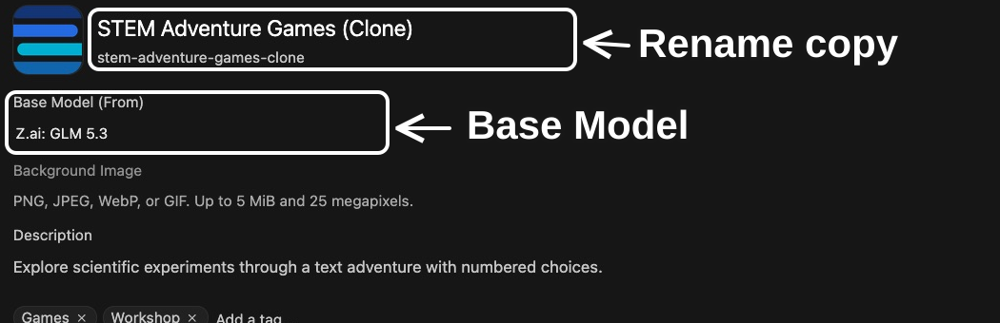
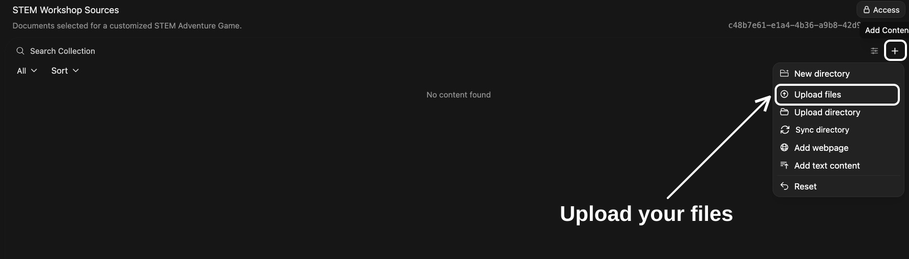
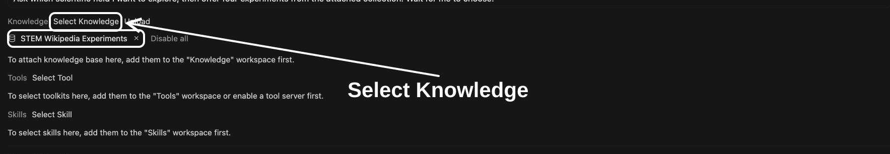
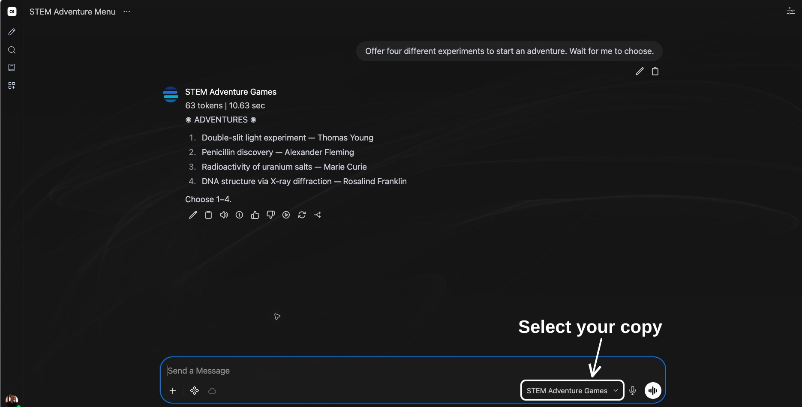
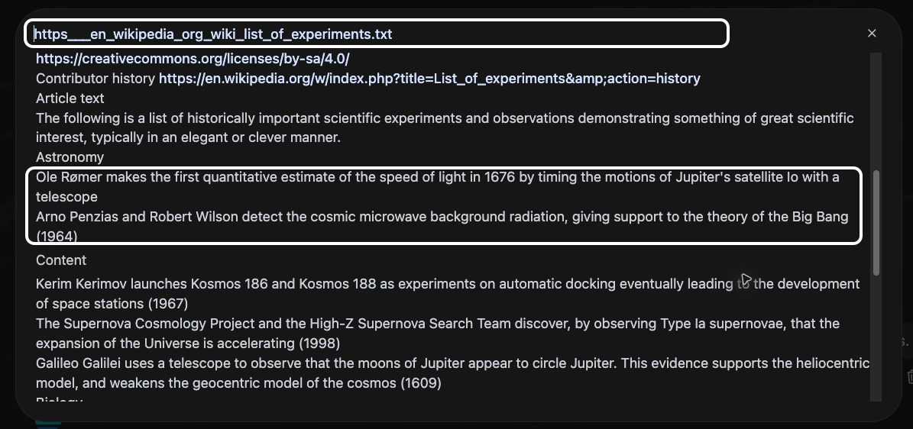

# Curating knowledge collections

## 1. Curating knowledge collections

### Curating knowledge collections

Led by  Zach Muhlbauer  and  Meha Gupta

New Media Lab · Room 7388.01
CUNY Graduate Center

Thursday, October 1, 2026   2:30–4:00 p.m.

---

## 2. Workshop Agenda

- Choose and clone models · 15 minutes

- Select new sources · 25 minutes

- Create and populate collections · 20 minutes

- Revise system prompts · 10 minutes

- Test and revise · 20 minutes

Requires individual access, Sandbox sign-in.

Open Sandbox <https://chat.ailab.gc.cuny.edu/>

---

## 3. Retrieval-Augmented Generation

A Knowledge collection contains documents a custom model can search.

**Retrieval-augmented generation (RAG)** combines information retrieval with text generation. Relevant passages are retrieved from external sources and added to a model’s context. Custom models use those passages with your request and system prompt instructions to generate a response.

**Search sources → Retrieve passages → Generate response**

 Open WebUI Knowledge <https://docs.openwebui.com/features/workspace/knowledge/>

---

## 4. Choose Custom Model

Follow **STEM Adventure Games**, or choose **Compare Wikipedia Edits**. Work with one model throughout.

Teaching

### STEM Adventure Games

<https://chat.ailab.gc.cuny.edu/?model=stem-adventure-games>

Explore scientific experiments through a text adventure with numbered choices.

Research

### Compare Wikipedia Edits

<https://chat.ailab.gc.cuny.edu/?model=compare-wikipedia-revisions>

Compare Wikipedia revisions and examine changes in wording, claims, and citations.

---

## 5. Clone Custom Model

Select **Workspace** in left sidebar, then **Models**. Search for your chosen example. Open **⋯** beside it and select **Clone**.

---

## 6. Name Your Copy

Give your copy a unique name and model ID. Base model, system prompt, and settings carry over when you clone.

Scroll to bottom and select **Save & Create**.

---

## 7. Try Custom Model

For **STEM Adventure Games**, select **Start an adventure**. Choose from four experiments and try its numbered choices. Ask for another menu to explore new options.

For **Compare Wikipedia Edits**, ask “Use attached source documents to compare one change between Wikipedia revisions.” Read its comparison.

---

## 8. Example Sources

Inspect sources attached to **STEM Adventure Games**. Select **Workspace → Knowledge** and open **STEM Wikipedia Experiments**.

Open **Scientific method** and read a passage. What could an adventure ask players to learn or do with this information?

<https://en.wikipedia.org/wiki/List_of_experiments>

<https://en.wikipedia.org/wiki/Scientific_method>

<https://en.wikipedia.org/wiki/Women_in_science>

---

## 9. Choose Your Sources

Choose a topic or audience for your copy of **STEM Adventure Games**. Select two or three documents with experiments, methods, or historical context for that version.

Save source text as PDF, Markdown, or plain text. Include titles, links, and dates. Uploaded documents preserve saved versions.

For **Compare Wikipedia Edits**, choose an article and save two revisions with their IDs and links.

---

## 10. Create Your Collection

Select **Workspace → Knowledge → Create**. Name your collection and describe what your sources cover.

Keep access **Private** and select **Create Knowledge**.

---

## 11. Upload Your Sources

Your new collection starts empty. Select **Add Content → Upload files** and upload documents you prepared.

Wait for processing, then open each file to check text and source links.

---

## 12. Attach Your Collection

Open cloned custom model in **Workspace → Models**. Under **Knowledge**, remove any inherited collection attachments, then select your own collection.

Continue to **System Prompt** in this editor.

---

## 13. Revise System Prompt

Replace original source list with filenames you uploaded. Explain how each document should guide your game.

- **Purpose** · Name your chosen topic or audience.

- **Procedure** · Use your sources to develop scenes and choices.

- **Constraints** · Require source support for historical details.

- **Format** · Preserve brief scenes and four numbered choices.

For Wikipedia, name saved revisions, specify changes to compare, and retain Before/After quotations.

Select **Save & Update**.

---

## 14. Test Custom Model

Start a new chat. Select model ID on bottom right of message box. Choose your copy.

Ask for four experiments suited to your chosen topic or audience. Choose one, then ask “Which passage supports this scene? Quote it and cite your source.”

For Wikipedia, ask “Use saved revisions in my attached collection. Compare one change and quote both passages.”

---

## 15. Check Citations

Select a citation to inspect its source.

- Does quoted text match your document?

- Does it support this custom model’s interpretation?

---

## 16. Compare Responses

Use one request with original model and your copy. For STEM, choose one experiment for both. Compare how each uses source documents.

- What changed with your sources and instructions? For STEM, check scenes and experimental choices.

- What did this custom model miss or misinterpret?

---

## 17. Revise and Retest

Change one source document or system prompt instruction based on what you observed, then repeat your request in a new chat.

If a custom model misses a source, check that its file finished processing, your collection is attached, and instructions name your new documents.

---

## 18. Share Custom Model

To share your work, grant intended users or groups **Read** access to your copy and its collection.

Ask someone to try your copy and check its citations.

 Sandbox Roles & Permissions <https://ailab.gc.cuny.edu/sandbox-docs/roles-permissions/>

---

## 19. Workshop Resources

Choose another experiment or article. Refresh source documents when needed and check responses against versions you saved.

### Workshop Materials

- Review Composing system prompts <https://cuny-ai-lab.github.io/sandbox-series/index.html>

- Consult Sandbox Knowledge documentation <https://ailab.gc.cuny.edu/sandbox-docs/knowledge-bases/>

- Consult Open WebUI Knowledge <https://docs.openwebui.com/features/workspace/knowledge/>

- Check monthly usage <https://tools.ailab.gc.cuny.edu/model-access>

### Example Models

- Open STEM Adventure Games <https://chat.ailab.gc.cuny.edu/?model=stem-adventure-games>

- Open Compare Wikipedia Edits <https://chat.ailab.gc.cuny.edu/?model=compare-wikipedia-revisions>
