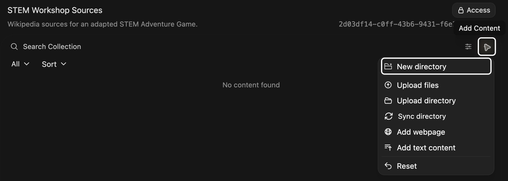
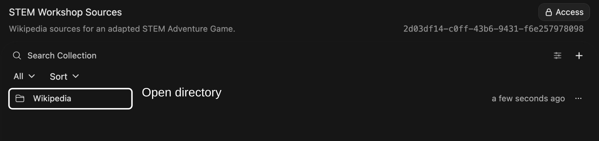
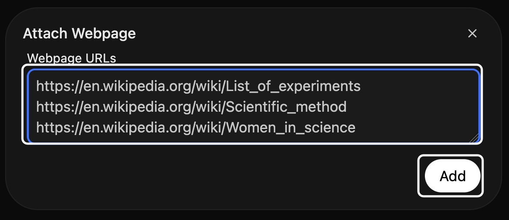

# Curating knowledge collections

## 1. Curating knowledge collections

Led by  Zach Muhlbauer  and  Meha Gupta

New Media Lab · Room 7388.01
CUNY Graduate Center

Thursday, October 1, 2026   2:30–4:00 p.m.

---

## 2. Workshop Roadmap

- **[Composing System Prompts](../basics/)** Configure model behavior with system prompts. Thursday, September 17

- **Curating Knowledge Collections** Organize source documents in knowledge collections. Thursday, October 1

- **Configuring Skills and Tools** Extend model capabilities with skills and tools. Thursday, October 15

[https://ailab.gc.cuny.edu/sandbox-docs/](https://ailab.gc.cuny.edu/sandbox-docs/)

---

## 3. Workshop Agenda

- Explore and clone · 15 minutes

- Select new sources · 25 minutes

- Create and populate collections · 20 minutes

- Revise system prompts · 10 minutes

- Test and revise · 20 minutes

Requires individual access, Sandbox sign-in.

Open Sandbox <https://chat.ailab.gc.cuny.edu/>

---

## 4. Retrieval-Augmented Generation

A Knowledge collection contains documents a custom model can search.

**Retrieval-augmented generation (RAG)** combines information retrieval with text generation. It retrieves relevant source passages and adds them to a model’s context alongside your request and system prompt instructions.

**Search documents → Retrieve passages → Generate response**

 Open WebUI Knowledge <https://docs.openwebui.com/features/workspace/knowledge/>

---

## 5. Explore STEM Adventures

**STEM Adventure Games** uses source documents to guide a text adventure with numbered choices.

Clone this example, then adapt its sources and instructions for a topic and audience you choose.

<https://chat.ailab.gc.cuny.edu/?model=stem-adventure-games>

---

## 6. Clone Custom Model

Select **Workspace** in left sidebar, then **Models**. Search for **STEM Adventure Games**. Open **⋯** beside it and select **Clone**.

---

## 7. Name Your Copy

Give your copy a unique name and model ID. Base model, system prompt, and settings carry over when you clone.

Scroll to bottom and select **Save & Create**.

---

## 8. Try Custom Model

Open **New Chat**. Select model ID on bottom right of message box. Choose your saved copy.

Select **Start an adventure**, choose an experiment, and try its numbered choices. Ask for another menu to see new options.

---

## 9. Example Sources

Select **Workspace → Knowledge** and open **STEM Wikipedia Experiments** to see how an example collection is organized.

**List of experiments** guides adventure options; **Scientific method** guides decisions; **Women in science** adds historical context.

Next, choose sources for your adapted version.

---

## 10. Choose Purpose

What should players learn or explore?

Choose a topic and audience for your adaptation of **STEM Adventure Games**. Identify a question players could investigate through their choices.

---

## 11. Find Sources

Locate three Wikipedia articles about your chosen topic.

Read relevant passages. Choose sources that explain what players could investigate and which decisions they could make.

---

## 12. Create Your Collection

Select **Workspace → Knowledge → Create**. Name your collection and describe what your sources cover.

Keep access **Private** and select **Create Knowledge**.

---

## 13. Add Webpages

Select **Add Content → New directory**. Name it **Wikipedia** and select **Create**.

Open **Wikipedia**. Add sources inside this directory.

Select **Add Content → Add webpage**. Paste Wikipedia URLs, one per line, and select **Add**.

Use three pages for your chosen topic. Wait for processing, then open each entry to check imported text. These are saved snapshots.

---

## 14. Add Instructions

Select collection name above directory contents to return to its root. Select **Add Content → Add text content**.

Enter **instructions** as title; Sandbox adds **.txt**. Describe how each source should guide play, substituting your page titles and directions. Select **Save**.

In **Workspace → Models**, open **⋯ → Edit** beside your saved copy.

Under **Knowledge**, replace **STEM Wikipedia Experiments** with your own collection. Scroll up to **System Prompt**.

In cloned **System Prompt**, revise **Purpose** and **Audience** for your topic. Under **Procedure**, replace source and retrieval directions above numbered steps.

Offer four adventure options immediately. After a player chooses, retrieve instructions.txt from attached Knowledge collection and use its directions to find relevant source passages. Reuse those passages during play.

Remove instructions that refer to sources you replaced. Keep numbered game steps, **Constraints**, and **Format**. Select **Save & Update**.

---

## 15. Test Custom Model

- Select **New Chat** in left sidebar.

- Select model ID on bottom right of message box. Choose your saved copy.

- Ask for four adventure options about your topic. Choose one to begin.

---

## 16. Check Citations

In same chat, ask “Which passage supports this scene? Quote it and cite your source.”

Select a citation beside a response. Does its source passage support that response?

---

## 17. Compare Responses

Keep your test chat open. Open **STEM Adventure Games** in another tab and send same opening request.

<https://chat.ailab.gc.cuny.edu/?model=stem-adventure-games>

- How do responses differ?

- Does your copy use new sources as instructed?

---

## 18. Revise and Retest

Choose one problem you observed. Change a source or system prompt instruction.

For source changes, update snapshots and **instructions.txt**. Wait for processing. For prompt changes, select **Save & Update**.

Open **New Chat**, select your saved copy, and repeat your request. Did this change resolve that problem?

---

## 19. Share Custom Model

In your copy’s editor, open **Access** and grant intended users or groups **Read** access. Give those same users **Read** access to its Knowledge collection.

Ask someone to try your copy and check its citations.

 Sandbox Roles & Permissions <https://ailab.gc.cuny.edu/sandbox-docs/roles-permissions/>

---

## 20. Workshop Resources

Choose another topic or experiment. Review webpages when they change and check responses against sources in your collection.

### Workshop Materials

- Review Composing System Prompts <https://cuny-ai-lab.github.io/sandbox-series/basics/>

- Consult Sandbox Knowledge documentation <https://ailab.gc.cuny.edu/sandbox-docs/knowledge-bases/>

- Consult Open WebUI Knowledge <https://docs.openwebui.com/features/workspace/knowledge/>

- Check monthly usage <https://tools.ailab.gc.cuny.edu/model-access>

### Example Model

- Open STEM Adventure Games <https://chat.ailab.gc.cuny.edu/?model=stem-adventure-games>
