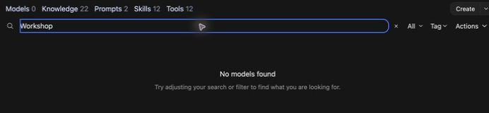
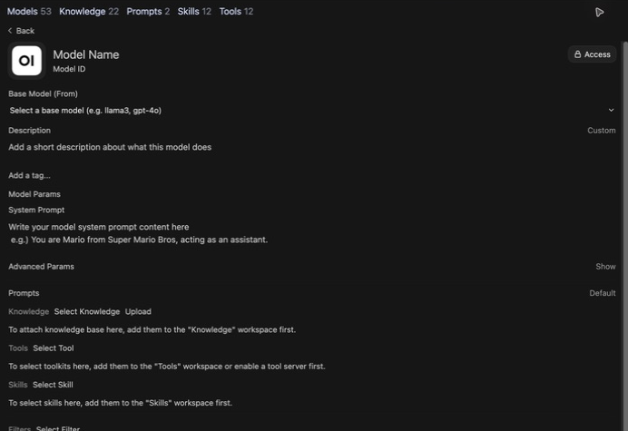
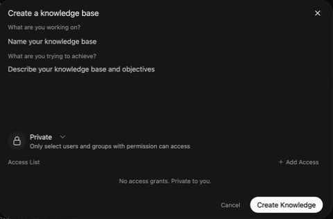

# Curate Knowledge Collections

Generated from index.html. Screenshot instructions are included below.

## Curate Knowledge Collections — 1

### Curate Knowledge Collections

Upload documents for models to reference in teaching and research

CUNY AI Lab Sandbox

Developed by Stefano Morello and Zach Muhlbauer

---

## Curate Knowledge Collections — 2

### Workshop Agenda

- Confirm Workspace and Knowledge access

- Select source documents

- Create knowledge collections

- Attach collections to model cards

- Check source citations

- Choose procedures for skills

Before attending, confirm individual access, Sandbox sign-in, Workspace access, and Knowledge collection access.

---

## Curate Knowledge Collections — 3

### Review Custom Models

Open the custom model you used in Workshop 1. You will attach documents and test whether the model can find and cite relevant passages.

Bring course materials, research papers, or other documents you know well enough to check.

Use [system-prompt examples](../examples.html) if you need a prompt to begin.

---

## Curate Knowledge Collections — 4

### Open Workspace



Open Workspace and select Knowledge to create a collection.

#### Supporting notes

Sign in after your Lab access is approved. Open **Workspace → Models** and find your card.

If you are joining here, use the sample prompt from the first workshop and choose a base model you can test.

Workspace authoring access is arranged separately from ordinary chat access.

[Access and sign-in](https://ailab.gc.cuny.edu/sandbox-docs/getting-started/)

---

## Curate Knowledge Collections — 5

### Review Model Settings



Review Base Model and System Prompt before attaching documents.

#### Supporting notes

Review **Base Model (From)** and **System Prompt**. Start a fresh chat using the card selected inside the message box.

Ask a question that depends on your source material. Save the response before attaching the collection.

[Model configuration](https://ailab.gc.cuny.edu/sandbox-docs/models/)

---

## Curate Knowledge Collections — 6

### Knowledge Collections

A knowledge collection contains uploaded documents that a model can search when responding to questions.

Collections support PDFs, Markdown, and plain text. Attach a collection to a custom model under **Knowledge**.

[Knowledge Bases](https://ailab.gc.cuny.edu/sandbox-docs/knowledge-bases/)

[Open WebUI Knowledge](https://docs.openwebui.com/features/workspace/knowledge/)

---

## Curate Knowledge Collections — 7

### Create Knowledge Collections



Enter a collection name and description, set access, and select Create Knowledge.

#### Supporting notes

- Open **Workspace → Knowledge → Create**.

- Name the collection and describe its contents and purpose.

- Keep it **Private** while building, then choose **Create Knowledge**.

[Create and manage collections](https://ailab.gc.cuny.edu/sandbox-docs/knowledge-bases/)

---

## Curate Knowledge Collections — 8

### Check Citations

Ask a question with a verifiable answer in one of your documents.

### Course Example

What does the assignment require as evidence for the midterm essay?

### Research example

How does this methods section define the study population?

Check the answer against the original passage. A plausible summary alone does not show that retrieval worked.

---

## Curate Knowledge Collections — 9

### Select Documents

Choose documents with clear headings and readable text.

- Course syllabi, readings, or assignment instructions

- Research papers, methods, or annotated bibliographies

- Markdown, plain text, or well-formatted PDFs

Check scans and complex PDFs before uploading. Convert them to text if necessary.

[Document formats](https://ailab.gc.cuny.edu/sandbox-docs/knowledge-bases/)

---

## Curate Knowledge Collections — 10

### Retrieve Source Passages

- Uploaded documents are divided into passages and indexed for search.

- Retrieval finds passages relevant to a question.

- The model uses those passages to generate a response.

Check that retrieved passages address your question and support the response.

[Open WebUI retrieval](https://docs.openwebui.com/features/workspace/knowledge/)

---

## Curate Knowledge Collections — 11

Example 1

### Organize Source Documents

Starting with Composition & Writing

---

## Curate Knowledge Collections — 12

Composition & Writing

### Incomplete Collections

**Weak**

```text
Collection contents:
• syllabus.pdf (14 pages, full course syllabus)
```

### Identify Problems

- The syllabus may not contain the evidence needed for a revision question. Check which passages are retrieved.

- No assignment context for the revision task

- No readings or reference materials for the model to draw on

---

## Curate Knowledge Collections — 13

Composition & Writing

### Add Specifics

**Getting There**

```text
Collection contents:
• syllabus.pdf
• essay-1-prompt.pdf
• mla-style-guide.pdf
```

### Compare Improvements

- Separate documents let the model find what it needs

- Assignment prompt gives the model context for the revision task

- Style guide helps with formatting questions

### Add Detail

- No course readings for the model to reference during analysis

- No common feedback patterns to guide revision

- No instructor notes on what substantive revision looks like in this course

---

## Curate Knowledge Collections — 14

Composition & Writing

### Support Revision

**Strong**

```text
Collection contents:

Course Context
• syllabus.pdf: schedule, learning objectives, policies
• revision-philosophy.txt: instructor notes on what revision means in this course

Assignment Materials (Essay 1: Rhetoric in Popular Media)
• essay-1-prompt.pdf: assignment instructions and requirements
• common-feedback.txt: patterns from past semesters (e.g., thesis too broad, evidence not analyzed)

Reference Materials
• mla-style-guide.pdf: citation and formatting conventions
• strong-intro-examples.txt: examples of effective introductions
• revision-checklist.pdf: the same checklist students use in peer review
```

---

## Curate Knowledge Collections — 15

Example 2

### Analyze Primary Sources

---

## Curate Knowledge Collections — 16

History

### Incomplete Collections

**Weak**

```text
Collection contents:
• textbook-chapter-12.pdf (42 pages)
```

### Identify Problems

- A general textbook chapter may not answer a question about a particular primary source.

- No primary sources for the model to help students analyze

- No framework like SOAPS for the model to scaffold source analysis

---

## Curate Knowledge Collections — 17

History

### Add Specifics

**Getting There**

```text
Collection contents:
• syllabus.pdf
• source-analysis-assignment.pdf
• primary-source-1.pdf (Freedmen's Bureau report, 1866)
• primary-source-2.pdf (Congressional testimony, 1871)
```

### Compare Improvements

- Includes actual primary sources students are working with

- Assignment prompt gives the model task-specific context

- Documents are separate and focused

### Add Detail

- No contextual background for the model to draw on when students ask about the period

- No SOAPS framework or equivalent to guide source analysis

- No source metadata (author, date, document type) to support sourcing questions

---

## Curate Knowledge Collections — 18

History

### Compare Primary Sources

**Strong**

```text
Collection contents:

Course Context
• syllabus.pdf: schedule, themes, learning objectives
• soaps-framework.txt: the analytical framework students use, with definitions and examples

Primary Sources (Reconstruction Unit)
• freedmens-bureau-report-1866.pdf: with metadata: author, date, document type, archive
• congressional-testimony-1871.pdf: with metadata
• source-context-notes.txt: brief historical context for each source (2-3 sentences each)

Reference Materials
• period-timeline.txt: key events 1865-1877 for contextualization questions
• common-analysis-errors.txt: patterns from past semesters (e.g., treating sources as neutral facts)
• chicago-citation-guide.pdf: citation format for history papers
```

---

## Curate Knowledge Collections — 19

Example 3

### Analyze Literary Texts

---

## Curate Knowledge Collections — 20

Literature & Cultural Studies

### Incomplete Collections

**Weak**

```text
Collection contents:
• course-reader.pdf (180 pages, all readings for the semester)
```

### Identify Problems

- An omnibus reader can make it harder to identify the relevant text. Check whether retrieval selects the intended source.

- No assignment context or close-reading framework

- No separation between literary texts and critical essays

---

## Curate Knowledge Collections — 21

Literature & Cultural Studies

### Add Specifics

**Getting There**

```text
Collection contents:
• syllabus.pdf
• close-reading-assignment.pdf
• sonny-blues-baldwin.pdf
• new-criticism-overview.pdf
```

### Compare Improvements

- Individual literary text rather than an omnibus reader

- Assignment prompt provides task-specific context

- Critical framework document gives the model methodological grounding

### Add Detail

- No annotated examples showing how to move from observation to interpretation

- No key terms for the current unit (e.g., tension, irony, ambiguity)

- No instructor notes on what close reading looks like in this course

---

## Curate Knowledge Collections — 22

Literature & Cultural Studies

### Support Textual Analysis

**Strong**

```text
Collection contents:

Course Context
• syllabus.pdf: schedule, texts, learning objectives
• new-criticism-framework.txt: key concepts and terms for this unit (tension, irony, paradox, ambiguity, diction, imagery)

Assignment Materials (Close Reading Essay)
• close-reading-assignment.pdf: instructions and requirements
• annotated-passage-example.txt: model annotation showing how to move from observation to interpretation

Literary Texts (Current Unit)
• sonny-blues-baldwin.pdf: the primary text for this assignment
• passage-selections.txt: key passages the instructor has flagged for class discussion
```

---

## Curate Knowledge Collections — 23

### Compare Research Methods

Build a collection from research papers or methods you want to compare.

- Identify a question that requires consulting those sources.

- Ask the model to compare specific claims or methods.

- Check its citations against the uploaded documents.

[Knowledge collections for research](https://ailab.gc.cuny.edu/sandbox-docs/knowledge-bases/)

---

## Curate Knowledge Collections — 24

### Organize Documents

Begin with a small collection so you can test how the model uses your materials.

- Name files so students or colleagues can identify them.

- Use headings to distinguish sections.

- Check whether the model retrieves the passages you need before adding more documents.

---

## Curate Knowledge Collections — 25

### Check Retrieval Problems

| Observation | Next check |
| --- | --- |
| No relevant source appears | Check processing, attachment, access, and the retrieval query. |
| The source is present but misread | Compare the answer with the full passage and revise instructions. |
| The answer invents a citation | Open the source and verify the quotation and location. |

Save the failed response before making one change.

---

## Curate Knowledge Collections — 26

Part IV

### Build Knowledge Collections

Three types of references to consider, then steps for how to create, curate, and use your first collection.

---

## Curate Knowledge Collections — 27

### Choose Reference Materials

Think about which type of course document you would add first

- **Course Context** Syllabus sections, weekly schedule

- **Assignment Materials** Instructions, feedback examples

- **Source Materials** Excerpted readings, primary sources

---

## Curate Knowledge Collections — 28

Type 1

### Describe Course Context

These documents describe course goals, structure, and methods students are expected to use.

- What are the course’s learning objectives?

- What analytical framework or methodology is central to the course?

- What course-level context would help the model support those goals?

```text
Recommended uploads:

1. syllabus.pdf
   - Course schedule, objectives, and policies

2. [framework-name].txt
   - The analytical method students use
   - Write it out in plain language with definitions
```

**Consider** Is there a framework or methodology central to your course? If so, a short document (1-2 pages) explaining it in the terms you use with students could be a strong addition.

---

## Curate Knowledge Collections — 29

Type 2

### Describe Assignments

These documents define the current task and help the model align its responses with your specific learning objectives.

- What does the assignment ask students to do?

- What does strong work on this assignment look like?

- What patterns come up most often in your feedback?

```text
Recommended uploads:

1. [assignment]-prompt.pdf
   - The assignment instructions

2. common-feedback.txt
   - 5-10 patterns you see every semester

3. strong-examples.txt (optional)
   - Excerpts showing what strong work looks like
```

**Consider** Which assignment stands to benefit? Try curating assignment instructions alongside a shortlist of common feedback patterns for starters.

---

## Curate Knowledge Collections — 30

Type 3

### Identify Sources

Upload the readings and reference materials students are working with in the current unit. This grounds the model in the actual texts.

- What texts are students reading for this assignment?

- Are there reference documents (timelines, glossaries, citation guides)?

- Can you add brief metadata or context for each source?

```text
Recommended uploads:

1. [reading-title].pdf
   - Individual files per text (not one big reader)
   - Add a header with: title, author, date, source

2. context-notes.txt (optional)
   - 2-3 sentences of context per source

3. [reference-guide].pdf
   - Citation style guide, glossary, or timeline
```

**Consider** Which readings or sources are students working with right now? Separate files can make sources easier to identify. Test retrieval with your actual questions.

---

## Curate Knowledge Collections — 31

### Select Research Materials

Use the preceding templates to describe research materials.

Research context

Describe your question, scope, and method.

Instructions

Include a codebook, protocol, or criteria for comparing sources.

Sources

Identify the documents and passages you want to examine.

---

## Curate Knowledge Collections — 32

### Attach Knowledge Collections

- Open your collection and upload the first few documents. Wait for processing to finish.

- Check the extracted text against each source.

- Return to **Workspace → Models**, open your card, and select the collection under **Knowledge**.

- Choose **Save & Update**, then start a fresh chat with that card.

[Upload and attach source material](https://ailab.gc.cuny.edu/sandbox-docs/knowledge-bases/)

---

## Curate Knowledge Collections — 33

### Test Retrieval

- Ask a question answered by one source. Verify the answer and quotation.

- Ask a question that needs two sources. Check whether both are used accurately.

- Ask a question the collection cannot answer. Check whether the response states that limit.

Repeat the baseline question with the model and prompt unchanged. Record the collection version and passages retrieved with your judgment.

---

## Curate Knowledge Collections — 34

### Share Knowledge Collections

Share the knowledge collection with the people who will use the custom model.

- Use **Add Access** to grant users or groups **Read** access.

- Check that participants can use the model and retrieve from the collection.

- Choose **Public** only for documents intended for all signed-in Sandbox users.

[Roles & Permissions](https://ailab.gc.cuny.edu/sandbox-docs/roles-permissions/)

---

## Curate Knowledge Collections — 35

### Prepare Skill Instructions

- Save source lists and retrieval tests

- Request Skills and Tools access

- Choose recurring teaching or research procedures

- Review [system-prompt examples](../examples.html)

- Continue to [Skills & Tools](../skills/)
