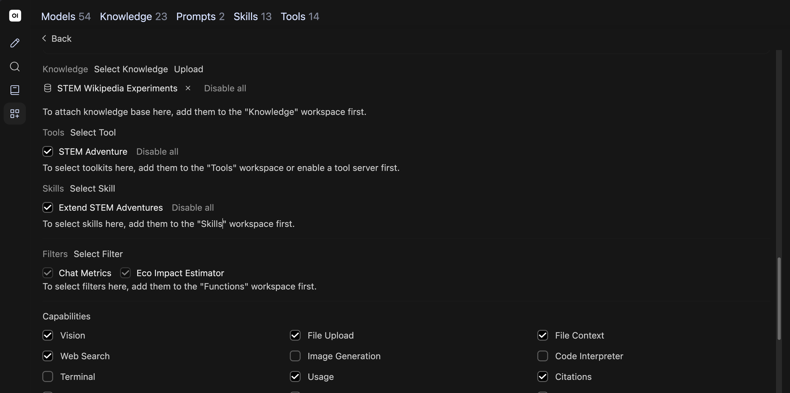

# Curating knowledge collections

## Curating knowledge collections — 1

### Curating knowledge collections

Upload documents for models to reference in teaching and research

CUNY AI Lab Sandbox

Developed by Zach Muhlbauer

---

## Curating knowledge collections — 2

### Workshop Agenda

- Confirm Workspace and Knowledge access

- Select source documents

- Create knowledge collections

- Attach collections to custom models

- Check source citations

- Choose procedures for skills

Before attending, confirm individual access, Sandbox sign-in, Workspace access, and Knowledge collection access.

---

## Curating knowledge collections — 3

### Knowledge Collections

A knowledge collection contains uploaded documents that a model can search when responding to questions.

Collections support PDFs, Markdown, and plain text. Attach a collection to a custom model under **Knowledge**.

[Knowledge Bases](https://ailab.gc.cuny.edu/sandbox-docs/knowledge-bases/)

[Open WebUI Knowledge](https://docs.openwebui.com/features/workspace/knowledge/)

---

## Curating knowledge collections — 4

### Review Custom Models

Choose a question about documents you want your custom model to use.

Bring course materials, research papers, or other documents you know well enough to check.

Use [system-prompt examples](../examples.html) if you need a prompt to begin.

---

## Curating knowledge collections — 5

### Open Workspace


Select Workspace in left sidebar. Choose Models and open your custom model.

---

## Curating knowledge collections — 6

### Review Model Settings


Review Base Model and System Prompt before attaching documents.

Review **Base Model (From)** and **System Prompt**. Start a new chat. Select model ID on bottom right of message box. Choose your custom model.

Ask a question about your source material. Save this response before attaching documents.

[Model configuration](https://ailab.gc.cuny.edu/sandbox-docs/models/)

---

## Curating knowledge collections — 7

### Select Documents

Choose documents with clear headings and readable text.

- Course syllabi, readings, or assignment instructions

- Research papers, methods, or annotated bibliographies

- Markdown, plain text, or well-formatted PDFs

Check scans and complex PDFs before uploading. Convert them to text if necessary.

[Document formats](https://ailab.gc.cuny.edu/sandbox-docs/knowledge-bases/)

---

## Curating knowledge collections — 8

### Retrieve Source Passages

- Uploaded documents are divided into passages and indexed for search.

- Retrieval finds passages relevant to a question.

- Your model uses retrieved passages to generate a response.

Check whether retrieved passages address your question and support claims in each response.

[Open WebUI retrieval](https://docs.openwebui.com/features/workspace/knowledge/)

---

## Curating knowledge collections — 9

### Open STEM Collection


Open Workspace → Knowledge. Search for STEM and open STEM Wikipedia Experiments. Inspect each file before using it as evidence.

---

## Curating knowledge collections — 10

### Review Source Roles

Use sources for different questions.

Newton’s optical experiments

Check apparatus, procedures, and observations.

Scientific method

Examine hypotheses, measurement, and revision.

Women in science

Investigate collaboration, recognition, and institutions.

Keep source summaries and game documentation distinguishable.

---

## Curating knowledge collections — 11

### Inspect Imported Text

Open each file and compare its contents with its source page.

- Confirm article text is present.

- Check headings, missing passages, and extraction errors.

- Record article title, source URL, and revision date.

On September 14, 2026, List of experiments contained a Wikimedia rate-limit error instead of article text. Its filename alone did not establish usable content.

---

## Curating knowledge collections — 12

### Review Attached Knowledge



Open Workspace → Models → STEM Adventure Games. Scroll to Knowledge and review its attached collection. For your own model, select a collection and choose Save & Update.

---

## Curating knowledge collections — 13

### Check Game Sources

Compare Prism Laboratory with Newton’s account.

```text
Which apparatus details from Newton’s account does Prism Laboratory simplify? Identify the uploaded source and quote a relevant passage. If it is unavailable, say so.
```

Open cited material. Does it support your model’s response?

[Read Newton source entry](../examples/knowledge/newton-light-colour.md) · [Review source register](../examples/knowledge/source-register.md)

---

## Curating knowledge collections — 14

### Check Citations

Check a response from STEM Adventure Games against its cited passage.

- Which apparatus did Newton describe?

- Which experimental changes did he examine?

Open each citation. Compare quoted wording and interpretation with source text.

---

## Curating knowledge collections — 15

### Compare Research Methods

Build a collection from research papers or methods you want to compare.

- Identify a question that requires consulting those sources.

- Ask your model to compare specific claims or methods.

- Check its citations against your uploaded documents.

[Knowledge collections for research](https://ailab.gc.cuny.edu/sandbox-docs/knowledge-bases/)

---

## Curating knowledge collections — 16

### Organize Documents

Begin with a few documents and test how your model uses them.

- Name files so students or colleagues can identify them.

- Use headings to distinguish sections.

- Check whether your model retrieves relevant passages before adding more documents.

---

## Curating knowledge collections — 17

### Check Retrieval Problems

| Observation | Next check |
| --- | --- |
| No relevant source appears | Check whether files finished processing, are attached, and are accessible. Review your search query. |
| A source is present but misread | Read cited passages in full and revise instructions. |
| A response invents a citation | Open cited documents and verify quotations and page numbers. |

Save unsuccessful responses before revising anything.

---

## Curating knowledge collections — 18

### Build Knowledge Collections

Choose documents that explain your course or research project and describe what you want to examine.

---

## Curating knowledge collections — 19

### Choose Reference Materials

Add sources that support your adventure.

- Use [Newton: Light and Colour](../examples/knowledge/newton-light-colour.md) for apparatus and observations.

- Use [Newton: Experimental Variants](../examples/knowledge/newton-experimental-variants.md) for procedural changes.

- Use [Evaluate Game Procedures](../examples/knowledge/game-procedure-evaluation.md) for software checks.

Download entries you want your model to use. Create your own collection after reviewing these materials.

---

## Curating knowledge collections — 20

### Describe Experimental Context

Separate documented experiments from invented game settings.

- Which question motivated an experiment?

- Which instruments and materials appear in its source?

- Which rooms or actions were created for play?

Prism Laboratory simplifies an apparatus with two boards and two prisms.

---

## Curating knowledge collections — 21

### Describe Scientific Methods

An aperture is an opening that admits light. Compare procedures before changing its size in your game.

- Which variable changes when an aperture narrows?

- Which conditions stay fixed?

- What would a changed observation support?

[Read experimental variants](../examples/knowledge/newton-experimental-variants.md)

---

## Curating knowledge collections — 22

### Identify Historical Sources

Use Women in science to examine contributors, institutions, and recognition.

- Who performed or supported this work?

- Which barriers affected participation?

- What can these sources establish about a particular experiment?

---

## Curating knowledge collections — 23

### Select Research Materials

Describe your research project and identify sources your model should use.

Research context

Describe your question, scope, and method.

Instructions

Include a codebook, protocol, or criteria for comparing sources.

Sources

Identify documents and passages you want to examine.

---

## Curating knowledge collections — 24

### Create Knowledge Collections


Enter a collection name and description, set access, and select Create Knowledge.

- Open **Workspace → Knowledge → Create**.

- Name your collection and describe its contents and purpose.

- Keep it **Private** while building, then choose **Create Knowledge**.

[Create and manage collections](https://ailab.gc.cuny.edu/sandbox-docs/knowledge-bases/)

---

## Curating knowledge collections — 25

### Attach Knowledge Collections

- Open Workspace → Knowledge → your collection. Use Add Content to upload documents, then wait for processing to finish.

- Check extracted text against each source.

- Return to **Workspace → Models**, open your custom model, and select your collection under **Knowledge**.

- Choose **Save & Update**, then start a new chat with your custom model.

[Upload and attach source material](https://ailab.gc.cuny.edu/sandbox-docs/knowledge-bases/)

---

## Curating knowledge collections — 26

### Test Retrieval

- Ask a question answered by one source. Verify each answer and quotation.

- Ask a question that needs two sources. Check whether both are used accurately.

- Ask about something absent from your documents. Check whether your model acknowledges missing information.

Repeat your first question without changing models or system prompts. Record which documents you used, which passages were retrieved, and whether those passages support your model’s response.

---

## Curating knowledge collections — 27

### Share Knowledge Collections

Share your collection with people who will use your custom model.

- Use **Add Access** to grant users or groups **Read** access.

- Ask someone you shared with to check access to your model and collection.

- Choose **Public** only for documents intended for all signed-in Sandbox users.

[Roles & Permissions](https://ailab.gc.cuny.edu/sandbox-docs/roles-permissions/)

---

## Curating knowledge collections — 28

### Prepare Skill Instructions

- Save source lists and retrieval tests

- Request Skills and Tools access

- Choose recurring teaching or research procedures

- Review [system-prompt examples](../examples.html)

- Continue to [Configuring skills and tools](../skills/)
