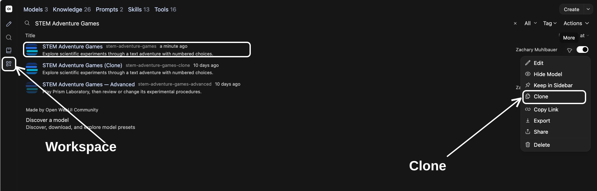
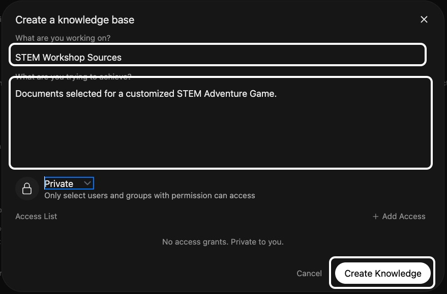

# Curating knowledge collections

## Curating knowledge collections — 1

### Curating knowledge collections

Led by  Zach Muhlbauer  and  Meha Gupta

New Media Lab · Room 7388.01
CUNY Graduate Center

Thursday, October 1, 2026   2:30–4:00 p.m.

---

## Curating knowledge collections — 2

### Workshop Roadmap

- **[Composing System Prompts](../basics/)** Configure model behavior with system prompts. Thursday, September 17

- **Curating Knowledge Collections** Organize source documents in knowledge collections. Thursday, October 1

- **Configuring Skills and Tools** Extend model capabilities with skills and tools. Thursday, October 15

[https://ailab.gc.cuny.edu/sandbox-docs/](https://ailab.gc.cuny.edu/sandbox-docs/)

---

## Curating knowledge collections — 3

### Workshop Agenda

- Explore and clone · 15 minutes

- Select new sources · 25 minutes

- Create and populate collections · 20 minutes

- Revise system prompts · 10 minutes

- Test and revise · 20 minutes

Requires individual access, Sandbox sign-in.

Open Sandbox <https://chat.ailab.gc.cuny.edu/>

---

## Curating knowledge collections — 4

### Retrieval-Augmented Generation

A Knowledge collection contains documents a custom model can search.

**Retrieval-augmented generation (RAG)** combines information retrieval with text generation. It retrieves relevant source passages and adds them to a model’s context alongside your request and system prompt instructions.

**Search documents → Retrieve passages → Generate response**

 Open WebUI Knowledge <https://docs.openwebui.com/features/workspace/knowledge/>

---

## Curating knowledge collections — 5

### Explore STEM Adventures

**STEM Adventure Games** uses source documents to guide a text adventure with numbered choices.

Clone this example, then adapt its sources and instructions for a topic and audience you choose.

<https://chat.ailab.gc.cuny.edu/?model=stem-adventure-games>

---

## Curating knowledge collections — 6

### Clone Custom Model

Select **Workspace** in left sidebar, then **Models**. Search for **STEM Adventure Games**. Open **⋯** beside it and select **Clone**.

---

## Curating knowledge collections — 7

### Name Your Copy

Give your copy a unique name and model ID. Base model, system prompt, and settings carry over when you clone.

Scroll to bottom and select **Save & Create**.

---

## Curating knowledge collections — 8

### Try Custom Model

Open **New Chat**. Select model ID on bottom right of message box. Choose your saved copy.

Select **Start an adventure**, choose an experiment, and try its numbered choices. Ask for another menu to see new options.

---

## Curating knowledge collections — 9

### Example Sources

Select **Workspace → Knowledge** and open **STEM Wikipedia Experiments** to see how an example collection is organized.

**List of experiments** guides adventure options; **Scientific method** guides decisions; **Women in science** adds historical context.

Next, choose sources for your adapted version.

---

## Curating knowledge collections — 10

### Choose Purpose

What should players learn or explore?

Choose a topic and audience for your adaptation of **STEM Adventure Games**. Identify a question players could investigate through their choices.

---

## Curating knowledge collections — 11

### Find Sources

Locate two or three Wikipedia articles or other documents about your chosen topic.

Read relevant passages. Choose sources that explain what players could investigate and which decisions they could make.

---

## Curating knowledge collections — 12

### Prepare Documents

Copy relevant source text into documents and save as PDF, Markdown, or plain text. Include a title, source URL, and date saved in each file.

Use descriptive filenames. These saved documents become your collection; links alone do not include article text.

---

## Curating knowledge collections — 13

### Create Your Collection

Select **Workspace → Knowledge → Create**. Name your collection and describe what your sources cover.

Keep access **Private** and select **Create Knowledge**.

---

## Curating knowledge collections — 14

### Upload Your Sources

Your new collection starts empty. Select **Add Content → Upload files** and upload documents you prepared.

Wait for processing, then open each file to check text and source links.

---

## Curating knowledge collections — 15

### Attach Your Collection

In **Workspace → Models**, find your saved copy. Open **⋯ → Edit**.

Under **Knowledge**, remove **STEM Wikipedia Experiments** from your copy and select your own collection. Scroll up to **System Prompt**.

---

## Curating knowledge collections — 16

### Update Purpose

In **System Prompt**, revise **Purpose** and **Audience** for your chosen topic. Use this as a starting point.

Create a text adventure about [topic] for [audience]. Let players investigate [question] through their decisions.

---

## Curating knowledge collections — 17

### Update Sources

Under **Procedure → Source documents**, replace original source names with filenames you uploaded. Explain how each document should guide play.

Use [filename] to guide [adventure options, decisions, or background details].

Remove instructions that refer to sources you replaced.

---

## Curating knowledge collections — 18

### Revise Instructions

Check remaining instructions against your chosen topic.

- **Procedure** · Revise directions that conflict with your topic.

- **Constraints** · Keep documented details distinct from invented scenes.

- **Format** · Retain brief scenes and numbered choices.

Select **Save & Update**.

---

## Curating knowledge collections — 19

### Test Custom Model

- Select **New Chat** in left sidebar.

- Select model ID on bottom right of message box. Choose your saved copy.

- Ask for four adventure options about your topic. Choose one to begin.

---

## Curating knowledge collections — 20

### Check Citations

In same chat, ask “Which passage supports this scene? Quote it and cite your source.”

Select a citation beside a response. Does its source passage support that response?

---

## Curating knowledge collections — 21

### Compare Responses

Keep your test chat open. Open **STEM Adventure Games** in another tab and send same opening request.

<https://chat.ailab.gc.cuny.edu/?model=stem-adventure-games>

- How do responses differ?

- Does your copy use new sources as instructed?

---

## Curating knowledge collections — 22

### Revise and Retest

Choose one problem you observed and revise its source document or system prompt instruction.

For document changes, replace outdated files in your collection and wait for processing. For prompt changes, select **Save & Update**.

Open **New Chat**, select your saved copy, and repeat your request. Did this change resolve that problem?

---

## Curating knowledge collections — 23

### Share Custom Model

In your copy’s editor, open **Access** and grant intended users or groups **Read** access. Give those same users **Read** access to its Knowledge collection.

Ask someone to try your copy and check its citations.

 Sandbox Roles & Permissions <https://ailab.gc.cuny.edu/sandbox-docs/roles-permissions/>

---

## Curating knowledge collections — 24

### Workshop Resources

Choose another topic or experiment. Refresh source documents when needed and check responses against versions you saved.

### Workshop Materials

- Review Composing System Prompts <https://cuny-ai-lab.github.io/sandbox-series/basics/>

- Consult Sandbox Knowledge documentation <https://ailab.gc.cuny.edu/sandbox-docs/knowledge-bases/>

- Consult Open WebUI Knowledge <https://docs.openwebui.com/features/workspace/knowledge/>

- Check monthly usage <https://tools.ailab.gc.cuny.edu/model-access>

### Example Model

- Open STEM Adventure Games <https://chat.ailab.gc.cuny.edu/?model=stem-adventure-games>
