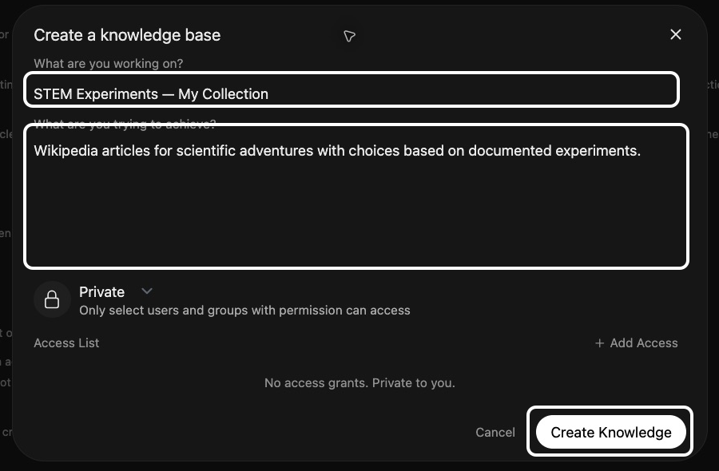
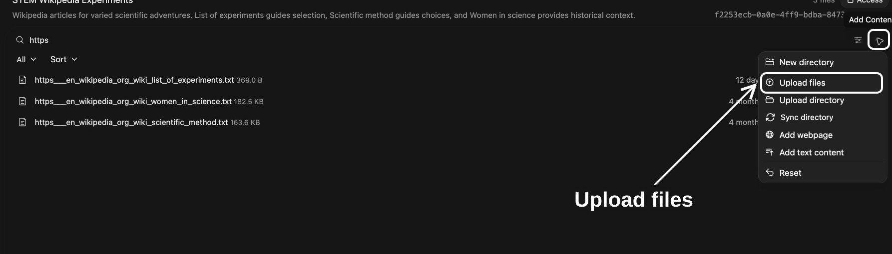
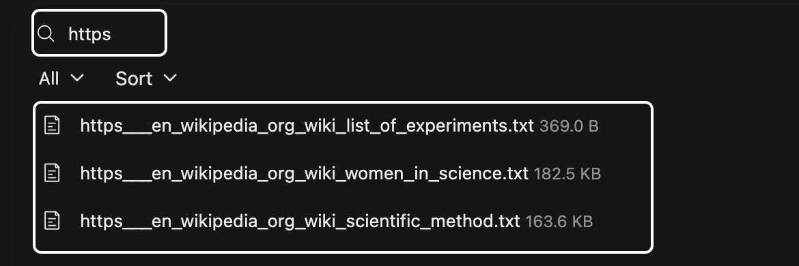
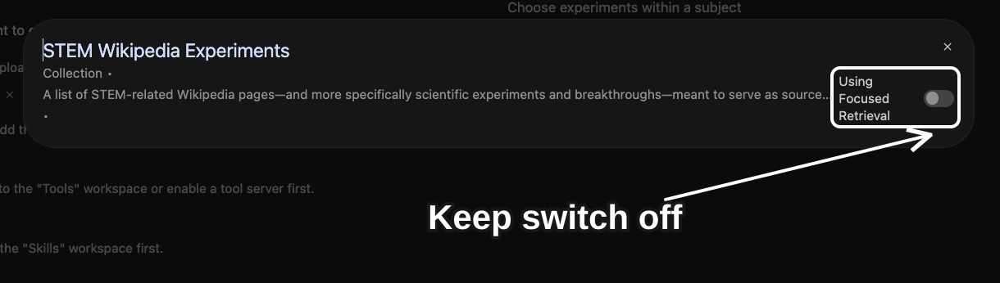
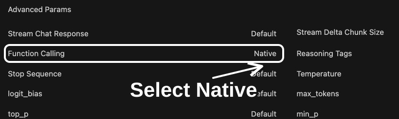
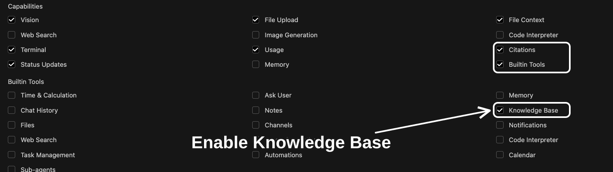

# Curating knowledge collections

## Curating knowledge collections — 1

### Curating knowledge collections

Led by  Zach Muhlbauer

New Media Lab · Room 7388.01
CUNY Graduate Center

Thursday, October 1, 2026   2:30–4:00 p.m.

---

## Curating knowledge collections — 2

### Workshop Agenda

- Choose and clone models · 15 minutes

- Select source documents · 20 minutes

- Create knowledge collections · 20 minutes

- Configure retrieval · 15 minutes

- Test and revise · 20 minutes

Requires individual access, Sandbox sign-in, Workspace and Knowledge access.

[Open Sandbox](https://chat.ailab.gc.cuny.edu/)

---

## Curating knowledge collections — 3

### Explain RAG

A Knowledge collection contains documents your model can search.

**Retrieval-augmented generation (RAG)** combines information retrieval with text generation. Relevant passages are retrieved from external sources and added to a model’s context. Your model uses those passages with your request and system prompt instructions to generate a response.

**Search sources → Retrieve passages → Generate response**

[Open WebUI Knowledge  https://docs.openwebui.com/features/workspace/knowledge/](https://docs.openwebui.com/features/workspace/knowledge/)

---

## Curating knowledge collections — 4

### Choose Models

Follow **STEM Adventure Games**, or choose **Compare Wikipedia Edits**. Work with one model throughout.

Teaching

### [STEM Adventure Games](https://chat.ailab.gc.cuny.edu/?model=stem-adventure-games)

Explore scientific experiments through a text adventure with numbered choices.

Research

### [Compare Wikipedia Edits](https://chat.ailab.gc.cuny.edu/?model=compare-wikipedia-revisions)

Compare Wikipedia revisions and examine changes in wording, claims, and citations.

---

## Curating knowledge collections — 5

### Clone Models

Select **Workspace** in left sidebar, then **Models**. Search for your chosen example. Open **⋯** beside it and select **Clone**.

---

## Curating knowledge collections — 6

### Review Settings

Give your copy a unique name and model ID. Review **Base Model** and **System Prompt**. Keep base model unchanged. Leave custom Skills and Tools unselected.

Scroll to bottom and select **Save & Create**.

---

## Curating knowledge collections — 7

### Try Models

For **STEM Adventure Games**, select **Start an adventure**. Choose from four experiments and try its numbered choices. Ask for another menu to explore new options.

For **Compare Wikipedia Edits**, ask “Retrieve three recently edited Wikipedia articles with dates and links.” Choose an article to compare.

---

## Curating knowledge collections — 8

### Prepare Documents

STEM Adventure Games draws on three Wikipedia articles.

- [List of experiments](https://en.wikipedia.org/wiki/List_of_experiments) offers experiments to explore.

- [Scientific method](https://en.wikipedia.org/wiki/Scientific_method) informs experimental choices.

- [Women in science](https://en.wikipedia.org/wiki/Women_in_science) provides historical context.

For Compare Wikipedia Edits, begin with an article’s [revision history](https://en.wikipedia.org/wiki/Help:Page_history) and [comparison of revisions](https://en.wikipedia.org/wiki/Help:Diff).

---

## Curating knowledge collections — 9

### Select Sources

Choose material you can read and check. Include article text, source links, and dates in your documents.

| Model | Source material |
| --- | --- |
| STEM Adventure Games | Begin with its three articles; add an article about your chosen experiment. |
| Compare Wikipedia Edits | Choose from live [Recent changes](https://en.wikipedia.org/wiki/Special:RecentChanges); save two revisions with IDs and links. |

Uploaded documents preserve saved versions. Check live pages when updating your collection.

---

## Curating knowledge collections — 10

### Create Collections

Select **Workspace → Knowledge → Create**. Name your collection and describe its purpose.

Keep access **Private** and select **Create Knowledge**.

---

## Curating knowledge collections — 11

### Add Sources

Select **Add Content → Upload files**. Upload your documents and wait for processing to finish.

PDFs, Markdown, and plain text are supported.

---

## Curating knowledge collections — 12

### Check Documents

Open each document. Check that selected text, source links, and headings are present.

For STEM Adventure Games, check passages about your chosen experiment. For Compare Wikipedia Edits, check that revision IDs match each version.

---

## Curating knowledge collections — 13

### Attach Knowledge

Open your copy in **Workspace → Models**. Under **Knowledge**, select your collection.

Keep only collections you want your copy to use. Cloning a model keeps links to shared documents, so edit documents in your own collection.

---

## Curating knowledge collections — 14

### Focus Retrieval

Click your attached collection. Leave its switch off so it reads **Using Focused Retrieval**.

This mode retrieves relevant passages for your request.

---

## Curating knowledge collections — 15

### Enable Retrieval

Open **Advanced Params** and set **Function Calling** to **Native**.

This allows your model to use built-in Knowledge tools to search and read documents.

---

## Curating knowledge collections — 16

### Enable Knowledge

Under **Capabilities**, enable **Builtin Tools** and **Citations**. Under **Builtin Tools**, enable **Knowledge Base**.

These tools are included in Open WebUI.

---

## Curating knowledge collections — 17

### Revise Instructions

Review **System Prompt** in your copy. Name your documents and explain when to consult them. Revise one component.

- **Purpose** · What should your model help you accomplish?

- **Procedure** · When should it retrieve from your collection?

- **Constraints** · What should it do when sources are insufficient?

- **Format** · How should it present responses?

Select **Save & Update**.

---

## Curating knowledge collections — 18

### Test Retrieval

Start a new chat. Select model ID on bottom right of message box. Choose your copy.

Ask STEM Adventure Games for four new adventures. Choose one, then ask “Which passage supports this scene? Quote it and cite your source.”

For Compare Wikipedia Edits, ask “Use saved revisions in my attached collection. Compare one change and quote both passages.”

---

## Curating knowledge collections — 19

### Check Citations

Select a citation to inspect its source.

- Does quoted text match your document?

- Does it support your model’s interpretation?

---

## Curating knowledge collections — 20

### Compare Responses

Use your same request with original model and your copy. For STEM, choose one experiment for both. Compare how each uses source documents.

- What changed after you added sources? For STEM, check scenes and experimental choices.

- What did your model miss or misinterpret?

---

## Curating knowledge collections — 21

### Revise and Retest

Change one document or instruction based on what you observed, then repeat your request in a new chat.

If retrieval fails, check file processing, collection attachment, and Knowledge settings.

Keep base model unchanged so you can examine effects of your revision.

---

## Curating knowledge collections — 22

### Share Models

To share your work, grant intended users or groups **Read** access to both your model and its collection.

Ask someone to try your model and check its citations.

[Sandbox Roles & Permissions  https://ailab.gc.cuny.edu/sandbox-docs/roles-permissions/](https://ailab.gc.cuny.edu/sandbox-docs/roles-permissions/)

---

## Curating knowledge collections — 23

### Workshop Resources

Choose another experiment or article. Refresh source documents when needed and check responses against versions you saved.

### Workshop Materials

- [Review Composing system prompts  https://cuny-ai-lab.github.io/sandbox-series/index.html](../index.html)

- [Consult Sandbox Knowledge documentation  https://ailab.gc.cuny.edu/sandbox-docs/knowledge-bases/](https://ailab.gc.cuny.edu/sandbox-docs/knowledge-bases/)

- [Consult Open WebUI Knowledge  https://docs.openwebui.com/features/workspace/knowledge/](https://docs.openwebui.com/features/workspace/knowledge/)

- [Check monthly usage  https://tools.ailab.gc.cuny.edu/model-access](https://tools.ailab.gc.cuny.edu/model-access)

### Example Models

- [Open STEM Adventure Games  https://chat.ailab.gc.cuny.edu/?model=stem-adventure-games](https://chat.ailab.gc.cuny.edu/?model=stem-adventure-games)

- [Open Compare Wikipedia Edits  https://chat.ailab.gc.cuny.edu/?model=compare-wikipedia-revisions](https://chat.ailab.gc.cuny.edu/?model=compare-wikipedia-revisions)
