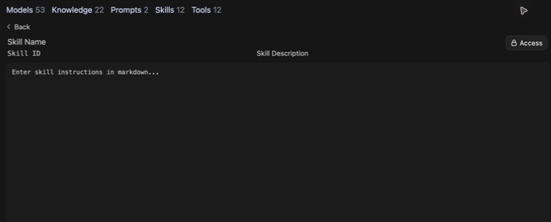
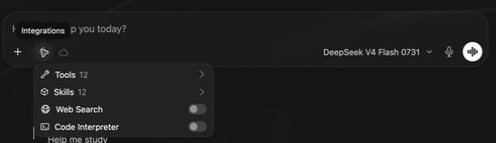

# Skills & Tools

## Skills & Tools — 1

### Skills & Tools

Add tools and reusable instructions for teaching and research

CUNY AI Lab Sandbox

Developed by Stefano Morello and Zach Muhlbauer

---

## Skills & Tools — 2

### Workshop Agenda

- Confirm Skills and Tools access

- Choose recurring procedures

- Write skill instructions

- Attach skills to models

- Inspect tool calls and results

- Test models with skills and tools

Before attending, confirm individual access, Sandbox sign-in, and Skills and Tools access. Creating or editing resources also requires Workspace access. Knowledge access is needed only when your task uses a collection.

---

## Skills & Tools — 3

### Review Previous Work

Open your custom model and review its system prompt. Choose a procedure you use in teaching or research.

Write instructions for the procedure, attach the skill to your model, and test it.

Bring a knowledge collection if the procedure needs to search your documents.

---

## Skills & Tools — 4

### Choose Procedures

- For teaching, guide a student through a source one question at a time.

- For research, compare a claim with its source or apply a codebook to an excerpt.

- Define what a successful response would show before writing the skill.

The procedure should be specific enough that another person can inspect whether it was followed.

---

## Skills & Tools — 5

### Define Skills

Skills contain reusable Markdown instructions for tasks or procedures.

The model receives a skill’s name and description and can load its full instructions when needed.

Describe when the skill should be used and what steps it should follow.

[Tools & Skills](https://ailab.gc.cuny.edu/sandbox-docs/tools-skills/)

[Open WebUI Skills](https://docs.openwebui.com/features/workspace/skills/)

---

## Skills & Tools — 6

### Create Skills



Enter a name, description, and instructions, then select Save & Create.

- Open **Workspace → Skills → Create**.

- Enter a name, identifier, and description that explain when to use it.

- Write the instructions, review **Access**, and choose **Save & Create**.

[Create and attach a skill](https://ailab.gc.cuny.edu/sandbox-docs/tools-skills/)

---

## Skills & Tools — 7

### Attach Skills

- Open **Workspace → Models** and edit your model.

- Select the skill under **Skills**.

- Set **Function Calling** to **Native** under **Advanced Parameters**.

- Select **Save & Update** and test a request that uses the skill.

Use a model that supports tool calling.

[Attach skills](https://ailab.gc.cuny.edu/sandbox-docs/tools-skills/)

---

## Skills & Tools — 8

### Compare Responses

Try the same request before and after attaching the skill. Keep the base model, sources, and system prompt fixed.

- Did the model use the intended procedure?

- Did it stop at the planned point for a response?

- Did it preserve evidence and uncertainty?

---

## Skills & Tools — 9

### Enable Tools



Open Integrations beside the plus button to enable tools for this chat.

A tool runs an operation, such as a search, a calculation, or a query of a source collection.

Open **Integrations** beside the plus button for available chat capabilities. Attach reusable tools under **Tools** in the model editor.

Availability depends on account permissions, configuration, and model support.

[Enable tools in chat or on a model](https://ailab.gc.cuny.edu/sandbox-docs/tools-skills/)

---

## Skills & Tools — 10

### Tools & Skills

Skills

Instructions the model can load for a task or procedure.

Tools

Operations the model can call, such as web search, code execution, or database queries.

Test a request that needs the skill or tool. Check what the model used and whether its response is correct.

[Tools & Skills](https://ailab.gc.cuny.edu/sandbox-docs/tools-skills/)

---

## Skills & Tools — 11

Example 1

### Establish Stasis

Composition — Stasis Theory

---

## Skills & Tools — 12

Composition & Writing

### Original Instructions

**Starting Point**

```text
When a student is developing a research topic, walk them through four stages — conjecture, definition, quality, and policy — to help them narrow their question. Ask one stasis at a time.
```

- Model walks through all four stages in a single response instead of pausing at each

- No procedure for connecting the student’s working topic to each stasis question

- Treats stasis as a checklist rather than a deliberative process

- No mechanism to let the student reformulate before moving on

- Does not help the student identify which stasis their argument addresses

---

## Skills & Tools — 13

Composition & Writing

### Revised Instructions

**Strong**

```text
Skill: Establishing Stasis for a Research Topic
When a student is developing or narrowing a research topic, follow this procedure:

Procedure:
1. Ask the student to state their topic in one sentence. Do not evaluate or refine it yet.
2. Conjecture: “What has happened or is happening that makes this worth investigating?” Wait for their answer. Use what they say to sharpen the next question.
3. Definition: Point to a key term in their response. “How are you defining [term]? What kind of problem is this — legal, ethical, empirical, cultural?” Wait.
4. Quality: “What’s at stake, and for whom? What makes this serious enough to argue about in an 8-page paper?” If their scope is too broad, ask them to name one specific population or context. Wait.
5. Policy: “What should be done, and by whom?” Help the student see whether their argument is making a factual claim, a definitional claim, a value judgment, or a policy proposal.
6. Ask: “Which of these four questions does your argument most need to answer?” Guide them toward a thesis grounded in that stasis.

Format:
Your topic: [student’s stated topic]

[One stasis question, tied to a specific phrase the student used]
[1–2 sentences explaining why this question matters for their project]
```

---

## Skills & Tools — 14

Example 2

### Examine Documents

History — The Sourcing Heuristic

---

## Skills & Tools — 15

History

### Original Instructions

**Starting Point**

```text
When a student asks about a primary source, retrieve it from the knowledge collection and walk them through its rhetorical situation using SOAPS. Ask questions one element at a time rather than summarizing.
```

- Model paraphrases the source instead of quoting from the uploaded document

- No procedure for retrieving and presenting specific passages as evidence

- Rushes through all SOAPS dimensions in a single response

- Student receives a finished reading rather than a structured inquiry

- No requirement to ground each analytical move in the source’s own language

---

## Skills & Tools — 16

History

### Revised Instructions

**Strong**

```text
Skill: Sourcing a Primary Document
When a student asks about or encounters a primary source from the course, follow this procedure:

Procedure:
1. Retrieve the document from the knowledge collection. Quote a key passage — do not paraphrase or summarize.
2. Present the passage in a block quote with its metadata (title, date, author) drawn from the uploaded file.
3. Ask: “Who created this document, and what was their position or stake?” Wait for the student’s answer.
4. After they respond, point to a specific phrase in the quoted passage that supports, complicates, or challenges their answer.
5. Ask: “When and where was this written? What was happening at that moment that shaped what the author could say?” Wait.
6. Ask: “Who was the intended audience? How does knowing that change what the document means?” Wait.
7. After all three sourcing moves, ask: “Given what you now know about the author, the moment, and the audience — what can this source tell us, and what can’t it?”

Format:
> [quoted passage from uploaded source]
— [Author], [Title], [Date]

[One sourcing question]
[1–2 sentences connecting the question to a specific phrase in the passage]
```

---

## Skills & Tools — 17

Example 3

### Analyze Images

Literature — Cinematic Mise-en-Scène

---

## Skills & Tools — 18

Literature & Cultural Studies

### Original Instructions

**Starting Point**

```text
When a student shares a film still or visual artifact, guide them from describing formal elements — composition, lighting, framing — toward interpreting how those choices construct meaning in context.
```

- Model describes the image for the student instead of directing their attention

- No scaffolding from observation to formal analysis to interpretive claim

- Treats all visual elements at once rather than isolating one per turn

- No mechanism to keep the student doing the looking and the arguing

- Skips the gap between “what’s in the frame” and “what argument it makes”

---

## Skills & Tools — 19

Literature & Cultural Studies

### Revised Instructions

**Strong**

```text
Skill: Reading Cinematic Images
When a student uploads a film still, photograph, or visual artifact — or asks about an image from the knowledge collection — follow this procedure:

Procedure:
1. Use an uploaded image only when the selected model can inspect images. If the visual is unavailable, ask the student to upload it or describe it. Do not assume text retrieval from a knowledge collection provides the original image.
2. Ask: “What do you notice first?” Let the student describe before you respond.
3. After their description, direct attention to one formal element they haven’t mentioned — composition, lighting, color, framing, depth of field, or gaze. Ask what it does.
4. Ask how that formal choice shapes the viewer’s experience. Move from what is in the frame to how the image is constructed.
5. Introduce context: ask the student to connect the visual choices to the cultural moment, genre, or argument of the work. If relevant context exists in the knowledge collection, quote it.
6. Guide them toward an interpretive claim: “Based on what you’ve observed, what argument is this image making?”

Framework: Description → Analysis → Interpretation
• Description: What is literally in the frame?
• Analysis: How do formal elements (light, angle, placement) create meaning?
• Interpretation: What claim can the student make, grounded in visual evidence?
```

---

## Skills & Tools — 20

### Write Skills

---

## Skills & Tools — 21

Structure

### Structure Skills

Use three parts to draft this skill.

- **Trigger** — When should this skill activate?

- **Procedure** — What steps does the model follow, in order?

- **Format** — What should the output look like?

---

## Skills & Tools — 22

Component 1

### Define Triggers

Define when this skill should activate. Test the trigger with a matching request and an unrelated request.

- What student action starts this workflow?

- Does it activate when they share a draft? Ask about a source? Upload an image?

- Should it run automatically, or only when the student asks?

```text
Skill: [Skill Name]
When a student [specific action or input], follow this procedure:
```

**Your turn** What pedagogical move are you trying to teach the model? Name the student action that should trigger it.

---

## Skills & Tools — 23

Component 2

### Write Procedures

The core of every skill. Numbered steps that tell the model what to do, in what order, and when to wait.

- What should happen first? What comes next?

- Where should the model wait for the student before continuing?

- Should it quote, cite, or reference specific materials?

```text
Procedure:
1. [First step — what does the model do or ask?]
2. [After the student responds, what comes next?]
3. [Continue the sequence — include wait points]
4. [Final step — synthesis, next action, or handoff]
```

**Your turn** Write 3–5 numbered steps. Use the sequence you follow when performing this task yourself.

---

## Skills & Tools — 24

Component 3

### Specify Format

Specify what the output should look like. Without a format, the model structures responses however it wants.

- Should the model quote the student’s text?

- Should each response end with a question?

- How long should a response be?

```text
Format:
> [quoted excerpt from student work or source document]

[1-2 sentences: what you observe]
[One question for the student]
```

**Your turn** Write a short format template. What should each response from the model actually look like?

---

## Skills & Tools — 25

Hands-On

### Draft Skills

Choose a teaching or research procedure and write steps that another person can inspect.

---

## Skills & Tools — 26

Exercise

### Choose Procedures

Which is closest to the skill you want to build?

### Establish Stasis

Narrow a research topic one question at a time

### Examine Documents

Quote, then ask who, when, for whom

### Analyze Images

Describe → analyze → interpret

### Choose Alternatives

A repeatable teaching or research procedure

---

## Skills & Tools — 27

Draft It

### Write Instructions

Use the three-part structure to write a skill for the move you chose.

### Define Triggers

What student action starts this?

### Write Procedures

3–5 numbered steps with wait points.

### Specify Format

What does each response look like?

```text
Skill: [Name]
When a student [trigger action], follow this procedure:

Procedure:
1. [First step]
2. [Second step — include wait points]
3. [Third step]

Format:
> [quoted text from student or source]

[Observation in 1-2 sentences]
[One question]
```

---

## Skills & Tools — 28

### Check Source Claims

Use this draft to check an interpretation against a source passage.

```text
When the user asks whether a passage supports a claim, ask for both if either is missing.

1. Quote the relevant passage and identify its source. Do not invent missing metadata.
2. State what the passage directly supports.
3. Identify an inference or competing reading that needs further evidence.
4. Ask one question that would help resolve the difference, then wait.

Keep the quotation separate from your interpretation. If the source is unavailable, explain what cannot be checked.
```

Test it with supported, overstated, and unsupported claims from public or approved material.

---

## Skills & Tools — 29

### Test Skills

Create the skill, attach it to your model, confirm native function calling, and save the card. Open a fresh chat with the card.

- Send a request that should trigger the skill.

- Reply once and check whether the procedure continues appropriately.

- Send an unrelated request and check whether the skill is applied unnecessarily.

Record the result before revising the trigger or a procedural step.

---

## Skills & Tools — 30

### Inspect Tool Results

With an available search tool, ask for the title and link of a source relevant to a narrow question. Open the returned page and verify the claim.

With an available code tool, use a small calculation whose answer you can check independently.

Look for the actual call and returned result. The sentence “I searched” or “I calculated” does not establish that a tool ran.

---

## Skills & Tools — 31

### Check Calculations

Run this calculation with Code Interpreter.

```text
Use Code Interpreter to calculate the median of [3, 8, 8, 12, 19]. Show the calculation and report whether the tool ran.
```

The expected median is **8**. Check the execution result and the final answer. If the tool is unavailable or fails, the response should report that.

---

## Skills & Tools — 32

### Record Test Results

| Record | Include |
| --- | --- |
| Configuration | Model, prompt, collection version, skill text, enabled tools. |
| Action | Input, skill loading, tool call, result, final response. |
| Judgment | Expected behavior, observed behavior, evidence, next revision. |

Before sharing, check that the people you share with can use the model and its collections, skills, and tools. Repeat relevant tests after a model or tool update.

---

## Skills & Tools — 33

### Repeat Tests

- Save prompts, sources, skills, and tool settings

- Compare expected and observed behavior

- Revise instructions from recorded failures

- Verify shared access with intended users

- Retest after model or tool updates

[Browse system-prompt examples](../examples.html) · [Return to Compose System Prompts](../)
