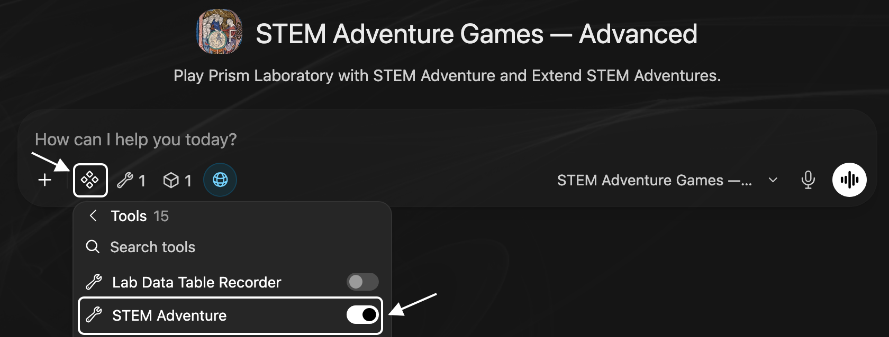
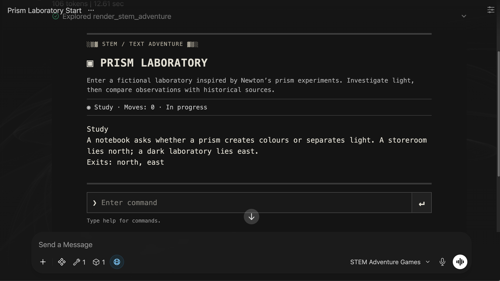
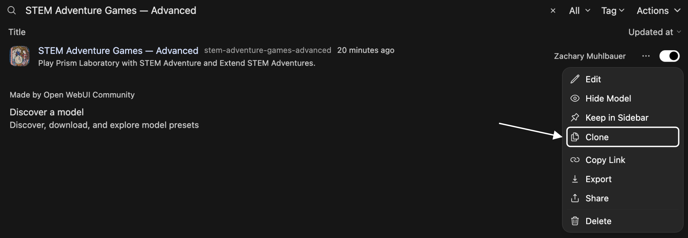
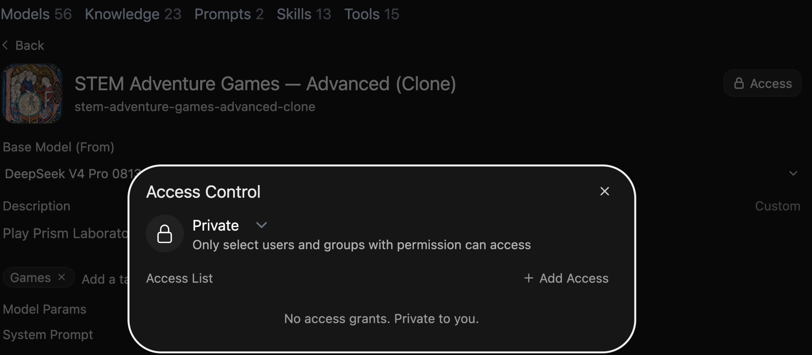
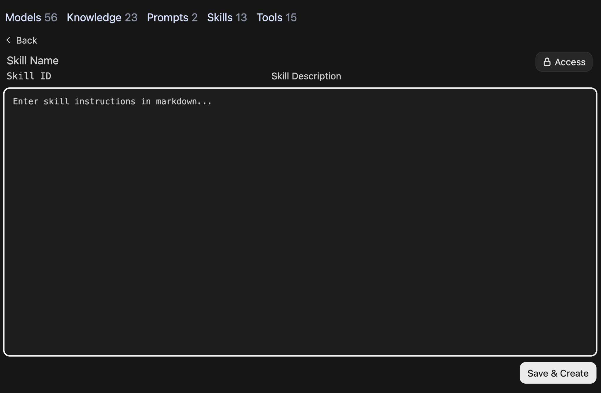

# Configuring skills and tools

## Configuring skills and tools — 1

### Configuring skills and tools

Add tools and reusable instructions for teaching and research

CUNY AI Lab Sandbox

Developed by Zach Muhlbauer

---

## Configuring skills and tools — 2

### Workshop Agenda

- Confirm Skills and Tools access

- Play STEM Adventure

- Inspect commands and results

- Configure reusable skills

- Create and test tools

- Compare procedural changes

Before attending, confirm individual access and Sandbox sign-in. Creating or editing resources also requires Workspace access. Knowledge access is needed when your task uses a collection.

---

## Configuring skills and tools — 3

### Tools & Skills

Skills

Reusable instructions for tasks or procedures.

Tools

Operations such as web search, code execution, or database queries.

Test a request that needs your skill or tool. Check what your model used and whether its response is correct.

[Tools & Skills](https://ailab.gc.cuny.edu/sandbox-docs/tools-skills/)

---

## Configuring skills and tools — 4

### Review Previous Work

Continue from your chat adventure and source collection. Workshop 3 adds tools and skills. Select STEM Adventure Games — Advanced and review its system prompt.

- Identify instructions for opening Prism Laboratory.

- Review attached STEM Wikipedia Experiments collection.

- Distinguish source material, skill instructions, and tool operations.

Use a private copy when adapting this configuration.

---

## Configuring skills and tools — 5

### Connect Resources

System prompt

Tell your model when to open a game or consult sources.

Knowledge

STEM Wikipedia Experiments contains scientific and historical sources.

Skill

Extend STEM Adventures describes how to change experimental procedures.

Tool

STEM Adventure opens a game and applies its rules.

Use provided game files to describe rooms, objects, and rules.

---

## Configuring skills and tools — 6

### Enable Tools



With STEM Adventure Games — Advanced selected, open Integrations beside +. Under Tools, confirm STEM Adventure is enabled for this chat.

---

## Configuring skills and tools — 7

### Inspect Game Rules



Send Begin Prism Laboratory to your selected model. Enter help inside its command box, then go north and take prism. [Open game](../examples/adventure/preview.html) · [Read game file](../examples/adventure/prism.json)

---

## Configuring skills and tools — 8

### Test Game Commands

- Enter **restart**, then try **record result** before completing required steps.

- Follow [winning command sequence](reference.html#game-commands). Immediately after take prism, repeat take prism and check its response.

- Enter **save** to download your play record.

- Enter **restart**, then **load** and choose your saved file.

- Enter **inventory**. Check restored items, room, and completion. Enter **undo** to reverse your last move.

---

## Configuring skills and tools — 9

### Discuss Play Records

- Enter **discuss** inside your game.

- Review record in message box, then send it.

- Check how your model explains a failed action.

- Compare programmed observations with historical sources.

A completed game does not establish conceptual understanding.

---

## Configuring skills and tools — 10

### Choose Procedures

Choose one procedure to change or examine.

- Change size of an opening that admits light, called an aperture.

- Inspect a failed command and its prerequisite.

- Check a historical claim against source material.

Describe expected behavior before testing.

---

## Configuring skills and tools — 11

### Define Skills

Skills contain reusable Markdown instructions for tasks or procedures.

Models can load attached skills when needed. Enable a skill under Integrations → Skills to include its full instructions in this chat.

Markdown is plain text with formatting such as headings and lists.

[Tools & Skills](https://ailab.gc.cuny.edu/sandbox-docs/tools-skills/)

[Open WebUI Skills](https://docs.openwebui.com/features/workspace/skills/)

---

## Configuring skills and tools — 12

### Write Skills

---

## Configuring skills and tools — 13

Structure

### Structure Skills

Use three parts to draft this skill.

- **Trigger** — When should this skill activate?

- **Procedure** — Which steps should your model follow?

- **Format** — How should responses appear?

[Read blank template](reference.html#write-instructions)

[Read complete skill](../examples/stem-game-skill.md)

---

## Configuring skills and tools — 14

### Define Triggers

Describe when your skill should be used.

- Should it load when users request a procedural change?

- Should it also apply to submitted play records?

- Which requests should leave it unused?

```text
Use this skill when users request an experimental variation in STEM Adventure or ask to examine a submitted play record.
```

---

## Configuring skills and tools — 15

### Write Procedures

Specify one change to your experiment. Use fields listed in [scenario instructions](../examples/stem-game-skill.md) when editing your game file.

```text
1. Identify one experimental decision to change.
2. Check source material for that procedure.
3. Revise scenario JSON using fields listed in attached instructions.
4. List commands that complete your game and one command that should fail, then open your game.
5. Compare a submitted record with expected behavior.
```

---

## Configuring skills and tools — 16

### Specify Format

Separate your game file, source evidence, and test results.

```text
Scenario JSON: [Complete scenario]
Source: [Relevant historical passage]
Invented elements: [Rooms or simplified observations]
Winning commands: [Sequence]
Blocked command: [Command and missing prerequisite]
Observed result: [Fill only after testing]
```

---

## Configuring skills and tools — 17

### Clone Custom Models



In Workspace → Models, open ⋯ beside STEM Adventure Games — Advanced and choose Clone.

---

## Configuring skills and tools — 18

### Save Private Copy



Rename model and ID. Open Access, keep Private, and remove copied users or groups from Access List. Close Access and choose Save & Create.

---

## Configuring skills and tools — 19

### Draft Skills

Kale Skill Builder is a custom model that drafts skills for tasks you describe.

Select model ID on bottom right of message box. Choose Kale Skill Builder.

Attach [scenario instructions](../examples/stem-game-skill.md) before sending this example.

```text
Draft a skill for adding an aperture comparison to STEM Adventure. Use attached scenario instructions and preserve existing game rules. Include when to use it, 3–5 steps, expected output, and two proposed tests. Do not claim unrun tests passed.
```

[Open Kale Skill Builder](https://chat.ailab.gc.cuny.edu/?model=cail-sandbox-skill-builder) · [Read tested skill](../examples/stem-game-skill.md)

[Review draft evaluation](reference.html#check-skill-drafts)

[Download skill instructions](../examples/stem-game-skill.md)

---

## Configuring skills and tools — 20

### Create Skills



Open Workspace → Skills → Create. Name your skill and add an identifier and description. Paste your saved draft into Instructions, review Access, and choose Save & Create.

---

## Configuring skills and tools — 21

### Attach Skills

- Open your private copy under **Workspace → Models**.

- Replace Extend STEM Adventures with your saved draft under **Skills**. Update System Prompt to name your skill.

- Set **Function Calling** to **Native** under **Advanced Parameters**.

- Select **Save & Update** and test a request that uses your skill.

Native function calling lets your model call tools and load attached skill instructions.

[Attach skills](https://ailab.gc.cuny.edu/sandbox-docs/tools-skills/)

---

## Configuring skills and tools — 22

### Extend Procedures

Open your private copy. Attach [Prism Laboratory JSON](../examples/adventure/prism.json) and enable your saved draft under **Integrations → Skills**. Send this request.

```text
Add an aperture comparison to Prism Laboratory using Newton: Experimental Variants. Keep existing rooms and actions. Provide scenario JSON, a winning command sequence, and one command that must fail before its prerequisite. Open the revised game.
```

[Read skill instructions](../examples/stem-game-skill.md) · [Download tested scenario](../examples/adventure/aperture.json)

[Download Prism Laboratory](../examples/adventure/prism.json)

---

## Configuring skills and tools — 23

### Test Skills

Use your private copy for both tests. Remove any additional skills from this copy before comparing your draft.

- Remove your skill under **Workspace → Models → Skills**. Save, start a new chat, and confirm it is off under **Integrations → Skills**. Repeat your extension request with Prism Laboratory JSON attached.

- Attach your skill again, save, and repeat that request in another new chat. Attach Prism Laboratory JSON and enable your saved draft under Integrations → Skills.

- Keep base model, system prompt, sources, and tool unchanged.

- Run winning and blocked commands. Compare expected and observed results.

Save generated scenarios and play records.

---

## Configuring skills and tools — 24

### Create Adventure Tools

Tool Creator is a custom model that drafts Python tools for tasks you describe. Save its output as a draft for review and testing. Use tested STEM Adventure code for installation in this workshop.

```text
Create a minimalist text adventure tool for Open WebUI. Return an interactive HTMLResponse and a description for the model. Track rooms, inventory, prerequisites, and completion. Use one command line with help, undo, restart, save, load, and discuss commands. Keep scenario JSON separate from executable code.
```

[Open Tool Creator](https://chat.ailab.gc.cuny.edu/?model=cail-sandbox-tool-creator) · [Download tested tool](../examples/tools/stem_adventure.py)

[Review code evaluation](reference.html#check-generated-code)

[Read tested code](../examples/tools/stem_adventure.py)

---

## Configuring skills and tools — 25

### Install Tool Code

- Open **Workspace → Tools → Create**.

- Enter Name, ID, and Description.

- Paste and review [tested STEM Adventure code](../examples/tools/stem_adventure.py). Keep your creator draft separate.

- Select **Save & Create**.

- Enable your tool through **Integrations → Tools**.

Use a private copy when changing code. Attach reusable tools under Tools in your model editor.

---

## Configuring skills and tools — 26

### Inspect Tool Results

Start a new chat with your private model. Under Integrations → Tools, select only your installed adventure tool. Send Begin Prism Laboratory, then open its tool-call details.

- Check which scenario was passed to render_stem_adventure.

- Compare returned result with your request.

- Confirm displayed game matches that scenario.

Save any error before revising your request.

---

## Configuring skills and tools — 27

### Compare Game Records

Attach saved play records from original and revised games, then send this request.

```text
Review both play records. Which commands and prerequisites changed? Which observations were programmed? Which historical claims can the uploaded sources support?
```

Check your model’s account against commands and source passages. Keep expected and observed results separate.

---

## Configuring skills and tools — 28

### Record Test Results

| Record | Include |
| --- | --- |
| Configuration | Model ID, system prompt, documents, skill instructions, and enabled tools. |
| Action | Request, instructions used, tool calls and results, and final response. |
| Judgment | What you expected, what happened, and any change you plan to test. |

Before sharing, confirm others can access your model, collections, skills, and tools. Repeat relevant tests after updates.

---

## Configuring skills and tools — 29

### Repeat Tests

- Save prompts, sources, skills, and tool settings

- Compare expected and observed behavior

- Revise instructions from recorded failures

- Verify shared access with intended users

- Retest after model or tool updates

[Browse system-prompt examples](../examples.html) · [Return to Composing system prompts](../)
